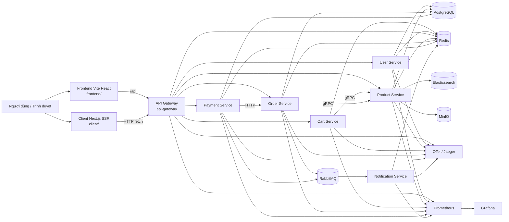
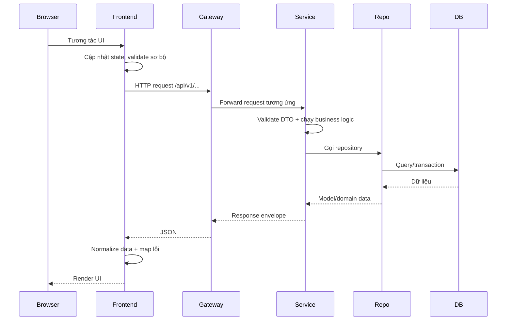
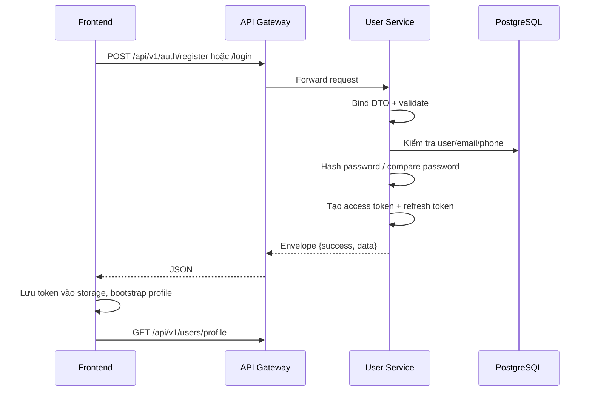
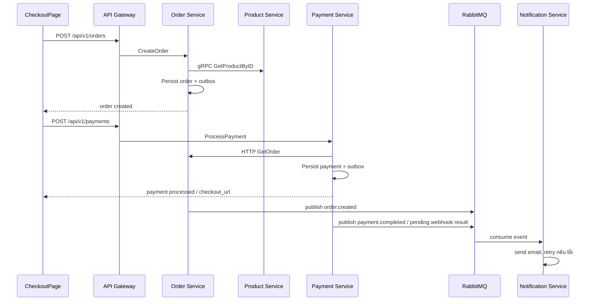

# LOGIC_FLOW

Tài liệu này mô tả chi tiết luồng hoạt động của toàn bộ dự án nền tảng thương mại điện tử theo đúng cấu trúc source code hiện tại. Mục tiêu là giúp người đọc:

- hiểu kiến trúc tổng thể của hệ thống
- lần theo luồng dữ liệu từ giao diện người dùng đến cơ sở dữ liệu và ngược lại
- biết chính xác nên mở file nào, hàm nào khi cần đọc, kiểm tra, sửa hoặc mở rộng chức năng
- dùng chính dự án này như một “sân tập” để học kiến trúc hệ thống, backend Go, frontend React/Next, DevOps và cách làm việc nhóm

## 0. Phạm vi và cách đọc tài liệu

### 0.1. Phạm vi

Tài liệu bám vào hiện trạng của repo, không mô tả theo “một kiến trúc lý tưởng tưởng tượng”.

Những thành phần chính hiện có:

- `frontend/`: giao diện người dùng chính trong Docker Compose, build bằng Vite + React, phục vụ qua Nginx nội bộ của chính frontend container
- `client/`: storefront Next.js chạy song song, chủ yếu phục vụ SSR/standalone runtime
- `api-gateway/`: cổng vào HTTP, đóng vai trò reverse proxy mỏng
- `services/user-service/`
- `services/product-service/`
- `services/cart-service/`
- `services/order-service/`
- `services/payment-service/`
- `services/notification-service/`
- `pkg/`: các package dùng chung như config, middleware, logger, observability, response
- `proto/`: hợp đồng gRPC giữa các service
- `deployments/docker/`: local stack gần production nhất
- `deployments/k8s/`: manifest Kubernetes mẫu cho môi trường triển khai

### 0.2. Cách đọc

Nếu bạn mới vào dự án, nên đọc theo thứ tự:

1. `deployments/docker/docker-compose.yml`
2. `frontend/src/app/App.tsx`
3. `api-gateway/cmd/main.go`
4. `pkg/response/response.go`
5. `services/order-service/internal/handler/order_handler.go`
6. `services/order-service/internal/service/order_pricing.go`
7. `services/order-service/internal/service/order_lifecycle.go`
8. `services/payment-service/internal/service/payment_processing.go`
9. `services/notification-service/internal/handler/event_handler.go`

### 0.3. Ghi chú thực tế rất quan trọng

Đây là các điểm “thực chiến” nên biết ngay từ đầu để tránh hiểu sai hệ thống:

1. Frontend chính trong local Compose chạy ở `http://localhost:4173`, không phải qua `deployments/docker/nginx.conf`. Frontend container dùng `frontend/nginx.conf` để vừa phục vụ static file vừa proxy `/api` sang `api-gateway`.
2. `deployments/docker/nginx.conf` là một edge proxy tách riêng, hiện chủ yếu minh họa/giới hạn API ở cổng `80`, không phải cổng mà frontend chính đang phục vụ toàn bộ UI.
3. Xác minh OTP số điện thoại hiện đi qua Telegram bot, không phải SMS gateway.
4. Luồng tồn kho hiện tại mới dừng ở mức kiểm tra tồn khi báo giá/đặt hàng và hoàn tồn khi hủy đơn. Chưa có một bước trừ tồn hoặc reserve tồn kho một cách transaction-safe trong luồng tạo đơn.
5. Luồng giao hàng hiện được biểu diễn bằng trạng thái đơn hàng `pending -> paid -> shipped -> delivered`; chưa có integration với hãng vận chuyển.
6. Luồng trả hàng hiện chưa có một module RMA riêng; trạng thái “hoàn trả/hoàn tiền” hiện chủ yếu được biểu diễn qua refund payment và chuyển trạng thái order sang `refunded`.
7. Frontend có một vài API helper đã được chuẩn bị sẵn nhưng backend chưa expose đầy đủ route tương ứng. Đây là điểm cần lưu ý khi mở rộng.

## 1. Kiến trúc tổng thể

### 1.1. Sơ đồ kiến trúc mức cao



### 1.2. Vai trò của từng thành phần

| Thành phần | File bắt đầu nên đọc | Vai trò chính |
| --- | --- | --- |
| Frontend chính | `frontend/src/app/App.tsx:29` | Route tree của SPA, điểm vào của người dùng cuối |
| Frontend providers | `frontend/src/app/providers/AppProviders.tsx:10` | Cấp state auth và cart cho toàn ứng dụng |
| Frontend HTTP client | `frontend/src/shared/api/http-client.ts:81` | Gửi request, đính token, parse envelope, ném lỗi |
| API Gateway | `api-gateway/cmd/main.go:24` | Load config, middleware, tracing, tạo service proxy và route mirror |
| User Service | `services/user-service/cmd/main.go:40` | Auth, profile, địa chỉ, OTP, OAuth |
| Product Service | `services/product-service/cmd/main.go:38` | Catalog, review, media, search, low-stock monitor |
| Cart Service | `services/cart-service/cmd/main.go:30` | Giỏ hàng dùng Redis, đọc giá/tồn từ product-service |
| Order Service | `services/order-service/cmd/main.go:32` | Báo giá, tạo đơn, coupon, timeline, báo cáo, outbox, consume payment event |
| Payment Service | `services/payment-service/cmd/main.go:31` | Tạo payment, webhook MoMo, refund, outbox |
| Notification Service | `services/notification-service/cmd/main.go:31` | Consume sự kiện từ RabbitMQ và gửi email |
| Shared packages | `pkg/response/response.go`, `pkg/middleware`, `pkg/observability`, `pkg/logger` | Chuẩn hóa response, auth, logging, metrics, tracing |

### 1.3. Topology local runtime

Từ `deployments/docker/docker-compose.yml:1-180`, stack local gồm:

- PostgreSQL
- Redis
- RabbitMQ
- MinIO
- Elasticsearch
- Jaeger
- Prometheus
- Grafana
- Nginx edge proxy
- Frontend container
- API Gateway
- 6 service backend

Các điểm đáng chú ý:

- `frontend` được map `4173:80`, và trong chính container này, `frontend/nginx.conf` proxy `/api/` sang `api-gateway:8080`.
- `api-gateway` được map `8080:8080`.
- `client/` không nằm trong Docker Compose mặc định, nhưng có Dockerfile và standalone runtime riêng.

## 2. Luồng tổng quát từ yêu cầu đến phản hồi

### 2.1. Luồng chung



### 2.2. 7 bước thực thi chuẩn

1. Người dùng thao tác trên giao diện.
2. Frontend cập nhật state cục bộ, có thể validate trước khi gửi.
3. Frontend gọi module API tương ứng.
4. `api-gateway` nhận request, xác thực route và forward sang đúng service.
5. Handler của service bind DTO, validate, gọi service layer.
6. Service layer thực thi business logic và gọi repository/client khác nếu cần.
7. Kết quả được trả về dưới dạng JSON envelope thống nhất, frontend normalizer lại rồi render.

## 3. Chuẩn dữ liệu giữa backend và frontend

### 3.1. Envelope phản hồi chung

Backend dùng `pkg/response/response.go:20-64`.

Frontend mirror type tại `shared/types/api.ts:1-15`.

```json
{
  "success": true,
  "message": "Mô tả ngắn",
  "data": {},
  "error": "Chi tiết lỗi nếu có",
  "meta": {
    "page": 1,
    "limit": 20,
    "total": 100,
    "next_cursor": "opaque-cursor",
    "has_next": true
  }
}
```

### 3.2. Frontend xử lý response như thế nào

Điểm vào chính là `frontend/src/shared/api/http-client.ts:81` `request<T>`.

Flow của frontend HTTP client:

1. thêm `Accept: application/json`
2. thêm `Content-Type: application/json` nếu body là JSON
3. thêm `Authorization: Bearer ...` nếu có token
4. đọc raw text
5. parse về `ApiEnvelope<T>`
6. nếu HTTP status lỗi hoặc `success=false` thì ném `HttpError`

Sau đó dữ liệu tiếp tục được normalize:

- sản phẩm: `frontend/src/shared/api/normalizers.ts:81`
- giỏ hàng: `frontend/src/shared/api/normalizers.ts:239`
- đơn hàng: `frontend/src/shared/api/normalizers.ts:272`
- preview đơn hàng: `frontend/src/shared/api/normalizers.ts:333`
- payment: `frontend/src/shared/api/normalizers.ts:350`
- user profile: `frontend/src/shared/api/normalizers.ts:400`

### 3.3. Frontend xử lý lỗi như thế nào

`frontend/src/shared/api/error-handler.ts:71` `getErrorMessage` sẽ:

- phân loại lỗi mạng
- phân loại lỗi HTTP theo status code
- map một số thông điệp cụ thể như `invalid email/phone or password`, `phone verification required`, `otp rate limit exceeded`

Điều này làm cho backend có thể giữ error detail “đủ kỹ thuật”, còn frontend chuyển thành thông điệp người dùng.

## 4. Cấu trúc và trách nhiệm của từng backend service

## 4.1. API Gateway

### File quan trọng

- `api-gateway/cmd/main.go:24` `main`
- `api-gateway/internal/proxy/service_proxy.go:43` `NewServiceProxy`
- `api-gateway/internal/proxy/service_proxy_request.go:33` `Do`
- `api-gateway/internal/proxy/service_proxy_request.go:72` `newBackendRequest`
- `api-gateway/internal/proxy/service_proxy_request.go:141` `executeWithResilience`
- `api-gateway/internal/proxy/service_proxy_response.go:28` `ForwardResponse`

### Trách nhiệm

- không chứa business logic
- mirror route `/api/v1/...`
- forward request/response gần như nguyên vẹn
- thêm middleware:
  - recover
  - CORS
  - secure headers
  - tracing
  - Redis-backed rate limiter
  - request logger
  - Prometheus metrics

### Route mirror

- user routes: `api-gateway/internal/handler/user_handler.go:24-56`
- product routes: `api-gateway/internal/handler/product_handler.go:22-42`
- cart routes: `api-gateway/internal/handler/cart_handler.go:22-30`
- order routes: `api-gateway/internal/handler/order_handler.go:20-50`
- payment routes: `api-gateway/internal/handler/payment_handler.go:22-38`

## 4.2. User Service

### Phạm vi

- đăng ký
- đăng nhập
- refresh token
- xác minh email
- quên mật khẩu / đặt lại mật khẩu
- profile
- địa chỉ
- xác minh số điện thoại bằng OTP
- OAuth Google

### File cần đọc

- main wiring: `services/user-service/cmd/main.go:40-207`
- HTTP routes: `services/user-service/internal/handler/user_handler.go:53-83`
- auth: `services/user-service/internal/service/user_auth.go:35`, `:116`, `:158`
- token refresh: `services/user-service/internal/service/user_tokens.go:38`
- profile: `services/user-service/internal/service/user_profile.go:30`, `:55`
- OTP: `services/user-service/internal/service/phone_verification.go:44`, `:156`, `:214`
- OAuth: `services/user-service/internal/service/oauth_service.go:64`, `:112`, `:166`
- repository user: `services/user-service/internal/repository/user_repository.go:50`, `:93`, `:118`, `:142`, `:248`
- repository address: `services/user-service/internal/repository/address_repository.go:35`, `:71`, `:97`
- repository phone verification: `services/user-service/internal/repository/phone_verification_repository.go:31`, `:86`, `:110`
- model: `services/user-service/internal/model/user.go:10`, `address.go:6`
- migration: `services/user-service/migrations/000001_create_users.up.sql:1`

### Thực tế nghiệp vụ cần nhớ

1. User profile và địa chỉ mặc định có thể được cập nhật trong cùng transaction.
2. OTP điện thoại hiện đang gắn với Telegram bot:
   - `services/user-service/cmd/main.go:69-73`
   - handler có lỗi `telegram chat not linked` ở `services/user-service/internal/handler/user_handler.go:397-399`
3. OAuth login dùng ticket exchange, không đẩy JWT trực tiếp qua callback URL.

## 4.3. Product Service

### Phạm vi

- CRUD sản phẩm
- duyệt catalog
- tìm kiếm
- upload hình
- review sản phẩm
- cache review
- low-stock monitor

### File cần đọc

- main wiring: `services/product-service/cmd/main.go:38-227`
- HTTP routes: `services/product-service/internal/handler/product_handler.go:41-65`
- list/query: `services/product-service/internal/service/product_queries.go:49`
- CRUD: `services/product-service/internal/service/product_crud.go:32`, `:64`, `:127`, `:166`
- review: `services/product-service/internal/service/product_review_service.go:138`, `:215`, `:255`, `:307`
- gRPC: `services/product-service/internal/grpc/product_grpc.go:35`, `:58`
- repository product: `services/product-service/internal/repository/product_repository.go:149`, `:329`, `:346`
- search adapter: `services/product-service/internal/search/elasticsearch.go:187`
- object storage: `services/product-service/internal/storage/object_storage.go:72`

### Thực tế nghiệp vụ cần nhớ

1. HTTP catalog dùng cursor pagination trong repository.
2. Search chỉ đi qua Elasticsearch ở một số trường hợp:
   - có `search`
   - không có `cursor`
   - sort không phải `popular`
3. Review có transaction + cache + observer invalidation.
4. MinIO và Elasticsearch là optional integration, nếu lỗi thì service vẫn degrade gracefully.

## 4.4. Cart Service

### Phạm vi

- lưu giỏ hàng theo user trong Redis
- đọc snapshot sản phẩm từ product-service để lấy giá/tồn hiện tại

### File cần đọc

- main wiring: `services/cart-service/cmd/main.go:30-124`
- HTTP routes: `services/cart-service/internal/handler/cart_handler.go:25-117`
- mutation: `services/cart-service/internal/service/cart_mutations.go:33`, `:85`, `:125`
- helpers: `services/cart-service/internal/service/cart_helpers.go:38`, `:69`, `:96`
- repository: `services/cart-service/internal/repository/cart_repository.go:51`, `:77`, `:90`

### Thực tế nghiệp vụ cần nhớ

1. Cart Service là service ít state nghiệp vụ nhất, nhưng lại rất quan trọng cho UX.
2. Giá và tồn kho trong giỏ được “refresh” theo snapshot hiện tại của product-service.
3. Guest cart được giữ ở frontend local storage, chưa có backend merge endpoint thực thi.

## 4.5. Order Service

### Phạm vi

- preview order
- create order
- timeline sự kiện đơn hàng
- coupon
- báo cáo admin
- outbox event
- đồng bộ trạng thái từ payment event

### File cần đọc

- main wiring: `services/order-service/cmd/main.go:32-162`
- routes: `services/order-service/internal/handler/order_handler.go:29-62`
- pricing: `services/order-service/internal/service/order_pricing.go:46`, `:76`, `:179`
- lifecycle: `services/order-service/internal/service/order_lifecycle.go:40`, `:178`, `:214`, `:255`
- queries: `services/order-service/internal/service/order_queries.go:35`, `:112`, `:170`, `:194`
- payment event consumer: `services/order-service/internal/service/payment_events.go:32`, `:78`
- repository create: `services/order-service/internal/repository/order_repository.go:65`
- repository inbox/outbox: `services/order-service/internal/repository/order_repository.go:736`, `:828`
- model state machine: `services/order-service/internal/model/order.go:5-20`

### Thực tế nghiệp vụ cần nhớ

1. Order Service là nơi giữ business invariant của đơn hàng.
2. Tạo đơn:
   - báo giá
   - validate coupon
   - tạo order aggregate
   - ghi `orders`, `order_items`, `order_events`, `outbox_events`
3. Order status hiện là:
   - `pending -> paid -> shipped -> delivered`
   - `pending -> cancelled`
   - `pending -> paid -> refunded`
4. Chuyển `paid` và `refunded` có thể đến từ payment event consumer.

## 4.6. Payment Service

### Phạm vi

- tạo payment cho order
- quản lý trạng thái payment
- webhook MoMo
- refund
- outbox event

### File cần đọc

- main wiring: `services/payment-service/cmd/main.go:31-144`
- routes: `services/payment-service/internal/handler/payment_handler.go:25-42`
- process payment: `services/payment-service/internal/service/payment_processing.go:42`
- refunds + webhook: `services/payment-service/internal/service/payment_refunds.go:41`, `:185`
- payment enrichment: `services/payment-service/internal/service/payment_enrichment.go:33`
- repository create/update/webhook: `services/payment-service/internal/repository/payment_repository.go:39`, `:211`, `:273`
- model: `services/payment-service/internal/model/payment.go:5-41`

### Thực tế nghiệp vụ cần nhớ

1. Payment method hiện tại chỉ thấy rõ `manual` và `momo`.
2. `manual` thường hoàn tất ngay.
3. `momo` được tạo ở trạng thái `pending` và trả `checkout_url`.
4. Webhook dùng inbox table để chống xử lý lặp.
5. Refund được ghi thành một payment record mới với `transaction_type=refund`.

## 4.7. Notification Service

### Phạm vi

- consume event từ RabbitMQ
- gửi email
- retry và dead-letter queue
- duplicate inbox protection qua Redis nếu có

### File cần đọc

- main wiring: `services/notification-service/cmd/main.go:31-188`
- worker: `services/notification-service/cmd/main.go:190-210`
- dispatcher: `services/notification-service/internal/handler/event_handler.go:105-233`
- queue monitor: `services/notification-service/internal/messaging/queue_monitor.go:32`, `:70`
- retry publisher: `services/notification-service/internal/messaging/retry_publisher.go:27`
- inbox Redis: `services/notification-service/internal/inbox/redis_store.go:39`

## 5. Luồng nghiệp vụ chi tiết theo use case

## 5.1. Đăng ký, đăng nhập, refresh token, profile

### Sơ đồ



### Luồng đăng ký

1. Frontend gọi `authApi.register` tại `frontend/src/shared/api/modules/authApi.ts:100-105`.
2. Gateway forward `POST /api/v1/auth/register`.
3. User handler `Register` tại `services/user-service/internal/handler/user_handler.go:93-114`.
4. User service `Register` tại `services/user-service/internal/service/user_auth.go:35-96`:
   - normalize email/phone/họ tên
   - kiểm tra email đã tồn tại
   - kiểm tra phone đã tồn tại
   - bcrypt hash password
   - tạo user
   - tạo token pair
   - gửi verification email best-effort

### Luồng đăng nhập

1. `frontend/src/routes/LoginPage.tsx:94-142` `handleLogin`
2. `AuthProvider.login` tại `frontend/src/features/auth/providers/AuthProvider.tsx:202-207`
3. backend `Login` handler tại `services/user-service/internal/handler/user_handler.go:124-160`
4. service `Login` tại `services/user-service/internal/service/user_auth.go:116-135`
5. nếu sai nhiều lần, `LoginAttemptProtector` sẽ khóa tạm

### Luồng refresh token

- frontend `AuthProvider.withFreshToken` tại `frontend/src/features/auth/providers/AuthProvider.tsx:118-134`
- refresh thật sự gọi `authApi.refreshToken` và `UserService.RefreshToken`
- backend function: `services/user-service/internal/service/user_tokens.go:38-56`

### Luồng profile

- lấy profile: `services/user-service/internal/handler/user_handler.go:247-262`
- cập nhật profile: `services/user-service/internal/handler/user_handler.go:265-306`
- service update dùng transaction: `services/user-service/internal/service/user_profile.go:55-67`

## 5.2. Xác minh email, quên mật khẩu, OTP điện thoại, OAuth

### Xác minh email và quên mật khẩu

- verify email: `services/user-service/internal/service/auth_recovery.go:21-35`
- resend verify email: `:38-67`
- forgot password: `:69-94`
- reset password: `:96-115`

### OTP điện thoại

- gửi OTP: `services/user-service/internal/handler/user_handler.go:321-341`
- verify OTP: `:343-363`
- resend OTP: `:365-385`
- map lỗi: `:387-435`
- service core: `services/user-service/internal/service/phone_verification.go:44`, `:156`, `:214`

### OAuth Google

- start: `services/user-service/internal/handler/user_handler.go:514-570`
- callback: `:572-609`
- exchange ticket: `:522-543`
- service: `services/user-service/internal/service/oauth_service.go:64`, `:112`, `:166`

## 5.3. Duyệt sản phẩm và tìm kiếm

### Luồng duyệt catalog

1. Route SPA `/products` từ `frontend/src/app/App.tsx:44`.
2. `productApi.listProducts` tại `frontend/src/shared/api/modules/productApi.ts:102-145`.
3. Gateway forward `GET /api/v1/products`.
4. Product handler `List` tại `services/product-service/internal/handler/product_handler.go:162-210`.
5. Product service `List` tại `services/product-service/internal/service/product_queries.go:49-80`.
6. Nếu phù hợp, tìm qua Elasticsearch; nếu lỗi thì fallback về PostgreSQL.
7. Repository `List` tại `services/product-service/internal/repository/product_repository.go:149`.
8. Frontend normalize lại qua `normalizeProductList`.

### Luồng xem chi tiết sản phẩm

1. Route `/products/:productId`
2. `frontend/src/routes/ProductDetailPage.tsx:67-146` tải:
   - product detail
   - review list
   - review của người dùng hiện tại nếu đã đăng nhập
3. Product detail backend qua `GetByID`
4. Review backend qua `ProductReviewService.ListReviews`

## 5.4. Thêm vào giỏ hàng

### Luồng guest cart

1. User chưa đăng nhập.
2. `CartProvider` dùng local storage:
   - `frontend/src/features/cart/providers/CartProvider.tsx:48-59`
3. Khi thêm sản phẩm:
   - frontend gọi `productApi.getProductById`
   - lấy giá/tồn hiện tại
   - cập nhật local storage và total

### Luồng user cart

1. User đã đăng nhập.
2. `cartApi.addToCart` tại `frontend/src/shared/api/modules/cartApi.ts:36-48`
3. Gateway forward `POST /api/v1/cart/items`
4. Cart service `AddItem` tại `services/cart-service/internal/service/cart_mutations.go:33-62`
5. Cart service:
   - load cart từ Redis
   - gọi product-service gRPC lấy snapshot sản phẩm
   - merge item hoặc append item
   - lưu lại Redis

### Luồng merge guest cart khi đăng nhập

Hiện tại chưa có endpoint backend `/api/v1/cart/merge` thực thi, dù frontend đã chuẩn bị helper ở `frontend/src/shared/api/modules/cartApi.ts:100-112`.

Flow thực tế đang dùng:

- `frontend/src/features/cart/providers/CartProvider.tsx:72-97`
- lặp từng item guest cart và replay `addToCart`

Đây là một quyết định thực dụng, nhưng chưa tối ưu nếu guest cart lớn.

## 5.5. Xem trước đơn hàng, áp dụng coupon, đặt đơn

### Luồng preview order

1. Trang giỏ hàng gọi `api.previewOrder` tại `frontend/src/routes/CartPage.tsx:98-131`.
2. API module `orderApi.previewOrder` tại `frontend/src/shared/api/modules/orderApi.ts:74-86`.
3. Order handler `PreviewOrder` tại `services/order-service/internal/handler/order_handler.go:89-104`.
4. Service `PreviewOrder` và `quoteOrder`:
   - `services/order-service/internal/service/order_pricing.go:46-53`
   - `:76-116`
5. `quoteOrderItem` tại `:179-207` gọi product-service gRPC để lấy giá/tồn.
6. Coupon được validate ở `:413-435`.

### Luồng create order

1. Checkout form submit ở `frontend/src/routes/CheckoutPage.tsx:193-257`.
2. Frontend gửi payload:

```json
{
  "items": [
    {"product_id": "product-uuid", "quantity": 2}
  ],
  "coupon_code": "SUMMER10",
  "shipping_method": "standard",
  "shipping_address": {
    "recipient_name": "Nguyễn Văn A",
    "phone": "090...",
    "street": "123 Đường A",
    "ward": "Phường 1",
    "district": "Quận 1",
    "city": "TP.HCM"
  }
}
```

3. Gateway forward `POST /api/v1/orders`.
4. Handler `CreateOrder` tại `services/order-service/internal/handler/order_handler.go:72-87`.
5. Service `CreateOrder` tại `services/order-service/internal/service/order_lifecycle.go:40-97`:
   - quote order
   - dựng aggregate
   - build outbox `order.created`
   - persist transaction
6. Repository `Create` tại `services/order-service/internal/repository/order_repository.go:65-141` ghi:
   - `orders`
   - `order_items`
   - `order_events`
   - `outbox_events`
   - consume coupon nếu có

### Ghi chú rất quan trọng về tồn kho

Hiện trạng tồn kho cần hiểu đúng:

1. Order Service có kiểm tra stock qua `quoteOrderItem` ở `services/order-service/internal/service/order_pricing.go:179-207`.
2. Product repository có hàm trừ tồn `UpdateStock` ở `services/product-service/internal/repository/product_repository.go:329-343`.
3. Nhưng trong luồng create order hiện tại, `UpdateStock` chưa được gọi.
4. Khi hủy đơn, hệ thống lại có bước hoàn tồn:
   - `services/order-service/internal/service/order_lifecycle.go:488-504`
   - `services/order-service/internal/grpc_client/product_client.go:67-112`
5. Nghĩa là hiện tại hệ thống:
   - có check tồn
   - có hoàn tồn
   - nhưng chưa có reserve/trừ tồn một cách transaction-safe khi tạo order

Đây là một trong các điểm nên ưu tiên cải thiện nếu muốn đưa flow inventory lên mức production chắc chắn hơn.

## 5.6. Thanh toán, webhook, xác nhận đơn hàng

### Sơ đồ checkout -> payment -> event



### Luồng process payment

1. Sau khi tạo order, frontend gọi `api.processPayment` ngay trong `CheckoutPage.handleSubmit`.
2. Module API: `frontend/src/shared/api/modules/paymentApi.ts:27-39`.
3. Handler backend: `services/payment-service/internal/handler/payment_handler.go:48-84`.
4. Service `ProcessPayment`: `services/payment-service/internal/service/payment_processing.go:42-175`.

Các bước chính:

1. gọi order-service để lấy order authoritative
2. kiểm tra order thuộc user hiện tại
3. kiểm tra order còn được phép thanh toán
4. tải toàn bộ payment history của order để tính:
   - `net_paid_amount`
   - `outstanding_amount`
5. normalize payment method
6. nếu `manual`:
   - đánh dấu `completed`
   - build outbox event ngay
7. nếu `momo`:
   - đánh dấu `pending`
   - tạo `gateway_order_id`
   - trả `checkout_url`

### Luồng webhook MoMo

1. Endpoint: `POST /api/v1/payments/webhooks/momo`
2. Handler: `services/payment-service/internal/handler/payment_handler.go:175-196`
3. Service: `services/payment-service/internal/service/payment_refunds.go:185-304`

Các bước:

1. tìm payment theo `payment_id` hoặc `gateway_order_id`
2. verify signature
3. kiểm tra amount khớp
4. nếu payment còn `pending`, cập nhật sang:
   - `completed`
   - hoặc `failed`
5. chèn inbox message để chống xử lý trùng
6. ghi outbox event payment lifecycle

### Luồng xác nhận đơn hàng ở frontend

`frontend/src/routes/OrderDetailPage.tsx:45-69` tải lại order và payment list sau khi checkout.

Nếu payment có `checkout_url`, UI hiển thị link thanh toán ngoài tại `frontend/src/routes/OrderDetailPage.tsx:161-168`.

## 5.7. Giao hàng và hoàn tất đơn

### Trạng thái giao hàng

Order status được định nghĩa tại `services/order-service/internal/model/order.go:5-20`.

Các trạng thái hiện có:

- `pending`
- `paid`
- `shipped`
- `delivered`
- `cancelled`
- `refunded`

### Thực tế hiện tại

1. Không thấy integration với đơn vị vận chuyển trong code hiện tại.
2. Chuyển `shipped` và `delivered` đi qua luồng cập nhật trạng thái admin:
   - handler `services/order-service/internal/handler/order_handler.go:251-284`
   - service `services/order-service/internal/service/order_lifecycle.go:120-155`
3. Nghĩa là “giao hàng” hiện đang là lifecycle trạng thái nghiệp vụ nội bộ, chưa phải shipping pipeline có webhook/carrier tracking thật.

## 5.8. Hủy đơn, hoàn tiền, trả lại

### Hủy đơn

- user cancel:
  - handler: `services/order-service/internal/handler/order_handler.go:157-173`
  - service: `services/order-service/internal/service/order_lifecycle.go:178-190`
- admin cancel:
  - handler: `services/order-service/internal/handler/order_handler.go:313-345`
  - service: `services/order-service/internal/service/order_lifecycle.go:214-230`

Shared flow:

- `cancelOrderWithActor` ở `services/order-service/internal/service/order_lifecycle.go:255-302`
- đổi status
- ghi audit
- restore stock best-effort
- publish outbox event

### Refund / return hiện tại

Refund hiện nằm ở Payment Service:

- handler: `services/payment-service/internal/handler/payment_handler.go:136-161`
- service: `services/payment-service/internal/service/payment_refunds.go:41-162`

Sau khi payment refund thành công:

1. Payment Service publish `payment.refunded`
2. Order Service consume event tại `services/order-service/internal/service/payment_events.go:138-175`
3. Order status có thể chuyển sang `refunded`

### Ghi chú thực tế

Hệ thống hiện chưa có một flow trả hàng đầy đủ kiểu:

- tạo yêu cầu trả hàng
- kiểm tra điều kiện trả hàng
- nhập kho lại theo QC
- hoàn tiền từng phần theo logistics thực tế

Hiện tại “trả lại” gần đúng với:

- refund payment
- cập nhật order status

Điều này đủ để học flow event-driven, nhưng chưa phải một return management hoàn chỉnh.

## 6. Luồng frontend chi tiết

## 6.1. Frontend chính `frontend/`

### App shell

- entry: `frontend/src/app/main.tsx:1-10`
- route tree: `frontend/src/app/App.tsx:29-127`
- providers: `frontend/src/app/providers/AppProviders.tsx:10-15`

### Auth state

- `frontend/src/features/auth/providers/AuthProvider.tsx:88-327`

Các trách nhiệm:

- bootstrap session
- refresh token khi bị 401
- lưu token vào storage
- expose `isAuthenticated`, `user`, `isAdmin`, `isStaff`
- bọc toàn ứng dụng bằng React context

### Cart state

- `frontend/src/features/cart/providers/CartProvider.tsx:38-328`

Các trách nhiệm:

- phân biệt guest cart và authenticated cart
- đồng bộ với backend khi đăng nhập
- replay guest cart vào server cart

### Page flow đáng chú ý

| Màn hình | File chính | Vai trò |
| --- | --- | --- |
| Đăng nhập | `frontend/src/routes/LoginPage.tsx:28-150` | nhập credential, gọi auth, redirect |
| Callback OAuth | `frontend/src/routes/AuthCallbackPage.tsx:19-62` | nhận ticket và đổi lấy JWT |
| Catalog | `frontend/src/routes/CatalogPage.tsx` | duyệt sản phẩm |
| Chi tiết sản phẩm | `frontend/src/routes/ProductDetailPage.tsx:67-345` | product + reviews + add to cart |
| Giỏ hàng | `frontend/src/routes/CartPage.tsx:12-220` | sửa số lượng, preview coupon, đi checkout |
| Checkout | `frontend/src/routes/CheckoutPage.tsx:48-257` | tạo order rồi tạo payment |
| Chi tiết đơn hàng | `frontend/src/routes/OrderDetailPage.tsx:25-260` | hiển thị order + payment |
| Lịch sử thanh toán | `frontend/src/routes/PaymentHistoryPage.tsx:35-202` | liệt kê payments |

## 6.2. Frontend song song `client/`

`client/` là implementation Next.js có SSR và standalone runtime.

Các file đáng đọc:

- layout/providers: `client/src/app/layout.tsx`, `client/src/providers/app-providers.tsx:9-16`
- auth provider: `client/src/providers/auth-provider.tsx:116-255`
- cart provider: `client/src/providers/cart-provider.tsx:66-144`
- server-side storefront fetch: `client/src/lib/server/storefront.ts:63-238`

Các use case SSR đã có:

- homepage initial data: `client/src/lib/server/storefront.ts:134-153`
- catalog initial data: `:155-215`
- product initial data: `:217-238`

## 7. Dữ liệu lưu ở đâu

### 7.1. Bảng và storage chính

| Domain | Storage | Nguồn tham chiếu |
| --- | --- | --- |
| User | PostgreSQL | `services/user-service/migrations/000001_create_users.up.sql:1` |
| Address | PostgreSQL | `services/user-service/migrations/000001_create_users.up.sql:35` |
| Phone verification challenge | PostgreSQL | `services/user-service/migrations/000001_create_users.up.sql:51` |
| Product | PostgreSQL | `services/product-service/migrations/000001_create_products.up.sql:1` |
| Product review summary | PostgreSQL | `services/product-service/migrations/000004_create_product_review_summaries.up.sql:1` |
| Cart | Redis | `services/cart-service/internal/repository/cart_repository.go:51-90` |
| Order | PostgreSQL | `services/order-service/migrations/000001_create_orders.up.sql:1` |
| Order items | PostgreSQL | `services/order-service/migrations/000001_create_orders.up.sql:24` |
| Order events | PostgreSQL | `services/order-service/migrations/000001_create_orders.up.sql:35` |
| Coupon | PostgreSQL | `services/order-service/migrations/000001_create_orders.up.sql:48` |
| Payment | PostgreSQL | `services/payment-service/migrations/000001_create_payments.up.sql:1` |
| Payment outbox/inbox | PostgreSQL | `services/payment-service/migrations/000004_create_outbox_inbox.up.sql:1` |
| Notification inbox | Redis | `services/notification-service/internal/inbox/redis_store.go:39-70` |

### 7.2. Rule nguồn dữ liệu

- PostgreSQL là nguồn dữ liệu nghiệp vụ chính.
- Redis chỉ nên được coi là cache hoặc state hỗ trợ.
- RabbitMQ là đường vận chuyển event, không phải source of truth.
- Elasticsearch là index tìm kiếm, không phải nơi lưu sản phẩm gốc.
- MinIO là object storage, không phải nơi định nghĩa metadata sản phẩm.

## 8. Logging, monitoring, tracing, alerting

## 8.1. Structured logging

- logger dùng Zap: `pkg/logger/logger.go`
- request logger middleware: `pkg/middleware/logging.go`

Log hiện có các field quan trọng:

- `service`
- `request_id`
- `trace_id`, `span_id`
- `user_id` khi có
- `path`, `route`, `status`, `latency_ms`

## 8.2. Request ID và distributed tracing

- request ID middleware: `pkg/observability/context.go`
- Echo tracing middleware: `pkg/observability/tracing.go`
- gRPC tracing interceptor: `pkg/observability/grpc.go`

Điều này cho phép:

- theo dõi request xuyên qua gateway -> service -> gRPC/HTTP downstream
- correlate log và trace bằng `request_id`, `trace_id`, `span_id`

## 8.3. Metrics

- business metrics helper: `pkg/observability/metrics.go`
- mỗi service expose `/metrics`
- Prometheus scrape toàn bộ service qua `deployments/docker/prometheus.yml`

Các loại metric đang thấy rõ:

- operation total
- operation duration
- state transition total
- notification queue/retry/DLQ metrics

## 8.4. Dashboards và alert

- Prometheus config: `deployments/docker/prometheus.yml`
- alert rules: `deployments/docker/alert_rules.yml`
- dashboard provider: `deployments/docker/grafana/dashboards/dashboard-provider.yml`
- dashboard JSON:
  - `deployments/docker/grafana/dashboards/json/ecommerce-platform-overview.json`
  - `deployments/docker/grafana/dashboards/json/notification-reliability.json`

Alert hiện có cho:

- service down
- high 5xx rate
- high p95 latency
- notification DLQ backlog
- notification retry backlog
- notification duplicate inbox spike

## 8.5. Thực hành tốt khi debug

Khi debug một request lỗi, nên đi theo thứ tự:

1. lấy `request_id` từ response header
2. kiểm tra log của gateway
3. kiểm tra log service đích
4. mở Jaeger xem trace
5. nếu liên quan event async, xem outbox/inbox và RabbitMQ queue metrics

## 9. Bảo mật

## 9.1. Bảo mật ứng dụng

- JWT middleware: `pkg/middleware/auth.go`
- role middleware: `pkg/middleware/auth.go`
- CORS giới hạn origin local hợp lệ: `pkg/middleware/cors.go`
- Redis-backed rate limiter: `pkg/middleware/rate_limit.go`
- frontend Nginx có CSP và security headers: `frontend/nginx.conf`
- edge Nginx có `limit_req`: `deployments/docker/nginx.conf`

## 9.2. Bảo mật secrets và vận hành

- CI chặn `.env` và `.env.local` bị track:
  - `.github/workflows/ci.yml`
  - `.github/workflows/docker-publish.yml`
- Kubernetes manifest dùng `secretKeyRef`:
  - `deployments/k8s/apps.yaml`
  - `deployments/k8s/infra.yaml`
- container securityContext có:
  - `runAsNonRoot`
  - `readOnlyRootFilesystem`
  - `drop ALL capabilities`

## 9.3. Ghi chú thực tế

Các điểm nên đặc biệt để ý khi mở rộng:

1. Không log token, password, webhook secret.
2. Không đưa business logic vào gateway.
3. Không giả định frontend helper nào cũng đã có route backend thật.
4. Với payment/webhook, luôn nghĩ tới idempotency trước khi nghĩ tới feature.

## 10. Kiểm thử tự động

## 10.1. Kiểm thử backend hiện có

Ví dụ các test nổi bật:

- Gateway proxy:
  - `api-gateway/internal/proxy/service_proxy_test.go:18`
  - `api-gateway/internal/proxy/service_proxy_integration_test.go:13`
- User:
  - `services/user-service/internal/service/user_service_test.go:169`
  - `services/user-service/internal/service/phone_verification_test.go:167`
  - `services/user-service/internal/handler/user_handler_integration_test.go:89`
- Product:
  - `services/product-service/internal/service/product_service_test.go:228`
  - `services/product-service/internal/service/product_review_service_test.go:14`
  - `services/product-service/internal/repository/product_review_repository_integration_test.go:22`
- Cart:
  - `services/cart-service/internal/service/cart_service_test.go:65`
  - `services/cart-service/internal/repository/cart_repository_integration_test.go:16`
- Order:
  - `services/order-service/internal/service/order_service_test.go:143`
  - `services/order-service/internal/service/rabbitmq_integration_test.go:17`
- Payment:
  - `services/payment-service/internal/service/payment_service_test.go:158`
  - `services/payment-service/internal/repository/payment_repository_test.go:10`
- Notification:
  - `services/notification-service/internal/handler/event_handler_test.go:87`

## 10.2. Frontend test hiện trạng

Trong CI hiện tại, frontend chính được kiểm tra bằng build:

- `frontend/package.json` có `build: tsc -b && vite build`
- `.github/workflows/ci.yml` chạy `npm ci` rồi `npm run build`

Điều này nghĩa là:

- có kiểm tra compile/build
- chưa thấy test unit/component/e2e nổi bật trong workflow hiện tại

## 10.3. Ý nghĩa học tập

Đây là cơ hội tốt để bạn tự thêm:

- test cho API module
- component test cho page quan trọng
- e2e cho login, checkout, payment redirect

## 11. CI/CD và triển khai

## 11.1. CI hiện tại

Workflow: `.github/workflows/ci.yml`

Các bước chính:

1. `repo-safety`
   - đảm bảo `.env` và `.env.local` không bị track
2. `go-checks`
   - chạy theo matrix từng module
   - `go mod download`
   - `gofmt`
   - `go vet`
   - `go test ./...`
3. `frontend-checks`
   - `npm ci`
   - `npm run build`

## 11.2. CD hiện tại

Workflow: `.github/workflows/docker-publish.yml`

Các bước:

1. build từng image theo matrix
2. login GHCR
3. tạo tag theo branch/tag/sha/latest
4. push image đa kiến trúc `linux/amd64, linux/arm64`

## 11.3. Trạng thái triển khai thực tế

Repo hiện có:

- Docker Compose local stack hoàn chỉnh
- Dockerfile cho từng service
- manifest Kubernetes:
  - `deployments/k8s/apps.yaml`
  - `deployments/k8s/infra.yaml`
  - `deployments/k8s/ingress.yaml`
  - `deployments/k8s/hpa.yaml`

Tuy nhiên:

- chưa thấy workflow tự động deploy lên Kubernetes
- hiện dừng ở mức build/test/publish image

## 11.4. Khả năng mở rộng trên Kubernetes

`deployments/k8s/hpa.yaml` đã có HPA cho:

- `api-gateway`
- `product-service`
- `cart-service`
- `order-service`
- `payment-service`

Điều này cho thấy hướng scale ngang đã được nghĩ tới, ít nhất ở mức manifest.

## 12. Hiệu năng và khả năng mở rộng

## 12.1. Điểm tốt hiện có

1. Product catalog dùng cursor pagination:
   - `services/product-service/internal/repository/product_repository.go:149`
2. Search có fallback:
   - `services/product-service/internal/service/product_queries.go:52-80`
3. Cart dùng Redis:
   - đọc/ghi nhanh, không tạo tải SQL cho thao tác giỏ hàng
4. Order và payment dùng outbox:
   - giúp event async bền hơn
5. Notification có retry + DLQ:
   - giúp cô lập message lỗi

## 12.2. Điểm cần cẩn trọng

1. Admin order list vẫn dùng `COUNT(*) + OFFSET/LIMIT`:
   - `services/order-service/internal/repository/order_repository.go:211`
2. Tồn kho chưa reserve/trừ tồn khi tạo đơn.
3. Restore stock hiện đang “hack/reuse” `UpdateProduct` gRPC theo kiểu snapshot full update:
   - `services/order-service/internal/grpc_client/product_client.go:62-112`
   - `services/product-service/internal/grpc/product_grpc.go:54-125`
   - `proto/product.proto:75-89`
4. Guest cart merge đang replay nhiều request.
5. Frontend chính và `client/` có một lượng logic trùng lặp đáng kể.

## 12.3. Gợi ý mở rộng kỹ thuật

1. Thêm RPC chuyên biệt `AdjustStock` hoặc `ReserveStock`.
2. Thêm merge cart endpoint server-side.
3. Chuyển admin order list sang cursor hoặc keyset pagination.
4. Thêm saga tối giản cho flow order/payment nếu domain lớn dần, nhưng chỉ sau khi transaction + outbox hiện tại đã được dùng hết khả năng.

## 13. Những khoảng trống / debt hiện tại cần biết

Đây là các điểm rất nên ghi nhớ khi đọc repo:

### 13.1. Route cancel đơn hàng chưa đồng bộ hoàn toàn

- Frontend helper user cancel: `frontend/src/shared/api/modules/orderApi.ts:128-136` đang dùng `POST /api/v1/orders/:id/cancel`
- Order service handler thật: `services/order-service/internal/handler/order_handler.go:41` đăng ký `PUT /api/v1/orders/:id/cancel`
- Gateway hiện chỉ thấy `adminOrders.PUT("/:id/cancel", ...)` ở `api-gateway/internal/handler/order_handler.go:37-45`, chưa thấy route user cancel tương ứng

Điều này cho thấy luồng user-cancel ở frontend có khả năng chưa được wire đầy đủ.

### 13.2. Frontend có helper verify payment signature nhưng backend chưa expose route

- frontend helper: `frontend/src/shared/api/modules/paymentApi.ts:105-113`
- gateway/payment-service hiện không thấy route `/api/v1/payments/:id/verify`

### 13.3. Frontend có helper merge cart nhưng backend chưa implement route

- frontend helper: `frontend/src/shared/api/modules/cartApi.ts:100-112`
- backend cart/gateway không thấy route `/api/v1/cart/merge`

### 13.4. Tồn kho có khoảng trống logic

- có check tồn trước khi create order
- có restore tồn khi cancel
- chưa có trừ tồn trong create order

Đây là debt nghiệp vụ quan trọng nhất nếu hệ thống cần đi production nghiêm túc.

## 14. Gợi ý học tập qua dự án này

## 14.1. Công nghệ nên học theo repo này

### Backend

- Go
- Echo
- gRPC
- PostgreSQL
- Redis
- RabbitMQ
- OpenTelemetry
- Zap

### Frontend

- React
- React Router
- Vite
- Next.js App Router
- TypeScript

### DevOps / Platform

- Docker
- Docker Compose
- GitHub Actions
- Prometheus
- Grafana
- Jaeger
- Kubernetes

## 14.2. Tài liệu tham khảo nên đọc

Đây là các tài liệu chính thống, phù hợp để học song song với repo:

- Go: https://go.dev/doc/
- PostgreSQL: https://www.postgresql.org/docs/
- Redis: https://redis.io/docs/
- RabbitMQ: https://www.rabbitmq.com/docs.html
- gRPC Go: https://grpc.io/docs/languages/go/
- OpenTelemetry: https://opentelemetry.io/docs/
- Prometheus: https://prometheus.io/docs/
- Grafana: https://grafana.com/docs/
- React: https://react.dev/
- Next.js: https://nextjs.org/docs
- Docker: https://docs.docker.com/
- Kubernetes: https://kubernetes.io/docs/
- Echo framework: https://echo.labstack.com/

## 14.3. Bài tập thực hành đề xuất

### Mức 1: Làm quen codebase

1. Thêm một field mới vào profile user, đi xuyên suốt:
   - migration
   - model
   - repository
   - service
   - handler
   - frontend form
2. Thêm filter mới cho catalog và hiển thị ở frontend.
3. Thêm test cho một lỗi business đang chưa được test.

### Mức 2: Hiểu transaction và event

1. Thêm endpoint merge cart ở backend và sửa frontend dùng endpoint mới.
2. Viết benchmark cho `quoteOrder`.
3. Thêm metric riêng cho checkout success/failure.

### Mức 3: Nâng kỹ năng kiến trúc

1. Thiết kế RPC `AdjustStock` hoặc `ReserveStock` thay cho snapshot `UpdateProduct`.
2. Hoàn thiện inventory consistency khi create/cancel/refund order.
3. Thêm luồng return request riêng trước khi refund.
4. Thiết kế test e2e cho checkout -> payment -> notification.

## 14.4. Kỹ năng kiến trúc nên rèn từ repo này

1. Boundary design:
   - việc gì nên ở gateway
   - việc gì nên ở service
   - việc gì phải ở repository/transaction
2. Idempotency:
   - webhook
   - event consumer
   - retry-safe POST
3. Observability:
   - request ID
   - trace
   - metrics
   - alert
4. Trade-off:
   - đơn giản nhưng chắc
   - microservice nhưng không lạm dụng tách nhỏ

## 14.5. Kỹ năng làm việc nhóm nên rèn

1. Cắt PR theo lát nhỏ, không refactor lan man.
2. Khi sửa flow backend, luôn kiểm tra:
   - route gateway
   - DTO request/response
   - normalizer frontend
   - test liên quan
3. Khi review, ưu tiên:
   - bug nghiệp vụ
   - race condition
   - tính nhất quán dữ liệu
   - lỗi map status code
   - leak thông tin nhạy cảm

## 15. Cách dùng tài liệu này để tự học nhanh

Nếu bạn muốn tự học qua dự án này trong 2 tuần, có thể đi theo lộ trình:

### Tuần 1

1. Đọc kiến trúc tổng thể và chạy Docker Compose.
2. Theo luồng login -> profile -> product list -> product detail.
3. Đọc code của gateway, user-service, product-service.
4. Chạy test backend theo từng service.

### Tuần 2

1. Theo luồng cart -> checkout -> order -> payment -> notification.
2. Mở Jaeger, Prometheus, Grafana và xem trace/metric thật.
3. Làm một bài tập mở rộng nhỏ như merge cart endpoint hoặc thêm metric checkout.
4. Viết lại sơ đồ hệ thống bằng ngôn ngữ của chính bạn để kiểm tra đã hiểu hay chưa.

## 16. Kết luận

Điểm mạnh lớn nhất của repo này là nó cho bạn một bức tranh khá đầy đủ của một nền tảng thương mại điện tử hiện đại:

- frontend tách lớp API/state rõ
- gateway mỏng, ít business logic
- microservices có trách nhiệm tương đối rạch ròi
- PostgreSQL là nguồn dữ liệu chính
- Redis, RabbitMQ, Elasticsearch, MinIO đóng vai trò hỗ trợ hợp lý
- logging, metrics, tracing, dashboard, alert đã được nghĩ đến

Điểm quan trọng hơn cả là repo này không chỉ đáng học ở “cái đã hoàn thiện”, mà còn rất đáng học ở “cái còn thiếu nhưng thấy rõ vì sao cần bổ sung”, ví dụ:

- reserve/trừ tồn kho
- merge cart backend
- đồng bộ route contract frontend/backend
- return flow hoàn chỉnh
- test frontend/e2e

Nếu đọc kỹ và thực hành có chủ đích, bạn có thể dùng chính dự án này để nâng nhiều kỹ năng cùng lúc:

- backend Go
- thiết kế API
- transaction và idempotency
- frontend state và data normalization
- observability
- CI/CD
- review code
- tư duy kiến trúc hệ thống
