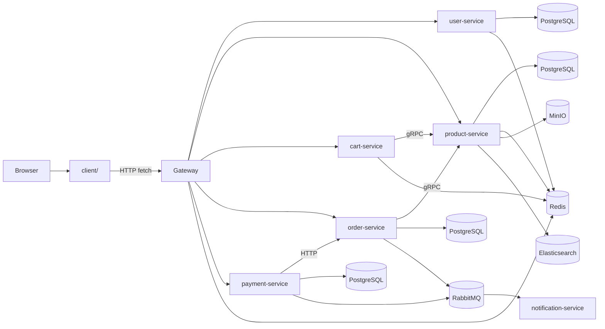
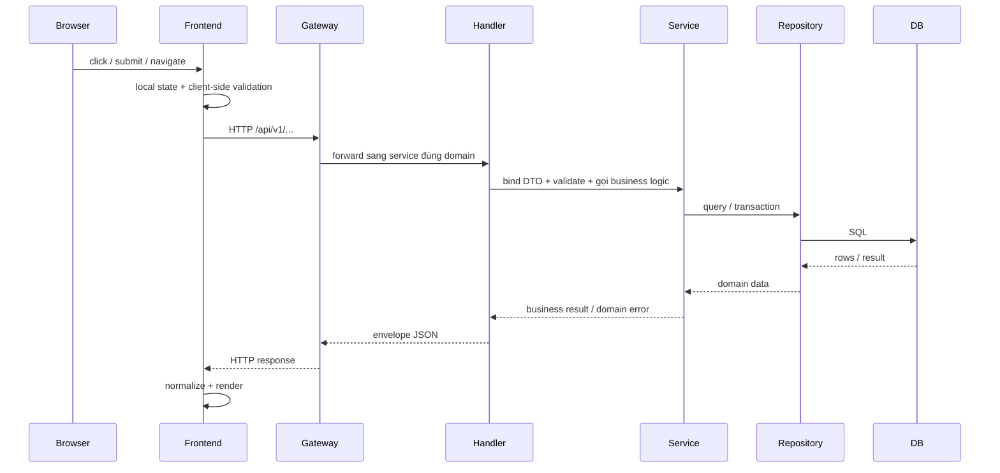
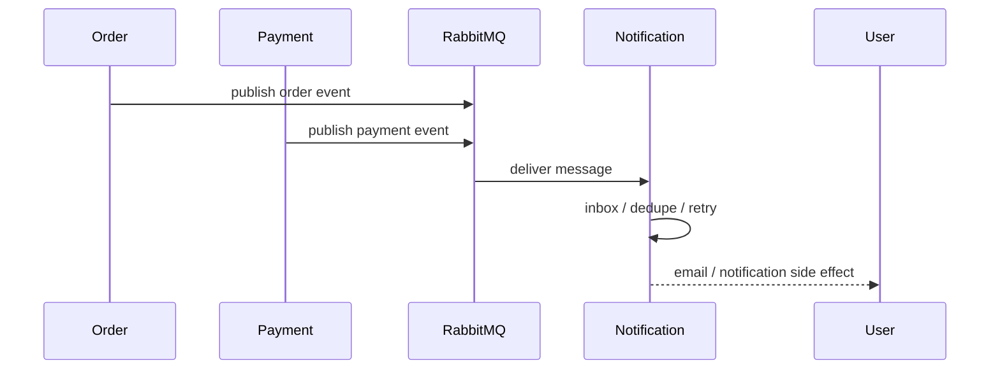

# LOGIC_FLOW

Tài liệu này mô tả luồng hoạt động của repo theo đúng source hiện tại. Mục tiêu là:

- hiểu hệ thống từ UI tới DB và async worker
- biết mở file nào trước khi đọc hoặc sửa một flow
- nhìn đúng source of truth của từng phần
- dùng repo này như một case study thực tế cho backend Go và commerce product flow

Tài liệu này ưu tiên thực dụng. Nó không cố mô tả một kiến trúc "đẹp trên giấy", mà mô tả những gì repo đang thật sự làm.

---

## 1. Bức Tranh Tổng Thể

Các khối chính hiện tại:

- `client/`: Next.js runtime mặc định cho shopper/account/admin product trong Docker Compose
- `frontend/`: React + Vite legacy cho workbook/local verification cũ
- `api-gateway/`: cửa vào HTTP chung
- `services/user-service/`
- `services/product-service/`
- `services/cart-service/`
- `services/order-service/`
- `services/payment-service/`
- `services/notification-service/`
- `pkg/`: config, logger, middleware, response, observability, validation
- `proto/`: gRPC contracts
- `deployments/docker/`: local runtime gần production nhất

### Kiến trúc mức cao

```mermaid
flowchart LR
    Browser --> Client[client/]

    Client -->|HTTP fetch| Gateway

    Gateway --> User[user-service]
    Gateway --> Product[product-service]
    Gateway --> Cart[cart-service]
    Gateway --> Order[order-service]
    Gateway --> Payment[payment-service]

    Cart -->|gRPC| Product
    Order -->|gRPC| Product
    Payment -->|HTTP| Order

    User --> UserDB[(PostgreSQL)]
    Product --> ProductDB[(PostgreSQL)]
    Order --> OrderDB[(PostgreSQL)]
    Payment --> PaymentDB[(PostgreSQL)]

    Cart --> Redis[(Redis)]
    Gateway --> Redis
    User --> Redis
    Product --> Redis
    Order --> Rabbit[(RabbitMQ)]
    Payment --> Rabbit
    Rabbit --> Notification[notification-service]

    Product --> MinIO[(MinIO)]
    Product --> Elastic[(Elasticsearch)]
```

---

## 2. Những Điều Cần Hiểu Đúng Ngay Từ Đầu

### 2.1. `client/` là UI runtime chính

Trong local compose:

- `client` chạy ở `http://localhost:3000` và là shopper/account/admin product runtime mặc định
- admin sản phẩm chạy ở `http://localhost:3000/admin`
- `api-gateway` chạy ở `http://localhost:8080`
- `nginx` ở `http://localhost` không phải storefront chính

### 2.2. `frontend/` không còn chạy mặc định trong Compose

Compose hiện chạy `client` mặc định. `frontend/` vẫn tồn tại trong repo cho tooling/workbook và một số màn admin cũ, nhưng không còn là localhost mặc định.

### 2.3. PostgreSQL là source of truth

Đây là điểm tư duy rất quan trọng:

- PostgreSQL giữ dữ liệu chính của user, product, order, payment
- Redis chỉ là storage/phụ trợ cho cart, cache, rate limit hoặc state tạm
- RabbitMQ dùng cho async side effects
- MinIO và Elasticsearch là optional integration

### 2.4. Không phải flow nào cũng fully hardened

Một số flow đã khá chắc, một số flow vẫn là vùng nên đầu tư tiếp:

- payment create/refund đã có idempotency
- create order đã nhận `Idempotency-Key` và replay theo `user + key + request hash`
- stock reservation hiện được giữ ở lúc create order, có TTL release khi đơn pending quá hạn, và được allocate khi payment hoàn tất
- guest cart merge đã có API backend; các vùng nên đầu tư tiếp nhiều hơn hiện là observability, admin scale path, và shopper UX

---

## 3. Cách Đọc Repo Theo Flow Thay Vì Theo Folder

Nếu bạn muốn hiểu một flow thật, hãy đi theo trình tự:

1. bắt đầu từ page `client/` hoặc `frontend/` đang thật sự gọi flow đó
2. tìm API module frontend gọi
3. mở gateway handler tương ứng
4. mở service handler
5. mở business service
6. mở repository / migration
7. nếu flow async, đọc tiếp producer/consumer

### Ví dụ với checkout

1. `frontend/src/pages/storefront/checkout-page.tsx`
2. `frontend/src/services/api/modules/order-api.ts`
3. `api-gateway/internal/handler/order_handler.go`
4. `services/order-service/internal/handler/order_handler.go`
5. `services/order-service/internal/service/order_pricing.go`
6. `services/order-service/internal/service/order_lifecycle.go`
7. `services/order-service/internal/repository/order_repository.go`

Đây là cách đọc ít bị ngợp nhất và cũng là cách sửa code an toàn nhất.

---

## 4. Luồng Chung Của Một Request HTTP

```mermaid
sequenceDiagram
    participant Browser
    participant Frontend
    participant Gateway
    participant Handler
    participant Service
    participant Repository
    participant DB

    Browser->>Frontend: click / submit / navigate
    Frontend->>Frontend: local state + client-side validation
    Frontend->>Gateway: HTTP /api/v1/...
    Gateway->>Handler: forward sang service đúng domain
    Handler->>Service: bind DTO + validate + gọi business logic
    Service->>Repository: query / transaction
    Repository->>DB: SQL
    DB-->>Repository: rows / result
    Repository-->>Service: domain data
    Service-->>Handler: business result / domain error
    Handler-->>Gateway: envelope JSON
    Gateway-->>Frontend: HTTP response
    Frontend->>Frontend: normalize + render
```

Các lớp trách nhiệm:

- `handler`: parse request, validate boundary, map response
- `service`: business logic và orchestration
- `repository`: SQL và transaction

---

## 5. Flow Chính Theo Domain

## 5.1. Auth, Profile, Email, Phone Verification

### Người dùng đi qua đâu

1. user mở login/register/profile pages ở shopper surface (`client/`) hoặc local verification/admin-adjacent surface (`frontend/`)
2. frontend gọi `frontend/src/services/api/modules/auth-api.ts` hoặc `user-api.ts`
3. request vào `api-gateway/internal/handler/user_handler.go`
4. gateway forward tới `user-service`
5. `user-service/internal/handler` bind request
6. `user-service/internal/service` xử lý auth/profile/verification
7. `repository` đọc/ghi PostgreSQL và các store phụ trợ cần thiết

### Những gì đang đáng chú ý

- email verification có OTP flow riêng
- phone verification hiện đi qua Telegram OTP, không phải SMS gateway
- profile, avatar, wishlist, addresses đều đi qua `user-service`

### File nên mở

- `frontend/src/pages/auth/`
- `frontend/src/pages/account/`
- `frontend/src/services/api/modules/auth-api.ts`
- `api-gateway/internal/handler/user_handler.go`
- `services/user-service/internal/handler/`
- `services/user-service/internal/service/`

---

## 5.2. Storefront Home, Category, Catalog, Product Detail

### Luồng chính

1. frontend page gọi API storefront hoặc product API
2. gateway forward sang `product-service` hoặc `order-service` tùy route
3. `product-service` trả dữ liệu catalog, review, search assist, storefront category data
4. frontend normalizer biến response về shape dùng cho UI

### File nên mở

- `frontend/src/pages/storefront/home-page.tsx`
- `frontend/src/pages/storefront/catalog-page.tsx`
- `frontend/src/pages/storefront/category-page.tsx`
- `frontend/src/pages/storefront/product-detail-page.tsx`
- `frontend/src/services/api/modules/product-api.ts`
- `frontend/src/services/api/modules/storefront-api.ts`
- `services/product-service/internal/service/storefront_service.go`
- `services/product-service/internal/service/product_service.go`

### Điều đáng chú ý

- product listing public dùng cursor pagination
- admin order ledger cũng đã có cursor pagination cho dashboard path nóng
- review flow đã có caching và transaction logic tương đối tốt
- storefront category pages đang là một lớp UI được tùy biến khá sâu so với catalog list đơn thuần

---

## 5.3. Cart

### Luồng chính

1. user thao tác cart ở frontend
2. `CartProvider` hoặc API module gọi `/api/v1/cart`
3. gateway forward sang `cart-service`
4. `cart-service` lưu giỏ hàng ở Redis
5. khi cần xác thực dữ liệu sản phẩm, `cart-service` gọi `product-service` qua gRPC

### File nên mở

- `frontend/src/features/cart/providers/cart-provider.tsx`
- `frontend/src/pages/storefront/cart-page.tsx`
- `frontend/src/services/api/modules/cart-api.ts`
- `api-gateway/internal/handler/cart_handler.go`
- `services/cart-service/internal/handler/`
- `services/cart-service/internal/service/`

### Điều đáng chú ý

- giỏ hàng guest vẫn có logic local ở frontend
- merge guest cart sau login giờ đi qua `POST /api/v1/cart/merge`, giúp auth transition bớt phụ thuộc vào replay nhiều lần từ client

---

## 5.4. Checkout, Order Preview, Create Order

### Luồng chính

1. checkout page thu thông tin cần thiết
2. frontend gọi `POST /api/v1/orders/preview`
3. gateway forward sang `order-service`
4. `order_pricing.go` tính subtotal, shipping, coupon, total
5. khi user xác nhận, frontend gọi `POST /api/v1/orders`
6. `order_lifecycle.go` tạo order, order items, event/audit liên quan

### File nên mở

- `frontend/src/pages/storefront/checkout-page.tsx`
- `frontend/src/services/api/modules/order-api.ts`
- `api-gateway/internal/handler/order_handler.go`
- `services/order-service/internal/handler/order_handler.go`
- `services/order-service/internal/service/order_pricing.go`
- `services/order-service/internal/service/order_lifecycle.go`
- `services/order-service/internal/repository/order_repository.go`

### Điều đáng chú ý

- checkout UI hiện đã tối giản form giao hàng so với trước
- user-service vẫn còn address APIs cho profile/account use cases
- create order là một trong những flow đáng đầu tư thêm về idempotency

---

## 5.5. Payment, Refund, Webhook

### Luồng chính

1. frontend gọi `POST /api/v1/payments`
2. gateway forward sang `payment-service`
3. `payment-service` tạo payment record
4. khi payment hoàn tất hoặc fail, service publish event
5. webhook MoMo đi vào `/api/v1/payments/webhooks/momo`
6. payment status được cập nhật rồi đồng bộ tiếp sang order flow

### File nên mở

- `frontend/src/services/api/modules/payment-api.ts`
- `api-gateway/internal/handler/payment_handler.go`
- `services/payment-service/internal/handler/`
- `services/payment-service/internal/service/payment_processing.go`
- `services/payment-service/internal/service/payment_refunds.go`
- `services/payment-service/internal/service/payment_idempotency.go`
- `services/payment-service/internal/repository/`

### Điều đáng chú ý

- payment create path đã có idempotency key handling
- refund path cũng đã có idempotency support
- webhook signature được verify
- retry story end-to-end vẫn là vùng nên kiểm chứng kỹ khi mở rộng

---

## 5.6. Returns Và Async Refund Queue

### Luồng chính

1. user tạo return request từ order
2. return được lưu ở `order-service`
3. admin duyệt hoặc đổi trạng thái return
4. admin có thể queue refund
5. background flow xử lý refund pending và đồng bộ payment state

### File nên mở

- `frontend/src/pages/account/return-detail-page.tsx`
- `frontend/src/features/admin/components/admin-returns-section.tsx`
- `api-gateway/internal/handler/order_handler.go`
- `services/order-service/internal/handler/order_handler.go`
- `services/order-service/internal/service/`
- `services/order-service/internal/repository/order_repository.go`

### Điều đáng chú ý

- đây là flow chạm cả order, payment và admin vận hành
- refund queue observability đã có nền nhưng vẫn là vùng đáng đầu tư tiếp

---

## 5.7. Event-Driven Flow: Order / Payment / Notification

### Luồng async mức cao

```mermaid
sequenceDiagram
    participant Order
    participant Payment
    participant RabbitMQ
    participant Notification

    Order->>RabbitMQ: publish order event
    Payment->>RabbitMQ: publish payment event
    RabbitMQ->>Notification: deliver message
    Notification->>Notification: inbox / dedupe / retry
    Notification-->>User: email / notification side effect
```

### Những điểm chính

- `order-service` và `payment-service` phát event bất đồng bộ
- `notification-service` consume message và xử lý side effect
- outbox/inbox pattern là vùng đáng học rất tốt nếu bạn muốn hiểu backend production

### File nên mở

- `services/order-service/internal/model/messaging.go`
- `services/payment-service/internal/model/messaging.go`
- `services/notification-service/internal/handler/event_handler.go`
- `services/notification-service/internal/inbox/`

---

## 6. Frontend Data Flow

Frontend hiện đã gom API layer khá rõ ràng:

- `frontend/src/services/api/http-client.ts`
- `frontend/src/services/api/modules/*.ts`
- `frontend/src/services/api/normalizers.ts`

Luồng dữ liệu thường là:

1. page hoặc feature component gọi API module
2. `http-client.ts` gửi request, đính token nếu có
3. response được parse theo envelope
4. `normalizers.ts` chuẩn hóa dữ liệu
5. page render theo shape ổn định hơn

Các provider đáng chú ý:

- `frontend/src/app/providers/app-providers.tsx`
- `frontend/src/features/auth/providers/auth-provider.tsx`
- `frontend/src/features/cart/providers/cart-provider.tsx`

Entrypoint app:

- `frontend/src/app/app.tsx`

---

## 7. Những Flow Nên Học Nếu Muốn Lên Tay Nhanh

Nếu bạn muốn hiểu repo nhanh mà vẫn có giá trị nghề nghiệp, hãy ưu tiên:

1. login -> profile
2. catalog -> product detail
3. cart -> checkout -> order preview
4. create order -> create payment
5. return -> refund
6. payment event -> notification

Đây là 6 flow giúp bạn chạm đủ:

- UI
- gateway
- service layering
- SQL
- idempotency
- async workflow

---

## 8. Những Chỗ Dễ Hiểu Sai Hoặc Dễ Vỡ

### Route helper cũ không luôn là contract thật

Một số helper/test expectation cũ có thể vẫn nhắc tới route không còn expose đầy đủ. Khi nghi ngờ, luôn kiểm tra lại gateway handler thật.

### Không phải mọi feature UI đều có backend flow hoàn chỉnh

Một số trang account/admin có thể đi trước hoặc đi sau backend capability. Khi sửa, cần rà cả UI lẫn gateway route thật.

### `frontend/` không nên được giả định là UI runtime mặc định

Hiện tại shopper/account/admin product flow trong local stack nên được verify trên `client` ở `3000`. `frontend/` chỉ còn là bề mặt legacy khi cần tooling cũ.

---

## 9. Cách Tự Lần Một Bug Hoặc Một Feature

Khi user báo lỗi hoặc khi bạn muốn thêm feature:

1. xác định page nào bị ảnh hưởng
2. tìm API module được gọi
3. kiểm tra gateway route
4. kiểm tra service handler
5. kiểm tra business logic
6. nếu là write flow, kiểm tra repository + migration + event
7. verify lại bằng UI, API, và log

Đây là quy trình ít tạo nợ kỹ thuật nhất vì nó giúp bạn nhìn cả flow thay vì vá một điểm rời rạc.

---

## 10. Kết Luận

Repo này đáng học vì nó không chỉ là CRUD đơn giản. Nó có đủ các lớp quan trọng của một commerce system thực tế:

- auth và profile
- catalog và search
- cart và checkout
- order và payment
- return và refund
- async notification
- observability và Docker runtime

Nếu bạn muốn dùng repo này để trưởng thành theo hướng Golang backend developer, hãy giữ một thói quen rất quan trọng:

> Mỗi lần đọc hoặc sửa code, luôn đi theo flow thật từ UI hoặc API boundary vào tận service và persistence, thay vì chỉ mở ngẫu nhiên từng file.

---

## 11. Invariant Thật Nằm Ở Đâu Theo Flow

Đây là phần rất hay bị bỏ qua khi đọc theo kiểu “handler gọi service rồi xong”. Với repo này, correctness thật thường nằm ở một số file và function rất cụ thể.

### 11.1. Auth và profile

Invariant chính:

- email/phone uniqueness không nằm ở pre-check frontend hay service, mà nằm ở constraint và map lỗi trong `userrepo`
- profile update nhiều bước được gom lại nhờ `ProfileTxManager.RunInTx`

File nên mở:

- `services/user-service/internal/repository/userrepo/user_repository.go`
- `services/user-service/internal/repository/profile_tx_manager.go`
- `services/user-service/internal/repository/addressrepo/repository.go`

### 11.2. Catalog và inventory

Invariant chính:

- cursor catalog phải stable theo sort thật
- stock không được âm khi concurrent write

File nên mở:

- `services/product-service/internal/repository/product/product_repository.go`
- `decodeProductListCursor`
- `appendCursorClause`
- `UpdateStock`

### 11.3. Create order

Invariant chính:

- order, order items, first event, outbox và idempotency record phải cùng commit
- coupon usage limit phải được serialize ở DB row

File nên mở:

- `services/order-service/internal/service/order/order_lifecycle.go`
- `services/order-service/internal/repository/order_repository.go`
- `createOrderTx`
- `lockAndConsumeCoupon`

### 11.4. Payment create, refund, webhook

Invariant chính:

- create/refund phải replay-safe qua `Idempotency-Key`
- webhook duplicate không được nhân đôi state transition

File nên mở:

- `services/payment-service/internal/service/payment/payment_processing.go`
- `services/payment-service/internal/service/payment/payment_refunds.go`
- `services/payment-service/internal/repository/payment/payment_repository.go`
- `ApplyWebhookResult`

### 11.5. Returns và refund worker

Invariant chính:

- mỗi return chỉ được một worker claim ở một thời điểm
- retry metadata phải nằm lại trong DB để reclaim khi worker chết

File nên mở:

- `services/order-service/internal/service/order_return_refund_worker.go`
- `services/order-service/internal/repository/order_repository.go`
- `ClaimPendingReturnRefunds`
- `MarkReturnRefundAttemptFailed`
- `CompleteReturnRefund`

### 11.6. Notification async

Invariant chính:

- message có thể bị giao lại, nên dedupe và retry phải explicit

File nên mở:

- `services/notification-service/internal/inbox/redis_store.go`
- `services/notification-service/internal/messaging/retry_publisher.go`
- `services/notification-service/internal/handler/event_handler.go`

## 12. Pattern Hot Path Nên Nhận Ra Ngay Khi Đọc Repo

Nếu bạn đọc source mà nhận ra được 6 pattern dưới đây, bạn đã bắt đầu nhìn repo như một backend production thay vì một bài CRUD.

### 12.1. Transaction bundle

Ví dụ:

- `createOrderTx`
- `CreateWithIdempotency`
- `ProfileTxManager.RunInTx`

Ý nghĩa:

- nhiều write phải thành công hoặc thất bại cùng nhau

### 12.2. Compare-and-set bằng SQL

Ví dụ:

- `UpdateStock`
- `ExpirePendingReservation`
- `ApplyWebhookResult`

Ý nghĩa:

- condition giữ invariant nằm trong `WHERE`
- `RowsAffected` quyết định mutate hay no-op

### 12.3. Row lock

Ví dụ:

- `lockAndConsumeCoupon`
- `GetReviewByProductAndUserForUpdate`
- `SELECT ... FOR UPDATE` trong inbox transition

Ý nghĩa:

- serialize critical state ở DB thay vì mutex trong Go

### 12.4. Cursor pagination

Ví dụ:

- product catalog
- order list by cursor

Ý nghĩa:

- tránh cost `COUNT(*) + OFFSET`
- giữ ordering deterministic với tie-breaker

### 12.5. Lease claim

Ví dụ:

- `ClaimPendingOutbox`
- `ClaimPendingReturnRefunds`
- Redis claim trong notification inbox

Ý nghĩa:

- nhiều worker chạy song song mà không xử lý cùng một việc cùng lúc

### 12.6. Outbox / inbox / idempotency

Ví dụ:

- outbox ở order/payment
- inbox transition ở order/payment
- idempotency key cho order/payment/refund

Ý nghĩa:

- retry-safe async
- webhook replay-safe
- POST side effect chịu được client retry
