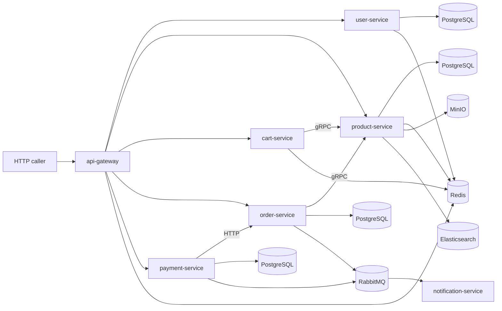
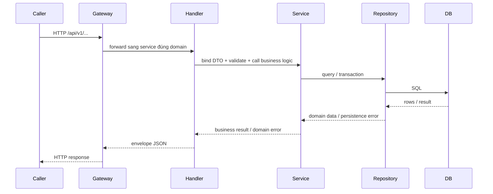
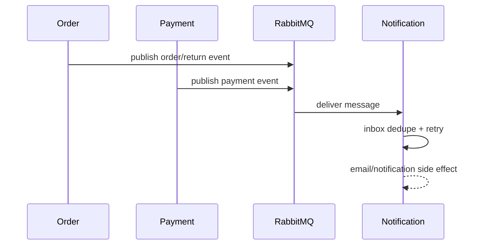

# LOGIC_FLOW

Tài liệu này mô tả luồng backend của repo theo source hiện tại. Mục tiêu:

- hiểu request đi từ gateway tới service, repository, database và async worker
- biết file backend nào cần mở trước khi sửa một flow
- nhìn đúng source of truth của từng domain
- giữ code mới bám đúng layering Go backend

---

## 1. Bức Tranh Tổng Thể

Các khối backend chính:

- `api-gateway/`: cửa vào HTTP chung, auth middleware, role gate, proxy, tracing, metrics.
- `services/user-service/`: auth, profile, address, wishlist, verification, OAuth.
- `services/product-service/`: product, catalog, review, upload, search, gRPC product lookup.
- `services/cart-service/`: cart trên Redis, validate product qua gRPC.
- `services/order-service/`: order, coupon, return, refund queue, order event.
- `services/payment-service/`: payment, refund, webhook, payment event.
- `services/notification-service/`: RabbitMQ consumer, inbox dedupe, retry publisher, email worker.
- `pkg/`: config, database, logger, middleware, observability, response, validation.
- `proto/`: gRPC contracts giữa services.
- `deployments/docker/`: runtime local gần production nhất.

```mermaid
flowchart LR
    Caller[HTTP caller] --> Gateway[api-gateway]
    Gateway --> User[user-service]
    Gateway --> Product[product-service]
    Gateway --> Cart[cart-service]
    Gateway --> Order[order-service]
    Gateway --> Payment[payment-service]

    Cart -->|gRPC| Product
    Order -->|gRPC| Product
    Payment -->|HTTP| Order

    User --> UserDB[(PostgreSQL)]
    Product --> ProductDB[(PostgreSQL)]
    Order --> OrderDB[(PostgreSQL)]
    Payment --> PaymentDB[(PostgreSQL)]

    Cart --> Redis[(Redis)]
    Gateway --> Redis
    User --> Redis
    Product --> Redis

    Order --> Rabbit[(RabbitMQ)]
    Payment --> Rabbit
    Rabbit --> Notification[notification-service]

    Product --> MinIO[(MinIO)]
    Product --> Elastic[(Elasticsearch)]
```

---

## 2. Source Of Truth

- PostgreSQL giữ dữ liệu chính của user, product, order và payment.
- Redis phục vụ cart, rate limit, cache, inbox dedupe hoặc state tạm.
- RabbitMQ phục vụ async side effects.
- MinIO phục vụ media/object storage khi config bật.
- Elasticsearch phục vụ search/index khi config bật.
- Optional integration phải degrade gracefully khi nghiệp vụ cho phép.

---

## 3. Cách Đọc Một Flow Backend

Trình tự đọc an toàn:

1. Mở gateway handler ở `api-gateway/internal/handler/`.
2. Kiểm tra proxy layer ở `api-gateway/internal/proxy/` nếu route đi qua reverse proxy.
3. Mở service handler ở `services/<service>/internal/handler/`.
4. Mở business service ở `services/<service>/internal/service/`.
5. Mở repository ở `services/<service>/internal/repository/`.
6. Mở model/DTO ở `services/<service>/internal/model/` và `services/<service>/internal/dto/`.
7. Mở migration nếu flow ghi PostgreSQL.
8. Mở producer/consumer/outbox/inbox nếu flow có async side effect.

Không bắt đầu từ helper phụ nếu chưa biết route và service boundary thật.

---

## 4. Luồng Chung Của HTTP Request

```mermaid
sequenceDiagram
    participant Caller
    participant Gateway
    participant Handler
    participant Service
    participant Repository
    participant DB

    Caller->>Gateway: HTTP /api/v1/...
    Gateway->>Handler: forward sang service đúng domain
    Handler->>Service: bind DTO + validate + call business logic
    Service->>Repository: query / transaction
    Repository->>DB: SQL
    DB-->>Repository: rows / result
    Repository-->>Service: domain data / persistence error
    Service-->>Handler: business result / domain error
    Handler-->>Gateway: envelope JSON
    Gateway-->>Caller: HTTP response
```

Layer responsibility:

- `handler`: parse request, validate boundary, map response.
- `service`: business logic, rule nghiệp vụ, orchestration, transaction decision.
- `repository`: SQL, Redis, RabbitMQ persistence helpers, lock, scan row.

---

## 5. Auth, Profile, Email, Phone Verification

Luồng chính:

1. Request vào `api-gateway/internal/handler/user_handler.go`.
2. Gateway forward tới `user-service`.
3. `services/user-service/internal/handler/` bind request và auth context.
4. `services/user-service/internal/service/` xử lý auth/profile/verification.
5. Repository đọc/ghi PostgreSQL và Redis nếu cần.

File nên mở:

- `api-gateway/internal/handler/user_handler.go`
- `services/user-service/internal/handler/`
- `services/user-service/internal/service/`
- `services/user-service/internal/repository/userrepo/user_repository.go`
- `services/user-service/internal/repository/profile_tx_manager.go`
- `services/user-service/internal/repository/addressrepo/repository.go`

Invariant:

- email/phone uniqueness phải được giữ bằng DB constraint và map lỗi repository.
- profile update nhiều bước phải giữ transaction qua `ProfileTxManager.RunInTx`.
- OTP flow phải có TTL, resend cooldown, max attempts và rate limit.

---

## 6. Product, Catalog, Search, Review

Luồng chính:

1. Product/catalog request vào gateway.
2. Gateway forward tới `product-service`.
3. Handler bind query/body.
4. Service xử lý catalog, product, review, upload hoặc search assist.
5. Repository đọc/ghi PostgreSQL, Redis cache, MinIO, Elasticsearch tùy config.

File nên mở:

- `api-gateway/internal/handler/product_handler.go`
- `services/product-service/internal/handler/`
- `services/product-service/internal/service/product_service.go`
- `services/product-service/internal/service/product_queries.go`
- `services/product-service/internal/service/storefront_service.go`
- `services/product-service/internal/repository/product/product_repository.go`
- `services/product-service/internal/repository/product_review_repository.go`

Invariant:

- catalog cursor phải stable theo sort thật.
- ordering cần tie-breaker ổn định.
- stock không được âm khi concurrent write.
- reservation theo order phải all-or-nothing và idempotent (ledger `stock_reservations`).
- review aggregate update phải transaction-safe.
- MinIO và Elasticsearch là optional integration.

Hot path:

- `decodeProductListCursor`
- `appendCursorClause`
- `UpdateStock`
- `ReserveStockForOrder` / `ReleaseStockForOrder`
- `AdjustStock`
- `ApplyReviewSummaryDelta`

### 6.1. Nhập kho và điều chỉnh tồn

Luồng chính:

1. `POST /api/v1/products/:id/stock-adjustments` (admin/staff) vào gateway.
2. Gateway forward tới `product-service`.
3. `AdjustStock` ở service validate: `delta` khác 0, `reason` nằm trong tập đóng,
   `sku` bắt buộc nếu sản phẩm có variant.
4. Repository lấy row lock `SELECT ... FOR UPDATE` trên sản phẩm — **cùng khoá mà
   `ReserveStockForOrder` dùng** — rồi áp delta vào đúng bể tồn kho và ghi một
   dòng `stock_adjustments` trong cùng transaction.
5. `GET /api/v1/products/:id/stock-adjustments` trả sổ cái để đối chiếu kiểm kê.

File nên mở:

- `services/product-service/internal/handler/product/product_handler.go`
- `services/product-service/internal/service/product_stock_adjustments.go`
- `services/product-service/internal/repository/product/product_stock_adjustment_repository.go`

Invariant:

- tồn kho không bao giờ được âm; delta trừ quá tay bị từ chối và **không để lại
  dòng sổ cái nào**, vì một dòng sổ cái phải luôn tương ứng với một biến động có
  thật.
- nhập kho và giữ chỗ checkout phải serialize với nhau. Cộng mù kiểu
  `stock = stock + $1` sẽ đua với reservation đang đọc số tồn cũ, nên cả hai đi
  qua cùng một row lock.
- `Idempotency-Key` biến lần gửi lại thành no-op. Không có nó, một cú double-click
  lúc nhập kho thổi phồng tồn kho âm thầm và chỉ lộ ra khi kiểm kê.
- lý do là tập đóng chứ không phải text tự do, để lọc được "lệch vì hỏng hàng"
  khỏi "lệch vì nhập thiếu".

---

## 7. Cart

Luồng chính:

1. Cart request vào gateway.
2. Gateway forward tới `cart-service`.
3. `cart-service` lưu cart ở Redis.
4. Khi cần product truth, `cart-service` gọi `product-service` qua gRPC.

File nên mở:

- `api-gateway/internal/handler/cart_handler.go`
- `services/cart-service/internal/handler/`
- `services/cart-service/internal/service/`
- `services/cart-service/internal/repository/`
- `proto/`

Invariant:

- Redis là storage cart, không phải source of truth cho inventory.
- Product existence, price và availability phải kiểm tra qua product-service khi cần.
- Concurrent cart write hiện cần được theo dõi nếu vẫn là last-write-wins.

---

## 8. Checkout, Order Preview, Create Order

Luồng chính:

1. `POST /api/v1/orders/preview` vào gateway.
2. Gateway forward tới `order-service`.
3. `order_pricing.go` tính subtotal, shipping, coupon, total.
4. `POST /api/v1/orders` tạo order với `Idempotency-Key`.
5. `order-service` gọi gRPC `ReserveStock` sang `product-service`: giữ chỗ tồn kho
   all-or-nothing cho mọi item, idempotent theo `order_id` (ledger
   `stock_reservations`, khoá theo `(order_id, product_id, sku)`, dưới row lock
   `SELECT ... FOR UPDATE` trên sản phẩm trong một transaction).
6. `order_lifecycle.go` tạo order, item, event, outbox và idempotency record;
   nếu persist fail thì gọi `ReleaseStock` bù trừ.
7. Đơn pending không thanh toán trong 15 phút bị `StartReservationExpiryWorker`
   hủy và trả kho qua `ReleaseStock` (retry qua cột `stock_released_at`).

File nên mở:

- `api-gateway/internal/handler/order_handler.go`
- `services/order-service/internal/handler/order_handler.go`
- `services/order-service/internal/service/order/order_pricing.go`
- `services/order-service/internal/service/order/order_lifecycle.go`
- `services/order-service/internal/service/order/order_reservation_expiry_worker.go`
- `services/order-service/internal/repository/order_repository.go`
- `services/product-service/internal/repository/product/product_stock_reservation_repository.go`

Invariant:

- order, order items, first event, outbox và idempotency record phải cùng commit.
- coupon usage limit phải serialize bằng DB row lock.
- order create replay-safe theo actor, idempotency key và request hash.
- reserve stock all-or-nothing và idempotent theo `order_id`; release idempotent
  (ledger `stock_reservations` quyết định, không cộng kho hai lần).
- giữ chỗ phải trỏ đúng variant: sản phẩm có khai báo `variants` thì mọi dòng
  đơn bắt buộc mang `sku`, và tồn kho bị trừ ở bể của chính variant đó chứ không
  phải `products.stock`. Thiếu điều này thì size M và size L cùng rút một bộ đếm
  và vẫn oversell theo size dù reservation đã đúng ở mức sản phẩm.
- `products.stock` chỉ là tổng hợp để listing/badge dùng; nó đi theo cùng delta
  với variant chứ không phải nguồn sự thật khi mua.
- load test chống oversell: `tests/load/run_oversell.sh`.

Hot path:

- `createOrderTx`
- `lockAndConsumeCoupon`
- `GetIdempotencyKey`
- `CreateOrder`
- `ReserveStockForOrder` / `ReleaseStockForOrder`
- `StartReservationExpiryWorker`

---

## 9. Payment, Refund, Webhook

Luồng chính:

1. `POST /api/v1/payments` vào gateway.
2. Gateway forward tới `payment-service`.
3. `payment-service` tạo payment record với idempotency.
4. Payment event được publish qua outbox/RabbitMQ.
5. Webhook của cổng vào `/api/v1/payments/webhooks/momo` hoặc `/api/v1/payments/webhooks/vnpay`.
6. Handler dịch payload về `service.GatewayWebhook` (dạng trung tính) rồi gọi `HandleGatewayWebhook`.
7. Webhook được verify signature (theo `PaymentGateway` của từng provider), dedupe qua inbox và guarded update bằng compare-and-set.
8. Payment state sync sang order flow khi cần.

Provider được chọn qua interface `PaymentGateway` (`internal/service/payment/gateway.go`):
`manual` chốt ngay, `momo` và `vnpay` dừng ở `pending` cho tới khi webhook xác thực gọi về.
Cổng nào thiếu secret thì không được đăng ký, và request chọn phương thức đó nhận
`ErrUnsupportedPaymentMethod` ngay ở biên.

File nên mở:

- `api-gateway/internal/handler/payment_handler.go`
- `services/payment-service/internal/handler/`
- `services/payment-service/internal/service/payment/gateway.go`
- `services/payment-service/internal/service/payment/gateway_momo.go`
- `services/payment-service/internal/service/payment/gateway_vnpay.go`
- `services/payment-service/internal/service/payment/payment_processing.go`
- `services/payment-service/internal/service/payment/payment_refunds.go`
- `services/payment-service/internal/service/payment/payment_idempotency.go`
- `services/payment-service/internal/repository/payment/payment_repository.go`

Invariant:

- create/refund phải replay-safe qua `Idempotency-Key`.
- webhook duplicate không được nhân đôi state transition.
- signature webhook phải được verify.
- audit/outbox phải đi cùng write quan trọng.

Hot path:

- `ApplyWebhookResult`
- `RefundPayment`
- `hashRefundPaymentRequest`
- `loadEnrichedPayment`

---

## 10. Returns Và Async Refund Queue

Luồng chính:

1. User tạo return request từ order.
2. Return được lưu ở `order-service`.
3. Admin/staff đổi trạng thái return khi phù hợp.
4. Refund được queue bằng trạng thái `refund_pending`.
5. Worker claim return đến hạn và gọi `payment-service` bằng idempotency key.
6. Return hoàn tất khi refund thành công.

File nên mở:

- `api-gateway/internal/handler/order_handler.go`
- `services/order-service/internal/handler/order_handler.go`
- `services/order-service/internal/service/order_returns.go`
- `services/order-service/internal/service/order_return_refund_worker.go`
- `services/order-service/internal/repository/order_repository.go`

Invariant:

- over-return phải bị chặn.
- return status transition phải hợp lệ.
- `refund_pending` giữ retry metadata trong DB.
- mỗi return chỉ được một worker claim tại một thời điểm.
- worker crash không được làm mất job.

Hot path:

- `RequestReturnRefund`
- `prepareReturnRefund`
- `ClaimPendingReturnRefunds`
- `MarkReturnRefundAttemptFailed`
- `CompleteReturnRefund`

---

## 11. Event-Driven Flow

```mermaid
sequenceDiagram
    participant Order
    participant Payment
    participant RabbitMQ
    participant Notification

    Order->>RabbitMQ: publish order/return event
    Payment->>RabbitMQ: publish payment event
    RabbitMQ->>Notification: deliver message
    Notification->>Notification: inbox dedupe + retry
    Notification-->>Notification: email/notification side effect
```

File nên mở:

- `services/order-service/internal/model/messaging.go`
- `services/payment-service/internal/model/messaging.go`
- `services/notification-service/internal/handler/event_handler.go` (pipeline nhận message; handler theo từng event ở `event_handler_events.go`)
- `services/notification-service/internal/inbox/`
- `services/notification-service/internal/messaging/retry_publisher.go`

Invariant:

- message có thể bị giao lại.
- consumer phải dedupe rõ ràng.
- retry phải explicit.
- outbox event không được tách khỏi transaction tạo business state.

---

## 12. Pattern Backend Cần Nhận Ra

### Transaction Bundle

Ví dụ:

- `createOrderTx`
- `CreateWithIdempotency`
- `ProfileTxManager.RunInTx`
- `ProductReviewTxManager.RunInTx`

Ý nghĩa:

- nhiều write phải cùng commit hoặc cùng rollback.

### SQL Compare-And-Set

Ví dụ:

- `UpdateStock`
- `ReserveStockForOrder`
- `ExpirePendingReservation`
- `ApplyWebhookResult`

Ý nghĩa:

- condition giữ invariant nằm trong SQL `WHERE`.
- `RowsAffected` quyết định mutate hay no-op.

### Row Lock

Ví dụ:

- `lockAndConsumeCoupon`
- `GetReviewByProductAndUserForUpdate`
- `SELECT ... FOR UPDATE` trong inbox transition.

Ý nghĩa:

- serialize critical state ở DB thay vì mutex trong Go.

### Cursor Pagination

Ví dụ:

- product catalog.
- order list by cursor.

Ý nghĩa:

- tránh cost `COUNT(*) + OFFSET`.
- giữ ordering deterministic bằng tie-breaker.

### Lease Claim

Ví dụ:

- `ClaimPendingOutbox`
- `ClaimPendingReturnRefunds`
- Redis claim trong notification inbox.

Ý nghĩa:

- nhiều worker chạy song song mà không xử lý cùng một việc cùng lúc.

### Outbox / Inbox / Idempotency

Ví dụ:

- outbox ở order/payment.
- inbox transition ở order/payment.
- idempotency key cho order/payment/refund.

Ý nghĩa:

- retry-safe async.
- webhook replay-safe.
- side-effecting POST chịu được caller retry.

---

## 13. Cách Tự Lần Một Bug Backend

1. Xác định public route hoặc worker bị ảnh hưởng.
2. Kiểm tra gateway handler.
3. Kiểm tra service handler.
4. Kiểm tra business service.
5. Nếu là write flow, kiểm tra repository, migration và transaction.
6. Nếu có async side effect, kiểm tra outbox/inbox/consumer.
7. Verify bằng API, log, trace và DB state.

Không vá một điểm rời rạc nếu chưa hiểu invariant nằm ở tầng nào.
