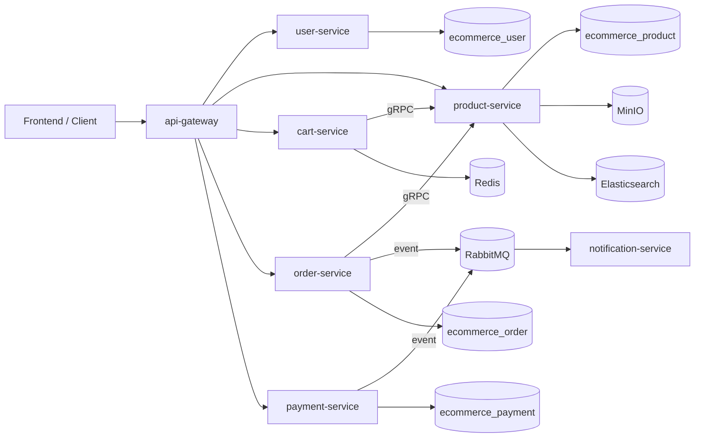

# E-Commerce Platform

Repo này là một nền tảng thương mại điện tử nhiều service viết chủ yếu bằng Go. Runtime local mặc định đi qua `api-gateway`, dùng PostgreSQL làm nguồn dữ liệu chính, Redis cho cart và rate limit, RabbitMQ cho event bất đồng bộ, và có thêm MinIO, Elasticsearch, Prometheus, Grafana, Jaeger trong stack Docker Compose.

Trạng thái hiện tại của UI có hai nhánh:

- `frontend/`: React + Vite, là đường chạy local chính và là frontend đang được dùng để verify end-to-end.
- `client/`: Next.js App Router, chạy tốt trên host ở `3000` và hỗ trợ standalone smoke test; hiện vẫn chưa nằm trong Docker Compose mặc định và chưa được CI build như `frontend/`.

README này ưu tiên phản ánh đúng source code hiện tại. Một số tài liệu sâu hơn trong `docs/` vẫn hữu ích, nhưng nếu có chỗ lệch nhau thì hãy tin `cmd/main.go`, `internal/handler`, `internal/service`, `deployments/docker/` và cấu hình thật trong repo.

## Mục tiêu và kiến trúc tổng quan

Hệ thống đang được tổ chức theo hướng microservices vừa đủ cho domain hiện tại:

- `api-gateway` nhận HTTP từ UI/client và proxy xuống service tương ứng.
- `user-service`, `product-service`, `order-service`, `payment-service` dùng PostgreSQL riêng theo database.
- `cart-service` dùng Redis làm storage chính cho giỏ hàng.
- `product-service` cung cấp gRPC cho `cart-service` và `order-service` để kiểm tra thông tin sản phẩm, giá và tồn kho.
- `order-service` và `payment-service` phát event qua RabbitMQ sử dụng outbox pattern bảo đảm tính bền vững. `notification-service` sử dụng Redis store và inbox pattern để consume event trước khi gửi email báo cáo tình trạng.
- `product-service` có tích hợp MinIO cho media và Elasticsearch cho search, nhưng cả hai được code theo hướng optional/degrade gracefully.



## Thành phần chính của hệ thống

| Thành phần | Vai trò thực tế trong source |
| --- | --- |
| `api-gateway/` | Reverse proxy HTTP dùng Echo, có tracing, metrics, Redis-backed rate limiter, request logging, retry có chọn lọc cho method an toàn và circuit breaker trong proxy layer. |
| `services/user-service/` | Đăng ký, đăng nhập, chuẩn hoá thông tin, profile, đổi role admin, quản lý địa chỉ, cấp refresh token ảo, bảo mật OTP qua Telegram kèm rate limiting, bootstrap tài khoản dev. |
| `services/product-service/` | CRUD sản phẩm, upload ảnh, product review (caching qua Redis, có benchmark đi kèm), listing có cursor pagination và filter, gRPC product lookup, optional Elasticsearch sync, optional MinIO. |
| `services/cart-service/` | Giỏ hàng trên Redis, xác thực dữ liệu sản phẩm qua gRPC product-service, hỗ trợ get/add/update/remove/clear cart cho user đã đăng nhập. |
| `services/order-service/` | Preview order, tạo đơn, lấy lịch sử đơn, timeline/event, hủy đơn, báo cáo admin, coupon, cập nhật trạng thái admin, consume payment event để đồng bộ trạng thái đơn. |
| `services/payment-service/` | Tạo payment, lấy lịch sử/detail, refund, webhook MoMo, publish payment event, gọi `order-service` qua HTTP để lấy dữ liệu đơn. |
| `services/notification-service/` | Worker consume RabbitMQ ứng dụng Redis store vào Inbox pattern, hỗ trợ tính năng retry publisher và đo lường metrics, gửi email cho `order` và `payment` event. |
| `pkg/` | Shared packages cho config, database, logger, middleware, observability, response, validation. |
| `proto/` | Contract gRPC dùng giữa service, hiện rõ nhất ở product gRPC và user gRPC definitions. |
| `frontend/` | Frontend React + Vite được tổ chức kiến trúc theo feature-based modular design, kèm codebase API quy hoạch gọn gàng, và là entrypoint local chính. |
| `client/` | Frontend Next.js App Router cho storefront/account flow, hỗ trợ standalone scripts + chia sẻ API types, chạy độc lập trên host nhưng chưa nằm trong compose mặc định. |
| `deployments/docker/` | Docker Compose, config YAML cho từng service, Prometheus, Grafana provisioning, Nginx edge config, Postgres init script. |

## Hạ tầng, dữ liệu và trạng thái runtime

| Thành phần | Trạng thái trong repo hiện tại |
| --- | --- |
| PostgreSQL | Một container Postgres, nhiều database: `ecommerce_user`, `ecommerce_product`, `ecommerce_order`, `ecommerce_payment`. Đây là nguồn dữ liệu chính. |
| Redis | Dùng cho cart storage và rate limiter. `cart-service` không có PostgreSQL riêng. |
| RabbitMQ | Dùng cho event bất đồng bộ giữa order/payment/notification. RabbitMQ management UI không được publish port trong compose hiện tại. |
| MinIO | Được bật trong compose và được `product-service` dùng cho media upload nếu object storage enabled. |
| Elasticsearch | Được bật trong compose; `product-service` có thể sync index khi startup nếu config bật search. |
| Prometheus/Grafana | Có mặt trong compose và provisioning sẵn, nhưng hiện chưa publish port ra host nên không vào dashboard trực tiếp từ máy host nếu không sửa compose. |
| Jaeger | Có publish `16686` và `4318`, dùng cho tracing local. |
| ORM | Repo hiện không dùng ORM. Layer persistence đi qua `database/sql` + `lib/pq` + SQL migration. |
| Migration/seed | `user-service`, `product-service`, `order-service`, `payment-service` có thư mục `migrations/` và auto-run migration khi service khởi động. Không có bộ seed chung; dữ liệu mẫu rõ nhất là bootstrap tài khoản dev ở `user-service`. |

## Chạy nhanh bằng Docker Compose

Điều kiện tối thiểu:

- Docker Desktop hoặc Docker Engine + Docker Compose plugin
- Go chỉ cần khi bạn muốn chạy test/build ngoài container
- Node.js 22 nếu bạn muốn chạy `frontend/` hoặc `client/` trên host

Luồng khuyến nghị cho người mới:

1. Tạo file môi trường local:

```bash
cp .env.local.example .env.local
```

2. Chỉnh các giá trị cần thiết trong `.env.local`.

Các biến quan trọng nhất:

- `POSTGRES_PASSWORD`, `JWT_SECRET`, `RABBITMQ_PASSWORD`
- `FRONTEND_BASE_URL`
- `SMTP_*` nếu muốn test email thật
- `OAUTH_GOOGLE_*` nếu muốn test Google OAuth
- `TELEGRAM_*` nếu muốn test phone verification qua Telegram

3. Render lại compose để kiểm tra cấu hình:

```bash
make docker-config
```

Lệnh này tạo file compose đã render tại `/tmp/ecommerce-compose.rendered.yaml`.

4. Dựng stack:

```bash
make compose-up
```

Lưu ý: `make compose-up` chạy ở chế độ attached, tức là terminal sẽ bám theo logs. Nếu muốn chạy nền, dùng raw Docker Compose:

```bash
docker compose --env-file .env.local -f deployments/docker/docker-compose.yml up --build -d
```

5. Kiểm tra nhanh:

```bash
curl http://localhost:8080/health
curl http://localhost:4173/health
curl http://localhost/health
```

Các URL thường dùng khi compose đang chạy:

- `http://localhost:4173`: frontend Docker, là UI nên mở đầu tiên
- `http://localhost:8080`: API Gateway
- `http://localhost`: Nginx edge trong `deployments/docker/nginx.conf`, hiện chỉ route `/api/*` và `/health`, không serve frontend
- `http://localhost:9000`: MinIO API
- `http://localhost:9001`: MinIO Console
- `http://localhost:16686`: Jaeger UI
- `http://localhost:9200`: Elasticsearch

Điểm dễ nhầm:

- `frontend` service chạy ở `4173` và tự proxy `/api` sang `api-gateway`
- `nginx` service chạy ở `80` nhưng config hiện tại chỉ proxy API, không phải entrypoint chính cho UI
- PostgreSQL, Redis, RabbitMQ, Prometheus và Grafana không publish port ra host trong compose hiện tại

## Chạy frontend trên host để refactor UI

Nếu bạn đang làm việc ở `frontend/` và muốn hot reload trực tiếp trên host:

```bash
make frontend-install
make frontend-dev
```

Thực tế hiện tại:

- Vite dev server chạy cứng trên `http://localhost:5174`
- `frontend/vite.config.ts` proxy `/api` và `/health` sang `http://localhost:8080`
- `frontend` Docker image lại serve bản build static ở `http://localhost:4173`

Vì vậy, khi bạn đổi giữa Vite dev và frontend Docker, hãy chỉnh `FRONTEND_BASE_URL` cho khớp mode đang dùng:

- dùng Vite dev: `FRONTEND_BASE_URL=http://localhost:5174`
- dùng frontend Docker: `FRONTEND_BASE_URL=http://localhost:4173`

Điểm này ảnh hưởng trực tiếp tới verify email, reset password và redirect sau OAuth.

## Chạy `client/` trên host để smoke test App Router runtime

Repo vẫn có `client/` với Next.js App Router:

```bash
make client-install
make client-build
make client-start
```

hoặc khi cần vòng lặp dev:

```bash
make client-dev
```

Hiện trạng:

- có Dockerfile riêng trong `client/Dockerfile`
- không có service `client` trong `deployments/docker/docker-compose.yml`
- workflow CI hiện build `frontend/`, chưa build `client/`
- đã có tool chuẩn bị standalone chạy độc lập trên production với API types chung
- host-based runtime mặc định của `client` là `http://localhost:3000`

Khi cần verify OAuth redirect, email link hoặc payment return với `client/`, hãy dùng:

- `FRONTEND_BASE_URL=http://localhost:3000`
- `PAYMENT_GATEWAY_MOMO_RETURN_URL=http://localhost:3000/payments`

## Biến môi trường và cấu hình

Luồng config hiện tại đi theo thứ tự sau:

1. `Makefile` ưu tiên `.env.local`, nếu không có sẽ fallback sang `.env.example`
2. Docker Compose mount các file YAML ở `deployments/docker/config/*.yaml` vào từng service qua `CONFIG_PATH=/config/config.yaml`
3. `pkg/config` load default + config file + environment variable override

Những chỗ cần nhớ:

- `.env.local` là file local-only, không commit
- `deployments/docker/config/*.yaml` mới là cấu hình runtime gần production/local stack nhất cho từng service
- frontend Docker build có `ARG VITE_API_BASE_URL`, nhưng để trống vẫn hoạt động vì `frontend/nginx.conf` proxy `/api` sang gateway
- nếu bạn chạy service ngoài compose, hãy tự map lại host của Postgres/Redis/RabbitMQ tương ứng

## Database, migration và dữ liệu mẫu

Repo đang đi theo hướng raw SQL thay vì ORM:

- connection pool + migration helper nằm ở `pkg/database/postgres.go`
- migration của từng service nằm ở:
  - `services/user-service/migrations/`
  - `services/product-service/migrations/`
  - `services/order-service/migrations/`
  - `services/payment-service/migrations/`

Trạng thái thực tế:

- các service dùng PostgreSQL sẽ tự chạy embedded migrations khi startup
- `cart-service` không có migration SQL vì lưu giỏ hàng trên Redis
- `deployments/docker/postgres-init/01-create-databases.sql` chỉ tạo database cho từng service, không seed nghiệp vụ
- dữ liệu mẫu rõ ràng nhất hiện nay là bootstrap tài khoản local ở `user-service`

Có sẵn Make target cho migration:

```bash
make migrate-up
make migrate-down
make migrate-force
```

Nhưng cần lưu ý:

- các target này mặc định nhắm vào `localhost:5432`
- compose hiện tại không publish Postgres ra host
- vì vậy trong flow Docker mặc định, bạn thường không cần chạy `make migrate-up`; migration đã được service tự apply

## Tài khoản test local

Khi `user-service` chạy với `bootstrap.dev_accounts.enabled`, repo sẽ tạo sẵn hai tài khoản deterministic để test khu vực `/admin`:

- `admin.dev@ndshop.local` / `AdminTest!2026-ChangeMe`
- `staff.dev@ndshop.local` / `StaffTest!2026-ChangeMe`

Có thể override password qua env:

- `BOOTSTRAP_DEV_ACCOUNTS_ADMIN_PASSWORD`
- `BOOTSTRAP_DEV_ACCOUNTS_STAFF_PASSWORD`

Không nên bật flow này ngoài môi trường development.

## Các lệnh quan trọng

```bash
make fmt
make tidy
make test
make vet
make ci
make frontend-build
make client-build
make client-start
make compose-build
make compose-down
```

Một vài lưu ý khi dùng lệnh:

- `make test` và `make vet` chạy qua toàn bộ Go modules trong repo
- `frontend` và `client` dùng `npm`, không dùng `pnpm` hay `yarn`
- CI hiện chạy Go checks cho mọi module và build `frontend`, chưa build `client`
- pipeline publish Docker hiện build/push `api-gateway`, toàn bộ Go services và `frontend`

## Cấu trúc thư mục nên đọc đầu tiên

| Đường dẫn | Nên hiểu gì ở đây |
| --- | --- |
| `api-gateway/cmd/main.go` | Cách gateway khởi động middleware, tracing, metrics và mount route handler/proxy. |
| `api-gateway/internal/handler/` | Route HTTP công khai ở gateway. |
| `api-gateway/internal/proxy/` | Logic proxy xuống service và retry/circuit breaker. |
| `services/*/cmd/main.go` | Wiring thật của từng service: config, DB, migration, background worker, route, graceful shutdown. |
| `services/*/internal/handler/` | API boundary của service. |
| `services/*/internal/service/` | Business logic. |
| `services/*/internal/repository/` | SQL, Redis, RabbitMQ persistence/integration. |
| `services/*/internal/grpc/` | gRPC server/client khi service có dùng. |
| `pkg/` | Shared code mà nhiều service đang dùng chung. |
| `proto/` | Contract gRPC giữa service. |
| `deployments/docker/` | Compose, config file, init SQL, observability stack. |
| `frontend/src/` | UI chính đang dùng để đọc flow end-to-end và admin flow. |
| `client/src/` | Nhánh Next.js thử nghiệm. |

## Cách hiểu nhanh source code

Nếu bạn mới vào repo, luồng đọc ngắn nhất thường là:

1. `deployments/docker/docker-compose.yml`
2. `deployments/docker/config/*.yaml`
3. `api-gateway/cmd/main.go`
4. service `cmd/main.go` của domain bạn đang sửa
5. `internal/handler -> internal/service -> internal/repository`
6. frontend page/provider/api module tương ứng trong `frontend/src/`

Khi debug end-to-end, hãy bám flow:

1. route frontend gọi API nào
2. gateway map route đó vào service nào
3. service giữ business rule ở đâu
4. repository đang chạm Postgres/Redis/RabbitMQ như thế nào
5. có event bất đồng bộ nào phát ra sau đó không

## Trạng thái hiện tại và lưu ý khi phát triển

- `frontend/` vẫn là UI Compose mặc định nên ưu tiên đọc trước khi debug local stack
- `client/` đã hỗ trợ runtime standalone ổn định trên host, nhưng vẫn chưa được đưa vào Compose mặc định
- `product-service` đã có cursor pagination cho catalog, nhưng `order-service` admin listing vẫn theo offset/count
- frontend account section đã có backend thật ở phía authentication/profile (ví dụ: đổi mật khẩu và verify rate-limiting), một số tính năng preference phụ trợ vẫn còn theo hướng UI.
- `frontend` có các trang editorial (Shop Men, Shop Women, Footwear, Accessories) sở hữu thiết kế layout khác biệt và filtering logic riêng so với API list mặc định.
- đừng assume `http://localhost` là frontend chính; trong compose hiện tại frontend chính là `http://localhost:4173`
- đừng assume Postgres ở `localhost:5432` khi chỉ dùng compose mặc định; database nằm trong network nội bộ compose

## Tài liệu liên quan

- [feature_tracker.md](./feature_tracker.md): feature inventory và roadmap gợi ý bám theo source hiện tại
- [DOCKER_GUIDE.md](./DOCKER_GUIDE.md): hướng dẫn Docker/Compose thực chiến cho chính repo này
- [docs/README.md](./docs/README.md): bản đồ tài liệu tổng thể
- [docs/learning/README.md](./docs/learning/README.md): lộ trình onboarding
- [docs/deep-dive/README.md](./docs/deep-dive/README.md): đọc sâu hơn về kiến trúc và runtime
- [docs/annotated/README.md](./docs/annotated/README.md): đọc source theo block quan trọng
