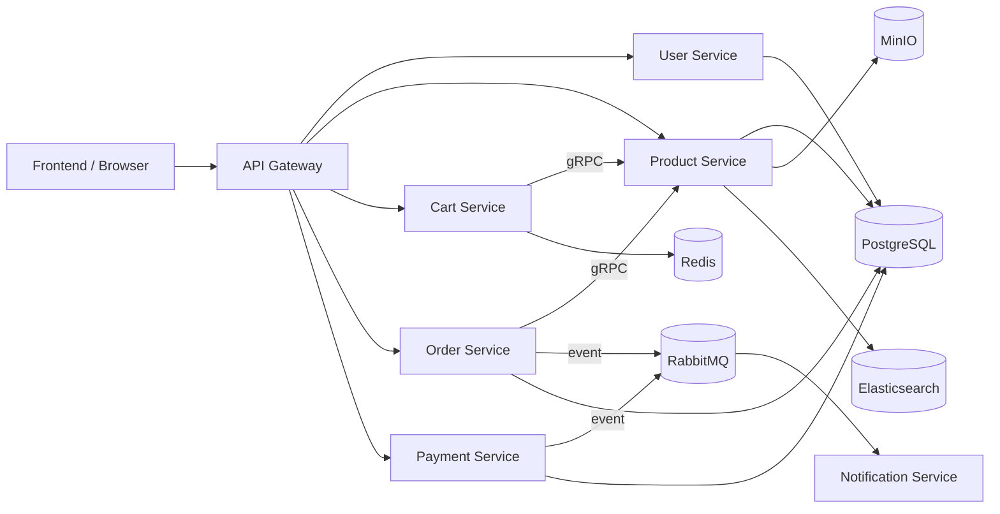

# E-Commerce Platform

Repo này là một nền tảng e-commerce demo theo kiến trúc Go microservices, có thêm frontend React + Vite và bộ công cụ local runtime bằng Docker Compose. Mục tiêu chính là giúp developer mới hiểu cách một hệ thống commerce được tách thành nhiều service, cách các service giao tiếp với nhau, và cách đọc source có phương pháp.

## Tổng quan nhanh

- `api-gateway`: cửa vào HTTP chung cho frontend và client.
- `services/user-service`: đăng ký, đăng nhập, JWT, profile, address.
- `services/product-service`: catalog, media upload, search, gRPC product lookup.
- `services/cart-service`: giỏ hàng trên Redis, đồng bộ giá/stock qua gRPC.
- `services/order-service`: quote, tạo đơn, coupon, shipping, audit, phát event.
- `services/payment-service`: payment lifecycle, webhook, refund, phát event.
- `services/notification-service`: worker consume RabbitMQ và gửi email.
- `pkg/`: config, database, middleware, validation, observability dùng chung.
- `frontend/`: ứng dụng React để test flow end-to-end.
- `deployments/docker/`: Docker Compose cho local development.

## Quick Start

1. Tạo file môi trường:

```bash
cp .env.example .env
```

2. Dựng toàn bộ stack backend + hạ tầng:

```bash
make docker-config
make compose-up
```

3. Chạy frontend ở chế độ dev nếu muốn:

```bash
make frontend-install
make frontend-dev
```

4. Kiểm tra nhanh:

```bash
curl http://localhost:8080/health
curl http://localhost:8081/health
curl http://localhost:8082/health
```

## Development Test Accounts

Khi chạy local qua Docker Compose, `user-service` sẽ seed sẵn hai tài khoản test chỉ dành cho development:

- `admin.dev@ndshop.local` / `AdminTest!2026-ChangeMe`
- `staff.dev@ndshop.local` / `StaffTest!2026-ChangeMe`

Lưu ý:

- đây là tài khoản deterministic để test nhanh khu vực `/admin`
- tuyệt đối không bật `bootstrap.dev_accounts` ở production
- nếu cần override password local, dùng env `BOOTSTRAP_DEV_ACCOUNTS_ADMIN_PASSWORD` hoặc `BOOTSTRAP_DEV_ACCOUNTS_STAFF_PASSWORD`

## Công nghệ chính

- Backend: Go, Echo, gRPC
- Data: PostgreSQL, Redis
- Messaging: RabbitMQ
- Catalog infra: MinIO, Elasticsearch
- Observability: Prometheus, Grafana, Jaeger
- Frontend: React, Vite, TypeScript

## Luồng chạy local



## Tài liệu

- [docs/README.md](./docs/README.md): bản đồ tài liệu tổng thể.
- [docs/learning/README.md](./docs/learning/README.md): lộ trình onboarding cho người mới.
- [docs/deep-dive/README.md](./docs/deep-dive/README.md): kiến trúc, stack, flow runtime.
- [docs/annotated/README.md](./docs/annotated/README.md): đọc source theo block code quan trọng.

## Test và verify

Kiểm tra Go modules:

```bash
make test
make vet
```

Build frontend:

```bash
make frontend-build
```

Chi tiết cách verify end-to-end nằm tại:

- [docs/learning/06-testing-and-verification.md](./docs/learning/06-testing-and-verification.md)

## Dành cho contributor mới

Nếu bạn mới vào repo, thứ tự đọc ngắn nhất là:

1. [docs/learning/00-local-setup.md](./docs/learning/00-local-setup.md)
2. [docs/deep-dive/system-overview.md](./docs/deep-dive/system-overview.md)
3. [docs/learning/05-first-contribution-walkthrough.md](./docs/learning/05-first-contribution-walkthrough.md)
4. [docs/annotated/frontend-app.md](./docs/annotated/frontend-app.md)
5. [docs/annotated/shared-packages.md](./docs/annotated/shared-packages.md)
