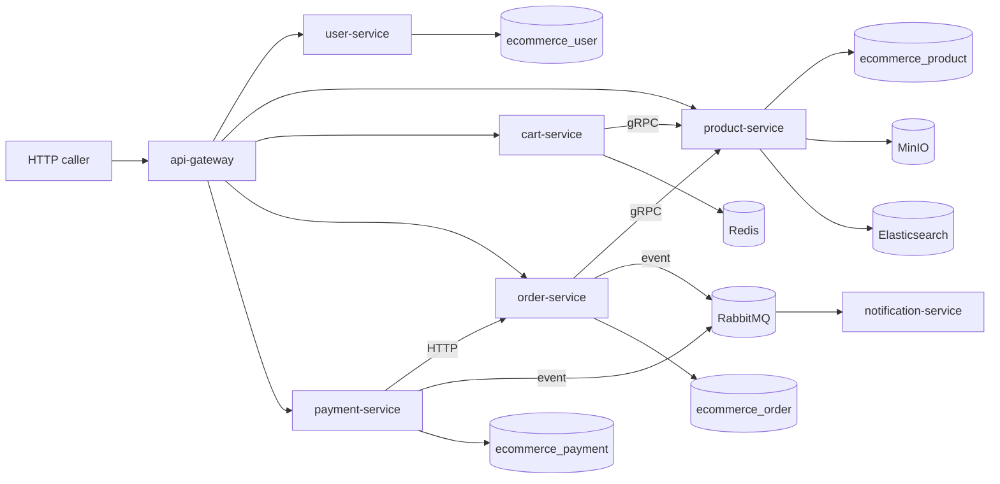

# E-Commerce Backend Platform

Repo này là nền tảng backend thương mại điện tử nhiều service viết chủ yếu bằng Go. Runtime local đi qua `api-gateway`, dùng PostgreSQL làm nguồn dữ liệu chính, Redis cho cart/rate limit/cache phụ trợ, RabbitMQ cho event bất đồng bộ, và có MinIO, Elasticsearch, Prometheus, Grafana, Jaeger trong Docker Compose.

README này chỉ mô tả backend, runtime server, API, service, database, middleware, observability và cấu hình vận hành.

---

## Kiến Trúc Tổng Quan

Hệ thống được tổ chức theo nhiều service theo domain:

- `api-gateway` nhận HTTP public và proxy xuống service tương ứng.
- `user-service`, `product-service`, `order-service`, `payment-service` dùng PostgreSQL riêng theo database.
- `cart-service` dùng Redis làm storage chính cho giỏ hàng.
- `product-service` cung cấp gRPC cho `cart-service` và `order-service` để kiểm tra product truth.
- `order-service` và `payment-service` phát event qua RabbitMQ bằng outbox pattern.
- `notification-service` dùng inbox pattern và Redis dedupe để consume event và gửi notification/email.
- `product-service` tích hợp optional MinIO cho media và optional Elasticsearch cho search.


```mermaid
flowchart LR
    Caller[HTTP caller] --> Gateway[api-gateway]
    Gateway --> User[user-service]
    Gateway --> Product[product-service]
    Gateway --> Cart[cart-service]
    Gateway --> Order[order-service]
    Gateway --> Payment[payment-service]
    Cart -->|gRPC| Product
    Order -->|gRPC| Product
    Payment -->|HTTP| Order
    Order -->|event| RabbitMQ[(RabbitMQ)]
    Payment -->|event| RabbitMQ
    RabbitMQ --> Notification[notification-service]
    User --> UserDB[(ecommerce_user)]
    Product --> ProductDB[(ecommerce_product)]
    Order --> OrderDB[(ecommerce_order)]
    Payment --> PaymentDB[(ecommerce_payment)]
    Cart --> Redis[(Redis)]
    Product --> MinIO[(MinIO)]
    Product --> Elasticsearch[(Elasticsearch)]
```

---

## Thành Phần Chính

| Thành phần | Vai trò |
| --- | --- |
| `api-gateway/` | Reverse proxy HTTP dùng Echo, tracing, metrics, Redis-backed rate limiter, request logging, retry chọn lọc và circuit breaker. |
| `services/user-service/` | Đăng ký, đăng nhập, refresh token, profile, role, address, wishlist, OTP email/phone, OAuth, bootstrap dev accounts. |
| `services/product-service/` | Product CRUD, upload ảnh, catalog listing, cursor pagination, search assist, review, gRPC product lookup, optional Elasticsearch, optional MinIO. |
| `services/cart-service/` | Giỏ hàng trên Redis, get/add/update/remove/clear/merge cart, validate product qua gRPC. |
| `services/order-service/` | Order preview, create order, idempotency, order event, order history/detail, cancel, coupons, admin report, returns, refund queue. |
| `services/payment-service/` | Create payment, history/detail, refund, MoMo webhook, idempotency, inbox/outbox, audit entries. |
| `services/notification-service/` | RabbitMQ consumer, Redis inbox dedupe, retry publisher, history/unread state, email worker, wishlist alert worker. |
| `pkg/` | Shared config, database, logger, middleware, observability, response, validation. |
| `proto/` | gRPC contracts giữa service. |
| `deployments/docker/` | Docker Compose, service YAML config, observability config, Nginx edge config, Postgres init script. |

---

## Hạ Tầng Và Dữ Liệu

| Thành phần | Trạng thái |
| --- | --- |
| PostgreSQL | Một container, nhiều database: `ecommerce_user`, `ecommerce_product`, `ecommerce_order`, `ecommerce_payment`. Đây là source of truth chính. |
| Redis | Cart storage, rate limit, cache, inbox/dedupe hoặc state tạm. |
| RabbitMQ | Event broker giữa order/payment/notification. |
| MinIO | Object storage cho media khi product-service bật object storage. |
| Elasticsearch | Search index khi product-service bật search sync. |
| Prometheus/Grafana | Metrics scraping và dashboard trong compose. |
| Jaeger | Distributed tracing local. |
| ORM | Không dùng ORM; persistence đi qua `database/sql`, `lib/pq` và SQL migration. |
| Migration | Các service PostgreSQL có `migrations/` và wiring auto-run migration khi startup. |

---

## Chạy Nhanh Bằng Docker Compose

Điều kiện tối thiểu:

- Docker Desktop hoặc Docker Engine + Docker Compose plugin.
- Go chỉ cần khi chạy test/build ngoài container.

Tạo env local:

```bash
cp .env.local.example .env.local
```

Chỉnh các biến quan trọng trong `.env.local`:

- `POSTGRES_PASSWORD`
- `JWT_SECRET`
- `RABBITMQ_PASSWORD`
- `SMTP_*`
- `OAUTH_GOOGLE_*`
- `TELEGRAM_*`
- `PAYMENT_GATEWAY_MOMO_*`
- `MINIO_*`
- `ELASTICSEARCH_*`

Render compose:

```bash
make docker-config
```

Dựng stack:

```bash
make compose-up
```

Chạy nền:

```bash
docker compose --env-file .env.local -f deployments/docker/docker-compose.yml up --build -d
```

Kiểm tra:

```bash
curl http://localhost:8080/health
curl http://localhost/health
```

URL thường dùng:

- `http://localhost:8080`: API Gateway
- `http://localhost`: Nginx edge cho `/api/*` và `/health`
- `http://localhost:9000`: MinIO API
- `http://localhost:9001`: MinIO Console
- `http://localhost:9200`: Elasticsearch
- `http://localhost:16686`: Jaeger trace viewer

Lưu ý:

- PostgreSQL, Redis, RabbitMQ, Prometheus và Grafana không publish port ra host trong compose mặc định.
- Public API nên được test qua `api-gateway`.

---

## Biến Môi Trường Và Cấu Hình

Luồng config:

1. `Makefile` ưu tiên `.env.local`, fallback `.env.example`.
2. Docker Compose mount `deployments/docker/config/*.yaml` vào từng service qua `CONFIG_PATH=/config/config.yaml`.
3. `pkg/config` load default, config file và environment variable override.

File config runtime:

- `deployments/docker/config/api-gateway.yaml`
- `deployments/docker/config/user-service.yaml`
- `deployments/docker/config/product-service.yaml`
- `deployments/docker/config/cart-service.yaml`
- `deployments/docker/config/order-service.yaml`
- `deployments/docker/config/payment-service.yaml`
- `deployments/docker/config/notification-service.yaml`

Khi thêm config production-critical:

- thêm vào `pkg/config`
- thêm default local an toàn
- cập nhật YAML trong `deployments/docker/config/`
- cập nhật env example nếu cần
- startup phải fail fast nếu thiếu secret/endpoint bắt buộc

---

## Database, Migration, Seed

Migration folders:

- `services/user-service/migrations/`
- `services/product-service/migrations/`
- `services/order-service/migrations/`
- `services/payment-service/migrations/`

Make targets:

```bash
make migrate-up
make migrate-down
make migrate-force
```

Lưu ý:

- Service PostgreSQL tự chạy embedded migrations khi startup nếu wiring hiện tại hỗ trợ.
- `cart-service` không có SQL migration vì lưu cart trên Redis.
- `deployments/docker/postgres-init/01-create-databases.sql` chỉ tạo database cho từng service.
- Dữ liệu bootstrap rõ nhất là dev accounts trong `user-service`.

---

## Tài Khoản Test Local

Khi `user-service` chạy với `bootstrap.dev_accounts.enabled`, local có thể tạo:

- `admin.dev@ndshop.local` / `AdminTest!2026-ChangeMe`
- `staff.dev@ndshop.local` / `StaffTest!2026-ChangeMe`

Override password qua env:

- `BOOTSTRAP_DEV_ACCOUNTS_ADMIN_PASSWORD`
- `BOOTSTRAP_DEV_ACCOUNTS_STAFF_PASSWORD`

Không bật bootstrap dev accounts ngoài môi trường development.

---

## Lệnh Quan Trọng

```bash
make fmt
make tidy
make test
make vet
make ci
make docker-config
make compose-build
make compose-up
make compose-down
make migrate-up
make migrate-down
make migrate-force
```

Ý nghĩa:

- `make fmt`: gofmt toàn bộ Go backend.
- `make tidy`: `go mod tidy` từng Go module.
- `make test`: `go test ./...` từng Go module.
- `make vet`: `go vet ./...` từng Go module.
- `make ci`: chạy `fmt`, `tidy`, `vet`, `test`.
- `make docker-config`: render compose config.
- `make compose-build`: build Docker images.
- `make compose-up`: build và chạy stack.
- `make compose-down`: dừng stack.

---

## Cấu Trúc Thư Mục Nên Đọc Đầu Tiên

| Đường dẫn | Nên hiểu gì |
| --- | --- |
| `deployments/docker/docker-compose.yml` | Runtime local, service dependency, network, volume. |
| `deployments/docker/config/*.yaml` | Config runtime của từng service. |
| `api-gateway/cmd/main.go` | Gateway startup, middleware, tracing, metrics, route wiring. |
| `api-gateway/internal/handler/` | Public HTTP routes ở gateway. |
| `api-gateway/internal/proxy/` | Proxy xuống service, retry, circuit breaker. |
| `services/*-service/cmd/main.go` | Wiring thật của từng service. |
| `services/*-service/internal/handler/` | API boundary của service. |
| `services/*-service/internal/service/` | Business logic và orchestration. |
| `services/*-service/internal/repository/` | SQL, Redis, RabbitMQ persistence/integration. |
| `services/*-service/internal/model/` | Domain/persistence model. |
| `services/*-service/internal/dto/` | Request/response DTO. |
| `services/*-service/internal/grpc/` | gRPC server/caller khi có. |
| `services/*-service/migrations/` | SQL migrations. |
| `pkg/` | Shared packages. |
| `proto/` | gRPC contracts. |

---

## Backend Flows Nên Hiểu Đầu Tiên

1. `login -> profile`
2. `catalog -> product detail -> search assist`
3. `cart -> merge cart -> order preview`
4. `create order`
5. `create payment -> webhook -> sync order`
6. `return -> refund queue -> notification`

Các flow này chạm đủ:

- HTTP gateway
- service layering
- transaction bundle
- SQL compare-and-set
- gRPC nội bộ
- outbox/inbox
- retry-safe async

---

## Hot Path Khi Audit Issue

| Tình huống | File/function nên mở |
| --- | --- |
| Order bị tạo lặp hoặc replay lạ | `services/order-service/internal/service/order/order_lifecycle.go`, `createOrderTx`, `GetIdempotencyKey` |
| Coupon bị dùng quá số lần | `services/order-service/internal/repository/order_repository.go`, `lockAndConsumeCoupon` |
| Admin list order chậm hoặc pagination lệch | `ListAll`, `ListAllByCursor` trong `order_repository.go` |
| Payment webhook replay hoặc update sai trạng thái | `services/payment-service/internal/repository/payment/payment_repository.go`, `ApplyWebhookResult` |
| Inventory bị âm hoặc oversell | `services/product-service/internal/repository/product/product_repository.go`, `UpdateStock` |
| Review aggregate sai | `product_review_repository.go`, `ApplyReviewSummaryDelta` |
| Profile update dính address/phone verification | `services/user-service/internal/repository/profile_tx_manager.go` |
| Notification gửi lặp | `services/notification-service/internal/inbox/redis_store.go`, `retry_publisher.go` |
| Refund worker bị kẹt hoặc retry vô hạn | `ClaimPendingReturnRefunds`, `MarkReturnRefundAttemptFailed`, `CompleteReturnRefund` |
| Cart bị mất update khi thao tác nhanh | `services/cart-service/internal/repository/cart/cart_repository.go` |

---

## Tài Liệu Liên Quan

- [DOCKER_GUIDE.md](./DOCKER_GUIDE.md): Docker Compose, container, debug local stack.
- [API_TESTING_GUIDE.md](./API_TESTING_GUIDE.md): route public, smoke flow, negative flow, replay/idempotency test.
- [LOGIC_FLOW.md](./LOGIC_FLOW.md): flow backend từ API boundary xuống service/repository/async worker.
- [PROJECTS.md](./PROJECTS.md): trạng thái triển khai theo function/layer, test, verify/deploy checklist.
- [docs/README.md](./docs/README.md): bản đồ tài liệu tổng thể.
- [docs/learning/README.md](./docs/learning/README.md): roadmap học repo và checklist audit.
- [docs/deep-dive/README.md](./docs/deep-dive/README.md): runtime map, boundary, data flow order/payment/notification.
- [docs/annotated/README.md](./docs/annotated/README.md): feature-to-source map và pattern đáng học.
