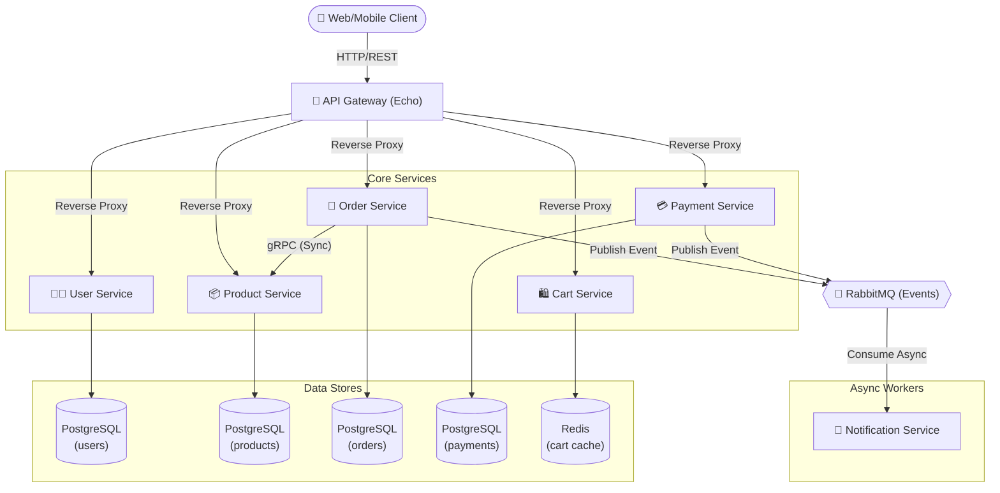

# Tổng quan Kiến trúc Hệ thống (System Architecture)

Tài liệu này cung cấp bức tranh gốc (Big Picture) về hệ sinh thái Microservices của dự án E-Commerce Platform. Việc nắm rõ kiến trúc sẽ giúp bạn hiểu được vai trò của từng Component trước khi đọc sâu vào code.

## 1. Mô hình Kiến trúc (Microservices Architecture)

Dự án áp dụng mô hình thiết kế **Microservices**, trong đó mỗi dịch vụ quản lý một miền nghiệp vụ (Domain) độc lập, có database riêng rẽ và không chia sẻ trạng thái (stateless) ngoại trừ qua cơ sở dữ liệu.

Các dịch vụ giao tiếp với nhau bằng hai hình thức:
1. **Synchronous (Đồng bộ)**: Gọi qua gRPC (ví dụ `order-service` gọi `product-service` để kiểm tra kho).
2. **Asynchronous (Bất đồng bộ)**: Gửi Message/Event qua RabbitMQ (ví dụ: Tạo đơn hàng xong thì bắn event `order.created` cho `notification-service`).

### Sơ đồ luồng dữ liệu tổng quát (Component Diagram)

## 2. Các Thành phần (Components) Chính

### `api-gateway`
- **Chức năng**: API Gateway đóng vai trò là "cửa trước" duy nhất cho toàn bộ hệ thống. Nhiệm vụ chính là che giấu sự phức tạp của hệ sinh thái microservices khỏi client.
- **Tính năng**: Rate Limiting (chống SPAM request), CORS, Bảo mật Headers, HTTP Proxy forwarding.
- **Công nghệ**: Go, Echo framework.

### `user-service`
- **Chức năng**: Quản lý thông tin định danh người dùng.
- **Đầu ra cốt lõi**: Access Token (JWT) và Refresh Token đính kèm Role (`user`, `admin`).
- **Nghiệp vụ**: Xác thực (Authentication), uỷ quyền (Authorization basic), quản lý địa chỉ giao hàng (`Addresses`).

### `product-service`
- **Chức năng**: Là "Nguồn sự thật" (Source of Truth - SoT) của mọi thông tin về hàng hoá.
- **Nghiệp vụ**: CRUD sản phẩm, duyệt danh mục, phân trang. Check và cập nhật Tồn kho (Stock).
- **Giao thức**: Phục vụ client qua HTTP REST, phục vụ các service backend nội bộ qua gRPC.

### `cart-service`
- **Chức năng**: Giỏ hàng tạm thời.
- **Lưu trữ**: Hoạt động hoàn toàn trên Redis (In-memory cache) do tính chất vòng đời dữ liệu ngắn (Session-based). Tốc độ cực nhanh.

### `order-service`
- **Chức năng**: Trái tim của quá trình thương mại. Chuyển đổi giỏ hàng sang giao dịch thực tế.
- **Nghiệp vụ**: Validate đơn, Orchestrator việc gọi kiểm tra tồn kho (ProductService gRPC), tạo bản ghi giao dịch qua DB Transaction, xuất hoá đơn.

### `payment-service`
- **Chức năng**: Xử lý cổng thanh toán (chờ tích hợp Stripe). Ghi nhận luồng tiền đối soát.

### `notification-service`
- **Chức năng**: Worker chạy nền không giao tiếp qua HTTP. Nó chỉ "lắng nghe" Message Broker để gửi Notification/Email.
- **Nghiệp vụ**: Khi có `order.created` hay `order.cancelled`, nó kích hoạt gửi thông báo cho cả User và Merchant.

## 3. Tech Stack cốt lõi

- **Language**: Go (Golang) 1.21+
- **HTTP Framework**: [Echo v4](https://echo.labstack.com/)
- **Database (Relational)**: [PostgreSQL](https://www.postgresql.org/) kết hợp `database/sql` & thư viện raw-sql cho hiệu năng cao.
- **Database (In-memory/Cache)**: [Redis v9](https://redis.io/)
- **Inter-service Communication**: [gRPC](https://grpc.io/) + Protobuf.
- **Message Broker**: [RabbitMQ](https://www.rabbitmq.com/) (AMQP 0.9.1)
- **Security**: [v5 JWT](https://github.com/golang-jwt/jwt) + Bcrypt hashing.
- **Observability**: Prometheus (Metrics Export) + Jaeger (Tracing hooks) + Grafana.
