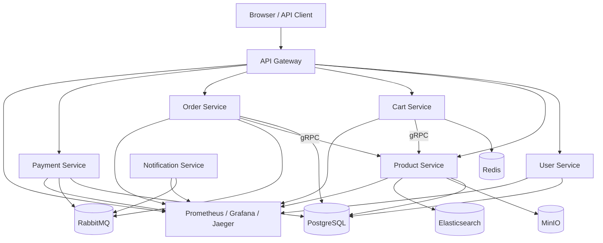

# Project Documentation Map

Thư mục `docs/` được tổ chức để phục vụ ba nhu cầu khác nhau:

- `learning/`: onboarding, setup, tutorial và vocabulary cho người mới.
- `learning/`: onboarding, setup, tutorial, test accounts và vocabulary cho người mới.
- `deep-dive/`: hiểu kiến trúc, runtime flow, stack và design decisions.
- `annotated/`: đọc source theo từng block code quan trọng.

## Cách dùng bộ docs này

Nếu bạn là developer mới:

1. Bắt đầu ở [learning/00-local-setup.md](./learning/00-local-setup.md)
2. Đọc [deep-dive/system-overview.md](./deep-dive/system-overview.md)
3. Xem [learning/05-first-contribution-walkthrough.md](./learning/05-first-contribution-walkthrough.md)
4. Chuyển sang [annotated/README.md](./annotated/README.md) để đọc source có hướng dẫn
5. Định hướng sự nghiệp tại [learning/08-career-path-golang-backend.md](./learning/08-career-path-golang-backend.md)

Nếu bạn cần hiểu runtime flow:

1. [deep-dive/system-overview.md](./deep-dive/system-overview.md)
2. [deep-dive/technology-stack.md](./deep-dive/technology-stack.md)
3. Các file service-specific trong [deep-dive/](./deep-dive/)

Nếu bạn đang sửa code:

1. [annotated/shared-packages.md](./annotated/shared-packages.md)
2. File annotate theo service hoặc frontend component tương ứng
3. [learning/06-testing-and-verification.md](./learning/06-testing-and-verification.md)

## Bản đồ kiến trúc cấp cao

## Nội dung chính

### `learning/`

- [learning/README.md](./learning/README.md): lộ trình học tổng quát.
- [learning/00-local-setup.md](./learning/00-local-setup.md): setup môi trường dev.
- [learning/05-first-contribution-walkthrough.md](./learning/05-first-contribution-walkthrough.md): tutorial cho contributor mới.
- [learning/06-testing-and-verification.md](./learning/06-testing-and-verification.md): cách test, verify, debug nhanh.
- [learning/07-core-concepts-and-terms.md](./learning/07-core-concepts-and-terms.md): glossary của repo.
- [learning/08-career-path-golang-backend.md](./learning/08-career-path-golang-backend.md): **lộ trình phát triển sự nghiệp Backend Golang.**

### `deep-dive/`

- [deep-dive/README.md](./deep-dive/README.md): bản đồ đọc kiến trúc.
- [deep-dive/system-overview.md](./deep-dive/system-overview.md): luồng request, event, dependency runtime.
- [deep-dive/technology-stack.md](./deep-dive/technology-stack.md): giải thích từng công nghệ và lý do tồn tại.
- Các file service-specific hiện có: `api-gateway`, `user-service`, `product-service`, `cart-service`, `order-service`, `payment-service`, `notification-service`.

### `annotated/`

- [annotated/README.md](./annotated/README.md): hướng dẫn đọc source theo block.
- [annotated/shared-packages.md](./annotated/shared-packages.md): config, auth, validation, database helpers.
- [annotated/frontend-app.md](./annotated/frontend-app.md): router, auth state, cart state, API client.
- Các file annotate theo service: `api-gateway`, `user-service`, `product-service`, `cart-service`, `order-service`, `payment-service`, `notification-service`.

## Ghi chú

- Repo vẫn giữ một số tài liệu cũ như `00-system-architecture.md`, `00-database-schema.md` và handbook trước đó. Bạn có thể xem như tài liệu tham khảo bổ sung, nhưng lộ trình chính nên đi từ các README mới trong ba thư mục con.
