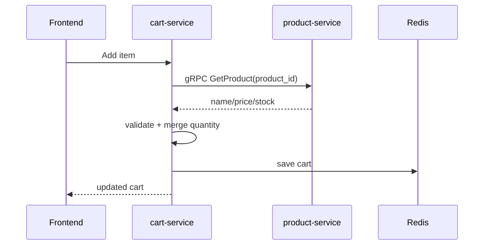

# Annotated: Cart Service

`cart-service` nhỏ hơn nhiều service khác, nhưng lại là nơi thể hiện rất rõ tư duy source of truth và trust boundary.

File chính nên đọc:

- `services/cart-service/internal/service/cart_service.go`

## 1. Dependency và ý nghĩa của từng dependency

### `repo`

- repository lưu cart vào Redis
- chịu trách nhiệm đọc/ghi cart state

### `productClient`

- gRPC client sang `product-service`
- dùng để lấy giá và tồn kho authoritative

### Vì sao thiết kế này đáng học

`cart-service` không coi Redis là source of truth cho catalog. Redis chỉ giữ trạng thái giỏ theo user. Giá và stock luôn phải xin lại từ `product-service`.

## 2. `AddItem`: hàm quan trọng nhất của service

### Điều gì xảy ra trước khi lưu cart

Service gọi:

```go
product, err := s.productClient.GetProduct(ctx, req.ProductID)
```

### Vì sao bước này cực kỳ quan trọng

- không tin `price` từ frontend
- không tin `stock` đã cache trong cart từ trước
- luôn lấy dữ liệu authoritative trước khi quyết định update cart

Đây là một bài học backend rất quan trọng:

> Cart có thể chạy trên Redis, nhưng catalog truth vẫn phải đến từ product domain.

### Flow `AddItem`

- nếu item đã có, tăng quantity
- kiểm tra stock mới
- refresh `name` và `price` theo product mới nhất
- `CalculateTotal()`
- lưu lại vào Redis

## 3. `UpdateItem`, `RemoveItem`, `ClearCart`

### `UpdateItem`

- cập nhật quantity
- lưu lại cart

Điểm cần nhớ:

- validation sâu nhất về stock được làm tốt nhất ở `AddItem`
- frontend guest cart có một lớp check stock riêng bên client để giữ UX tốt hơn

### `RemoveItem` và `ClearCart`

- thuần thao tác trên Redis state
- không cần gọi `product-service`

Điều này hợp lý vì xóa item không đòi hỏi xác minh lại catalog.

## 4. Flow tổng quát



## 5. Mối liên hệ với frontend hiện tại

Ở frontend React + Vite:

- API authenticated cart đi qua `frontend/src/shared/api/modules/cartApi.ts`
- abstraction state nằm ở `frontend/src/features/cart/providers/CartProvider.tsx`
- guest cart storage nằm ở `frontend/src/features/cart/utils/guestCartStorage.ts`

### Vì sao nên đọc song song backend và frontend

Bạn sẽ thấy một bài học rất hay:

- backend cart giữ source of truth đúng chỗ
- frontend cart lại phải giải quyết thêm bài toán guest cart và merge sau login

Đây là chỗ rất tốt để học cách một feature tưởng nhỏ nhưng thực ra có nhiều boundary và failure mode.

## 6. Điều cần nhớ khi sửa service này

- Redis là store cho cart state, không phải catalog database.
- Giá và stock phải được xác nhận từ `product-service`.
- nếu sửa cart flow, hãy kiểm tra cả `frontend/src/features/cart/providers/CartProvider.tsx` để xem guest mode và merge sau login có còn hợp logic không.
