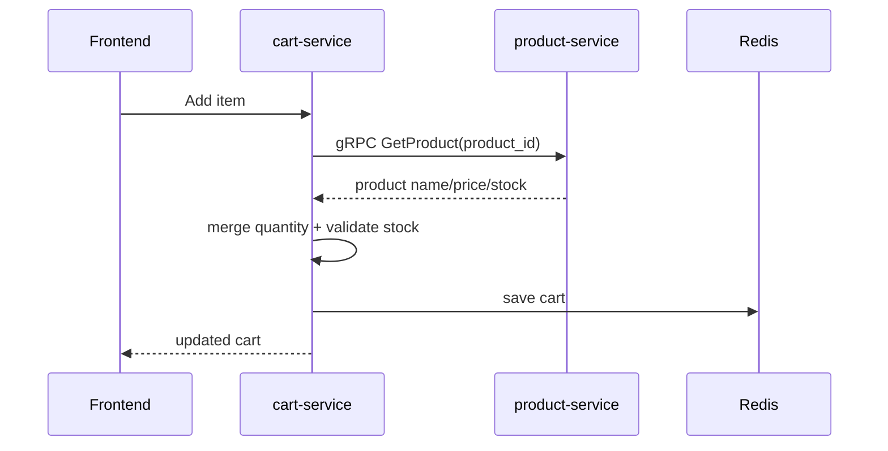

# Annotated: Cart Service

`cart-service` nhỏ hơn các service khác nhưng lại là nơi có nhiều quyết định nghiệp vụ quan trọng về source of truth.

File chính nên đọc:

- `services/cart-service/internal/service/cart_service.go`

## 1. Khối định nghĩa lỗi và dependency

### Block `cart_service.go:16-30`

- `repo` là Redis-backed repository
- `productClient` là gRPC client sang `product-service`

Điểm mấu chốt: cart không tự giữ giá chuẩn hoặc stock chuẩn. Nó chỉ cache trạng thái giỏ hiện tại theo user.

## 2. `AddItem` là block quan trọng nhất

### Block `cart_service.go:44-60`

Ngay khi add item, service gọi:

```go
product, err := s.productClient.GetProduct(ctx, req.ProductID)
```

Ý nghĩa:

- không tin `price` do frontend gửi lên
- không tin `stock` mà cart từng lưu từ trước
- luôn lấy thông tin authoritative từ `product-service`

Đây là lý do `cart-service` dùng Redis nhưng không trở thành source of truth của catalog.

### Block `cart_service.go:62-97`

Logic add item:

- nếu sản phẩm đã có trong giỏ thì tăng quantity
- trước khi tăng phải check stock mới
- nếu chưa có thì append item mới
- luôn cập nhật lại `Name` và `Price` từ dữ liệu product mới nhất
- gọi `cart.CalculateTotal()` rồi mới `repo.Save(...)`

Điều này giúp cart tự refresh giá hiển thị theo catalog hiện tại mỗi lần add.

## 3. `UpdateItem` và `RemoveItem`

### Block `cart_service.go:101-125`

`UpdateItem` hiện chỉ sửa quantity trong cart rồi save lại. Nó không re-fetch product tại bước này.

Hàm này đơn giản, nhưng khi đọc source bạn nên ghi nhớ:

- validate sâu hơn về stock đang được đảm bảo tốt nhất ở bước `AddItem`
- frontend guest cart lại có một lớp kiểm tra stock riêng ở client side

### Block `cart_service.go:129-160`

`RemoveItem` và `ClearCart` là các thao tác thuần trên Redis state, không đụng tới product-service.

## 4. Flow tổng quát



## 5. Điều cần nhớ khi sửa service này

- Redis là store cho session cart, không phải catalog database.
- Giá và stock phải được xác nhận từ `product-service`.
- Nếu sửa cart flow, hãy kiểm tra cả frontend guest cart trong `frontend/src/contexts/CartContext.tsx`.
