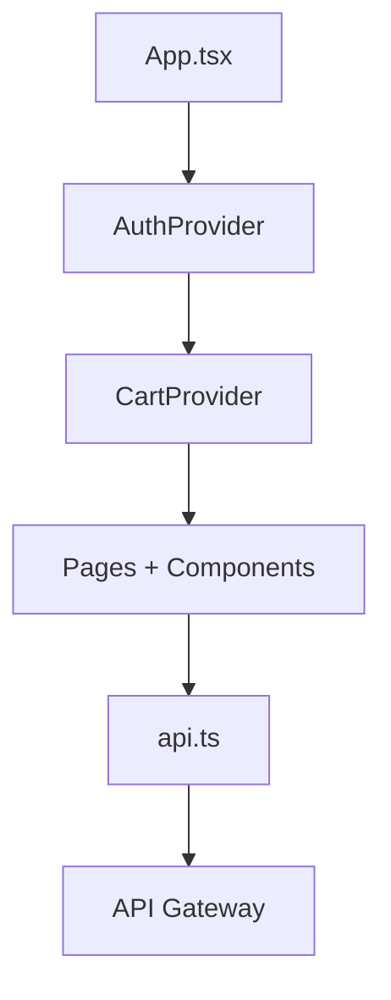

# Annotated: Frontend App

Frontend trong repo này không chỉ là UI demo. Nó còn là nơi gom các flow end-to-end quan trọng như auth, guest cart, checkout và admin catalog.

File nên đọc:

- `frontend/src/App.tsx`
- `frontend/src/contexts/AuthContext.tsx`
- `frontend/src/contexts/CartContext.tsx`
- `frontend/src/lib/api.ts`

## 1. Router và provider tree trong `App.tsx`

### Block `App.tsx:22-77`

Thứ tự wrapper hiện tại là:

1. `AuthProvider`
2. `CartProvider`
3. `BrowserRouter`
4. `Routes`

Ý nghĩa:

- auth state có trước để cart biết user đang guest hay authenticated
- cart state có trước khi page render
- route nào cần bảo vệ thì bọc bởi `ProtectedRoute`

Route `/admin` dùng `allowStaff`, nghĩa là cả `admin` và `staff` đều có thể đi vào khu vực catalog management.

## 2. Auth bootstrap trong `AuthContext.tsx`

### Block `AuthContext.tsx:50-112`

Đây là block rất quan trọng:

- lấy token từ `useSessionToken`
- nếu không có token thì reset user state
- nếu có token nhưng chưa có user thì gọi `api.getProfile(token)`
- nếu request profile fail thì xóa token

Điều này tránh tình trạng frontend giữ token hỏng và tưởng rằng user vẫn login.

`startTransition(...)` được dùng để giảm cảm giác UI bị block khi cập nhật state từ network response.

### Block `AuthContext.tsx:114-174`

Các action `register`, `login`, `logout`, `refreshProfile`, `updateProfile`, `resendVerificationEmail` đều đi qua API client tập trung. Nhờ vậy UI page không cần biết chi tiết HTTP.

## 3. Cart state và guest cart merge

### Block `CartContext.tsx:34-112`

Đây là điểm đáng đọc nhất của frontend:

- nếu chưa login thì đọc cart từ local storage qua `guestCart`
- nếu đã login thì fetch cart từ backend
- nếu guest cart có item, context sẽ lần lượt gọi `api.addToCart(...)` để merge sang server cart
- trong lúc merge, nó lưu `remainingGuestItems` để tránh mất trạng thái nếu request fail giữa chừng

Đây là block thể hiện rõ tư duy UX + resilience.

### Block `CartContext.tsx:134-257`

Guest mode và authenticated mode được tách khá rõ:

- guest mode: đọc product trực tiếp rồi lưu cart ở client
- authenticated mode: gọi `cart-service` qua API Gateway

Điều này giúp người dùng có thể thêm sản phẩm trước khi login, rồi merge lại sau.

## 4. API client tập trung

### Block `api.ts:20-22`

`apiBaseUrl` mặc định là rỗng, nghĩa là frontend ưu tiên gọi cùng origin như `/api/...`. Đây là lựa chọn tốt khi chạy sau reverse proxy.

### Block `api.ts:24-210`

Các hàm `normalize...` giúp frontend chịu lỗi tốt hơn trước JSON response không hoàn toàn sạch hoặc thiếu field.

### Block `api.ts:230-275`

`request<T>(...)` là wrapper fetch chung:

- set headers
- auto stringify JSON
- thêm JWT nếu có
- parse response envelope
- ném `ApiError` nếu HTTP status hoặc `success` không đúng

### Block `api.ts:277-303`

`getErrorMessage(...)` map một số lỗi backend phổ biến sang thông báo dễ đọc bằng tiếng Việt.

## 5. Flow frontend tổng quát

## 6. Khi sửa frontend, nên nhớ

- auth state không chỉ là token, mà còn có bootstrap profile
- cart có hai chế độ: guest và logged-in
- error message đã có lớp normalize trung tâm, đừng lặp lại mapping ở từng page
