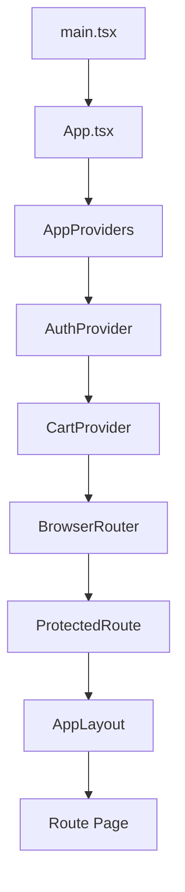

# Annotated: Frontend App Entry And Route Shell

Tài liệu này tập trung vào lớp “khởi động ứng dụng” của frontend React + Vite: từ lúc React mount, qua provider tree, tới route tree, layout shell và logic chặn quyền.

File nên mở song song:

- `frontend/src/app/main.tsx`
- `frontend/src/app/App.tsx`
- `frontend/src/app/providers/AppProviders.tsx`
- `frontend/src/app/router/ProtectedRoute.tsx`
- `frontend/src/app/router/ScrollToTop.tsx`
- `frontend/src/app/layout/AppLayout.tsx`

## 1. `main.tsx`: entrypoint nên càng mỏng càng tốt

### Code đang làm gì

- import CSS global từ `styles/index.css`
- mount `App` bằng `createRoot`
- bọc `App` trong `StrictMode`

### Vì sao code như vậy

`main.tsx` được giữ rất nhỏ để:

- làm “điểm bắt đầu” rõ ràng cho người mới
- tránh nhồi business logic vào entrypoint
- dồn phần orchestration thật sang `App.tsx` và `AppProviders.tsx`

### Nếu viết cách khác

Nếu nhét provider, router, side effect và config runtime vào ngay `main.tsx`, file mở đầu sẽ trở nên cồng kềnh rất nhanh. Cách tổ chức hiện tại tốt hơn cho onboarding.

## 2. `App.tsx`: bản đồ runtime thật của frontend

### Route groups thực tế

| Nhóm | Route | Ghi chú |
| --- | --- | --- |
| Auth/public | `/login`, `/register`, `/forgot-password`, `/auth/callback`, `/verify-email`, `/reset-password` | không bọc `AppLayout` |
| Storefront | `/`, `/products`, `/products/:productId`, `/categories/:categoryName`, `/cart`, `/checkout` | dùng `AppLayout` |
| Account protected | `/profile`, `/myorders`, `/addresses`, `/orders/:orderId`, `/payments`, `/security`, `/notifications` | bọc `ProtectedRoute` |
| Admin protected | `/admin` | bọc `ProtectedRoute allowStaff` |

### Điều đáng học

- public flow và protected flow được tách rất rõ
- route account cũ như `/profile/orders` được redirect về route mới, giúp giữ backward compatibility về navigation
- `AppLayout` chỉ bọc phần có shell chung, nên auth pages không bị ép dùng cùng layout với storefront

### Vì sao đây là cách tốt

Nó biến `App.tsx` thành “runtime contract” của UI:

- nhìn một file là biết app có những surface nào
- route guard và layout guard không bị phân tán trong từng page
- thêm route mới dễ hơn và ít duplication hơn

## 3. `AppProviders.tsx`: dựng dependency graph theo đúng thứ tự

Thứ tự hiện tại:

1. `AuthProvider`
2. `CartProvider`

### Vì sao auth phải đứng trên cart

`CartProvider` cần biết:

- hiện có token không
- đang là guest cart hay authenticated cart
- khi login xong có cần merge guest cart vào server cart không

Nên nếu cart đứng trên auth, provider dưới sẽ thiếu thông tin quyết định quan trọng.

### Khi nào nên dùng mẫu này

Dùng khi:

- provider dưới phụ thuộc dữ liệu của provider trên
- bạn muốn giữ dependency graph rõ ràng ngay ở root app

## 4. `ProtectedRoute.tsx`: guard đặt đúng ở boundary router

### Logic chính

- nếu đang bootstrap session: hiển thị trạng thái chờ
- nếu chưa authenticated: redirect về `/login` và giữ `from` trong `location.state`
- nếu `allowStaff` mà user không đủ quyền: đẩy về `/`
- nếu `requireAdmin` mà user không đủ quyền: đẩy về `/`

### Vì sao code như vậy

Đặt guard ở router boundary giúp:

- không để page render nửa chừng rồi mới phát hiện thiếu quyền
- tránh lặp auth check ở nhiều page
- giữ redirect sau login nhất quán

### Điều cần nhớ

- `allowStaff` != `requireAdmin`
- repo hiện dùng `allowStaff` cho `/admin`, tức cả `admin` và `staff` đều vào được admin surface

## 5. `ScrollToTop.tsx`: utility nhỏ nhưng UX rất quan trọng

### Code đang làm gì

Khi `pathname` hoặc `search` đổi:

- gọi `window.scrollTo({ top: 0, left: 0, behavior: "auto" })`

### Vì sao nên tách file riêng

Đây là side effect đúng kiểu utility component:

- không render UI
- logic rất rõ
- tránh lặp `scrollTo` trong từng page

## 6. `AppLayout.tsx`: application shell, không phải business page

### Nó đang làm gì

- đọc `location` để biết đang ở storefront, transactional surface hay account surface
- lấy `isAuthenticated`, `canAccessAdmin`, `logout`, `user` từ auth
- lấy `itemCount` từ cart
- sinh navigation theo context
- hiển thị dev badge nếu user là dev account
- render `Outlet` cho page thật

### Vì sao code như vậy

Đây là pattern rất đáng học:

- shell điều hướng được tách khỏi page nghiệp vụ
- checkout/order detail có thể dùng navigation gọn hơn để giảm nhiễu
- account surface có cảm giác thống nhất mà không làm từng page tự lo header/footer

### Nếu viết cách khác

Nếu mỗi page tự render header/footer/nav:

- UI nhanh bị lệch nhau
- sửa global navigation sẽ tốn công ở nhiều nơi
- khó tạo cảm giác ứng dụng liền mạch

## 7. Flow dữ liệu của lớp app shell

## 8. Vì sao lớp app shell hiện tại dễ maintain hơn cách “thông thường”

### Cách hiện tại

- route tree rõ
- provider tree rõ
- layout shell rõ
- guard rõ

### Cách kém tối ưu hơn thường gặp

- `main.tsx` làm quá nhiều việc
- page vừa lo layout vừa lo auth
- component con tự lấy thông tin global state không có provider rõ ràng
- route protected được xử lý bằng `if (!user) return null` rải rác ở từng page

Nhược điểm của cách kém tối ưu:

- khó trace bug
- dễ duplication
- thay đổi một policy auth/layout phải chạm nhiều file

## 9. Điểm cần ghi nhớ khi học

- `main.tsx` là nơi framework boot, không phải nơi business logic
- `App.tsx` là bản đồ route thật của frontend
- `AppProviders.tsx` cho biết provider nào phụ thuộc provider nào
- `ProtectedRoute.tsx` là boundary quyền truy cập
- `AppLayout.tsx` là shell điều hướng, không phải nơi fetch nghiệp vụ

## 10. Lỗi thường gặp

- thêm route protected nhưng quên bọc `ProtectedRoute`
- nghĩ `AppLayout` là nơi hợp lý để nhét logic fetch data của page
- đặt provider sai thứ tự làm auth/cart bootstrap lệch
- sửa page nhưng quên route thật nằm ở `App.tsx`

## 11. Cách debug

1. Route không vào được: xem `App.tsx` và `ProtectedRoute.tsx`
2. Header/nav hiện sai: xem `AppLayout.tsx` và các điều kiện phân surface
3. Cart count hoặc auth badge sai: trace `AppLayout -> useAuth/useCart -> provider`
4. Chuyển route nhưng scroll không reset: xem `ScrollToTop.tsx`

## 12. Mối liên hệ với file khác

- [frontend-source-map.md](./frontend-source-map.md)
- [frontend-auth-cart-providers.md](./frontend-auth-cart-providers.md)
- [frontend-api-layer.md](./frontend-api-layer.md)
- [frontend-routes-and-flows.md](./frontend-routes-and-flows.md)
