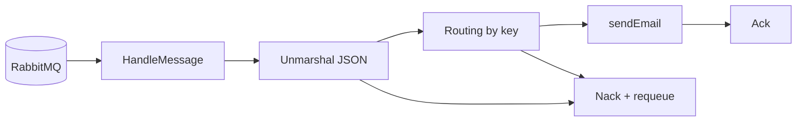

# Annotated: Notification Service

`notification-service` là worker event-driven thuần túy. Nó không phục vụ business API như các service khác mà chủ yếu:

- consume message từ RabbitMQ
- deserialize event
- route sang handler tương ứng
- gửi email

File nên đọc:

- `services/notification-service/internal/handler/event_handler.go`

## 1. Event handler là "entrypoint business" thật sự

### Block `event_handler.go:19-25`

`EventHandler` nhận hai dependency:

- `log`
- `sender`

Tức là phần nghiệp vụ của worker được giữ rất mỏng: nhận event rồi gọi email sender.

## 2. `HandleMessage` là trái tim của worker

### Block `event_handler.go:54-133`

Flow chuẩn cho từng message:

1. log routing key và payload
2. switch theo `msg.RoutingKey`
3. `json.Unmarshal` sang đúng struct
4. gọi sub-handler tương ứng
5. nếu lỗi thì `Nack(false, true)` để RabbitMQ requeue
6. nếu thành công thì `Ack(false)`

Tại sao phần `Ack/Nack` quan trọng:

- `Ack`: broker xóa message khỏi queue
- `Nack(..., true)`: message quay lại queue để retry

Đây là cơ chế reliability cốt lõi của service này.

## 3. Các sub-handler email

### Block `event_handler.go:135-199`

Các hàm:

- `handleOrderCreated`
- `handlePaymentCompleted`
- `handlePaymentFailed`
- `handlePaymentRefunded`

đều có cấu trúc giống nhau:

- log business event
- dựng nội dung email
- gọi `sendEmail(...)`

Điều đáng chú ý là payload email hiện được dựng rất trực tiếp, tức là service này đang tối ưu cho clarity và demoability hơn là templating phức tạp.

## 4. `sendEmail`

### Block `event_handler.go:202-212`

Nếu `UserEmail` trống, handler chỉ log warning rồi bỏ qua. Đây là một quyết định tốt vì:

- worker không crash vì dữ liệu event chưa đủ
- queue không bị retry vô hạn cho một payload vốn không thể gửi mail

## 5. `handleOrderCancelled`

### Block `event_handler.go:215-232`

Flow hủy đơn tách riêng vì nội dung email hơi khác và có guard rõ ràng cho trường hợp thiếu email.

## 6. Điều nên quan sát khi debug

- routing key có đúng không
- payload JSON có khớp schema không
- message đang bị `Ack` hay `Nack`
- SMTP sender có cấu hình chưa

