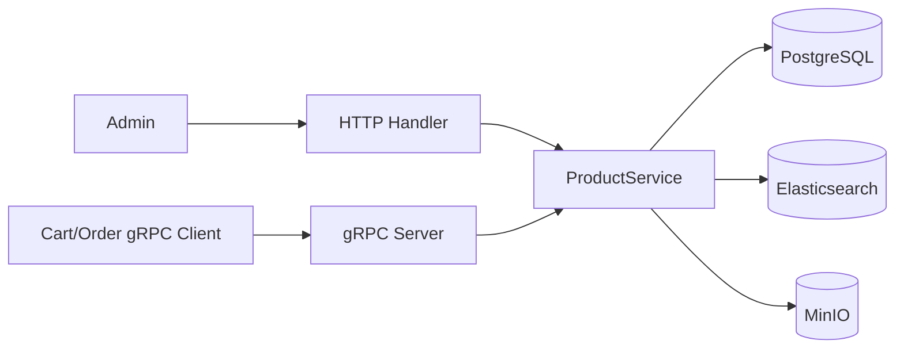

# Annotated: Product Service

Tài liệu này tập trung vào hai file quyết định hành vi chính của `product-service`:

- `services/product-service/cmd/main.go`
- `services/product-service/internal/service/product_service.go`

## 1. Runtime wiring trong `cmd/main.go`

### Block `main.go:37-68`

Đây là bootstrap chuẩn của service:

- load config bằng `config.Load("product-service")`
- khởi tạo logger và tracing
- kết nối PostgreSQL
- chạy migration ngay khi start

Ý nghĩa thực tế: service chỉ nhận request khi runtime dependency cốt lõi đã sẵn sàng. Điều này giúp fail fast nếu config sai hoặc DB chưa lên.

### Block `main.go:70-100`

Đây là phần rất đáng chú ý vì `product-service` có nhiều dependency tùy chọn hơn các service khác:

- `repository.NewProductRepository(db)` là dependency bắt buộc
- `storage.NewObjectStorage(cfg.ObjectStorage)` bật upload ảnh nếu MinIO sẵn sàng
- `search.NewElasticsearchIndex(cfg.Search)` bật search backend nếu config cho phép
- `ensureSearchReady(...)` thử chuẩn bị index và sync dữ liệu từ PostgreSQL sang Elasticsearch

Điểm hay ở đây là service vẫn chạy được nếu object storage hoặc search lỗi. Tức là catalog core không bị khóa cứng bởi tính năng phụ trợ.

```go
productRepo := repository.NewProductRepository(db)
productOptions := []service.ProductServiceOption{service.WithLogger(log)}
```

Pattern đang dùng là `functional options`, giúp service mở rộng capability mà không làm constructor quá dài.

### Block `main.go:101-127`

Phần này đăng ký HTTP server:

- Echo + validator
- CORS, secure headers, tracing, rate limit, request logging
- `/metrics` cho Prometheus
- `/health` cho Docker/K8s probe
- `productHandler.RegisterRoutes(...)`

Điều quan trọng: mọi concerns vận hành chung đều đi qua shared packages ở `pkg/`, nên các service giữ được cấu trúc nhất quán.

### Block `main.go:129-176`

Service này mở cả HTTP và gRPC:

- HTTP phục vụ CRUD catalog cho frontend/admin
- gRPC phục vụ lookup nhanh cho `cart-service` và `order-service`

Ngoài ra còn có worker nền `lowStockMonitor` ở `main.go:102-106`, nghĩa là service không chỉ xử lý request mà còn có background job.

## 2. Business core trong `product_service.go`

### Block `product_service.go:23-68`

`ProductService` có bốn dependency:

- `repo`: source of truth chính
- `mediaStore`: lưu media nếu có
- `search`: search backend nếu có
- `log`: để degrade gracefully khi dependency phụ lỗi

Đây là cách tổ chức rất tốt cho một service có nhiều integration nhưng vẫn muốn business core đơn giản.

### Block `product_service.go:76-111` với `Create(...)`

Flow tạo sản phẩm:

1. Chuẩn hóa trạng thái bằng `normalizeStatus`
2. Chuẩn hóa variants, tags, image URLs
3. Tính lại stock bằng `resolveStock`
4. Tạo entity `model.Product`
5. Persist vào PostgreSQL
6. Nếu search index bật thì index sang Elasticsearch

Điểm quan trọng nhất là backend không tin dữ liệu thô từ client. Nó normalize trước khi persist.

### Block `product_service.go:125-189` với `Update(...)`

Đây là kiểu partial update:

- field nào client gửi thì mới cập nhật
- nếu variants thay đổi thì stock được tính lại
- image primary luôn được resolve lại từ danh sách ảnh
- sau khi update DB thì cố gắng cập nhật search index

Logic này tránh tình trạng dữ liệu catalog bị lệch giữa `stock`, `variants`, `image_url` và `image_urls`.

### Block `product_service.go:211-252` với `List(...)`

Đây là nơi catalog search có graceful fallback:

- nếu có search backend và query phù hợp thì search ở Elasticsearch trước
- nếu search lỗi, service log cảnh báo rồi fallback về PostgreSQL
- nếu search thành công, repo lấy lại product theo ID để giữ schema response nhất quán

Ý nghĩa: Elasticsearch chỉ là tăng tốc/tăng chất lượng search, không phải source of truth.

## 3. Flow xử lý tiêu biểu



## 4. Câu hỏi nên tự trả lời khi đọc source

- Nếu Elasticsearch chết thì catalog còn chạy không?
- Vì sao `stock` không lấy trực tiếp từ client trong mọi trường hợp?
- Những tính năng nào là bắt buộc, những tính năng nào là optional integration?
