# Backend Deep Dive

File này trả lời câu hỏi: dữ liệu chạy như thế nào trong backend hiện tại, invariant nằm ở đâu, retry và recovery làm ra sao, và phải mở đúng function nào để hiểu luồng thật.

## Runtime và quyền sở hữu dữ liệu

| Thành phần | Vai trò runtime | Source of truth |
| --- | --- | --- |
| `api-gateway` | HTTP entrypoint, auth middleware, rate limit, tracing, reverse proxy | Không giữ business data |
| `user-service` | auth, profile, OTP, address, wishlist, notification preference | User/profile/contact/address |
| `product-service` | catalog, stock, storefront, review, search analytics | Product/stock/review |
| `cart-service` | cart state trên Redis | Cart |
| `order-service` | order, coupon, return, outbox, inbox, refund queue | Order/return |
| `payment-service` | payment, refund, webhook inbox, payment outbox | Payment |
| `notification-service` | consumer, retry/DLQ, inbox history, wishlist alert poller | Notification delivery state |

## Luồng 1: Gateway forward request xuống service

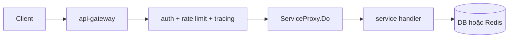

### Call chain chính

1. `api-gateway/cmd/main.go:24` boot middleware và proxy cho từng service.
2. `api-gateway/internal/handler/*_handler.go` mirror route contract, không thêm business rule.
3. `api-gateway/internal/proxy/service_proxy_request.go:33` `Do` tạo backend request mới.
4. `service_proxy_request.go:72` `newBackendRequest` clone path/query/body/header.
5. `service_proxy_request.go:141` `executeWithResilience` áp retry/circuit breaker.

### Ý nghĩa từng lớp

- Gateway handler: chỉ map route -> proxy method.
- Proxy: lớp transport/resilience.
- Backend handler: parse request, validate boundary, gọi service.
- Backend service: giữ invariant domain.
- Repository: giữ SQL/Redis primitive.

### Failure mode và recovery

| Failure mode | Nơi xử lý | Hành vi |
| --- | --- | --- |
| Backend timeout | `executeWithResilience` | Retry nếu request retry-safe, ngược lại fail nhanh. |
| Backend circuit open | `executeWithResilience` | Chặn gọi tiếp một khoảng thời gian để tránh cascade failure. |
| Header trust quá rộng | `newBackendRequest` | Hiện là hotspot cần siết nếu thêm internal privileged headers. |

## Luồng 2: Register/Login/Refresh/Password Recovery

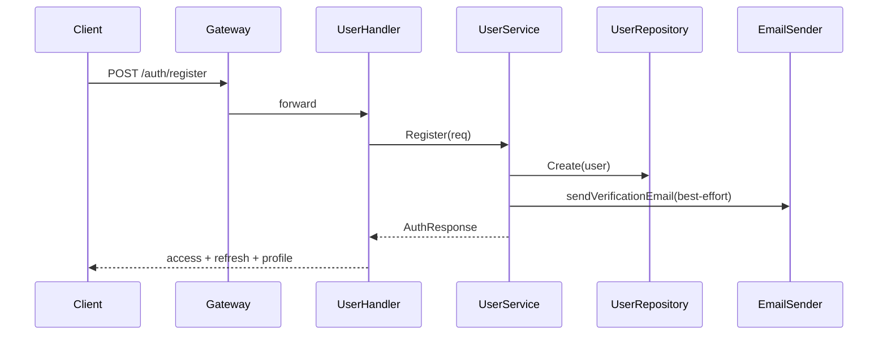

### Register call chain

1. `user_handler.go:111` `Register` bind request.
2. `user_auth.go:35` `Register` validate payload, hash password, tạo model user.
3. `user_repository.go:50` `Create` persist user.
4. `auth_recovery.go:146` `sendVerificationEmail` chạy best-effort.
5. `user_auth.go:198` `buildAuthResponse` gắn token/avatar/profile.

### Login call chain

1. `user_handler.go:148` `Login`.
2. `login_protection.go:52` `Check` xem identifier/IP đã bị lock chưa.
3. `user_auth.go:117` `Login`.
4. `user_auth.go:235` `findUserByIdentifier` chọn `GetByEmail` hoặc `GetByPhone`.
5. `user_tokens.go:76` `generateTokenPair`.
6. `login_protection.go:71` `RecordFailure` hoặc `:102` `RecordSuccess`.

### Refresh token call chain

1. `user_handler.go:193` `RefreshToken`.
2. `user_tokens.go:38` `RefreshToken`.
3. Parse refresh JWT -> load user -> `generateTokenPair`.

### Password recovery call chain

1. `user_handler.go:236` `ForgotPassword`.
2. `auth_recovery.go:69` `ForgotPassword`.
3. `auth_recovery.go:201` `issueTimeBoundToken`.
4. `user_repository.go:252` `Update` lưu token hash.
5. `auth_recovery.go:169` `sendPasswordResetEmail`.
6. `user_handler.go:252` `ResetPassword`.
7. `auth_recovery.go:96` `ResetPassword`.
8. `user_repository.go:193` `GetByPasswordResetTokenHash`.
9. `user_repository.go:252` `Update` ghi password hash mới và clear reset token.

### Invariant

- Password chỉ được so với hash ở service, không ở handler.
- Recovery token lưu hash thay vì lưu raw token.
- Email send failure không làm hỏng register/forgot-password flow chính.

### Function nên chú ý

| Hàm | Vì sao đáng đọc |
| --- | --- |
| `user_auth.go:35` `Register` | Một entrypoint auth sạch, ít side-effect phụ. |
| `auth_recovery.go:201` `issueTimeBoundToken` | Cách tạo token ngắn hạn đúng boundary. |
| `login_protection.go:52-102` | Cho thấy rate-limit/business guard ở level handler nhưng vẫn tách riêng. |

## Luồng 3: Email OTP signup, phone OTP signup, verify contact sau đăng nhập

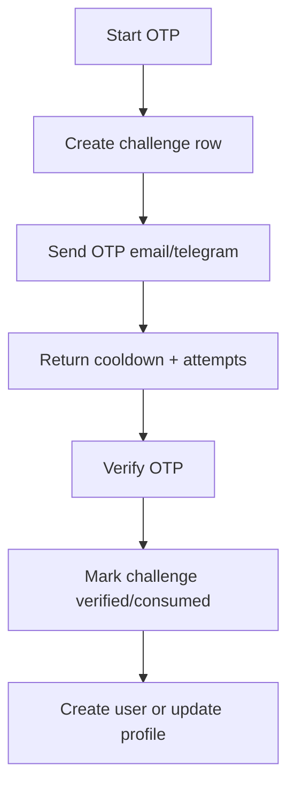

### Email signup OTP

1. `user_handler.go:382` `StartEmailSignup`.
2. `email_signup.go:21` `StartEmailSignup` validate password confirm, cooldown, duplicate email.
3. `email_signup_repository.go:86` `GetLatestActiveByEmail`.
4. `email_signup_repository.go:31` `Create`.
5. `email_signup.go:297` `sendEmailSignupOTP`.
6. `email_signup.go:272` `buildEmailSignupStatusResponse`.
7. `user_handler.go:399` `VerifyEmailSignupOTP`.
8. `email_signup.go:130` `VerifyEmailSignupOTP`.
9. `email_signup_repository.go:66` `GetByID` -> validate OTP -> `Update`.
10. Tạo user thật qua `user_repository.go:50` và token qua `user_tokens.go:76`.

### Phone signup OTP

1. `user_handler.go:433` `StartPhoneSignup`.
2. `phone_signup.go:22` `StartPhoneSignup`.
3. `phone_signup.go:320` `resolvePhoneSignupTelegramChatID`.
4. `phone_signup_repository.go:31` `Create`.
5. `user_handler.go:450` `VerifyPhoneSignupOTP`.
6. `phone_signup.go:142` `VerifyPhoneSignupOTP`.
7. `phone_signup_repository.go:67` `GetByID` -> verify -> `Update`.
8. Tạo user và phát token.

### Verify email/phone sau đăng nhập

1. `user_handler.go:498` `SendEmailVerificationOTP` -> `email_verification.go:41`.
2. `email_verification_repository.go:31` `Create`.
3. `user_handler.go:512` `VerifyEmailOTP` -> `email_verification.go:142`.
4. `user_repository.go:252` `Update` set verified fields.
5. `user_handler.go:556` `SendPhoneOTP` -> `phone_verification.go:44`.
6. `phone_verification_repository.go:31` `Create`.
7. `user_handler.go:578` `VerifyPhoneOTP` -> `phone_verification.go:156`.
8. `user_profile.go:228` `applyVerifiedPhoneChange` chỉ cho profile patch dùng challenge đã verify.

### Invariant

- Signup challenge và contact verification challenge là hai domain khác nhau, nên có bảng/repo riêng.
- OTP code luôn đi qua helper `generateOTPCode`, `hashOTPCode`.
- Cooldown/attempt limit nằm ở service, không ở transport.

### Failure mode

| Failure mode | Hàm | Hành vi |
| --- | --- | --- |
| Gửi OTP quá dày | `user_otp_limiter.go:136` `allowOTPEvent` | Chặn resend ngoài window. |
| Verify sai mã | `phone_verification.go:156`, `email_verification.go:142` | Giảm attempt còn lại, không consume challenge ngay. |
| Challenge hết hạn | repo `GetLatestActive*` + service verify | Trả domain error, bắt user start lại flow. |

## Luồng 4: Google OAuth

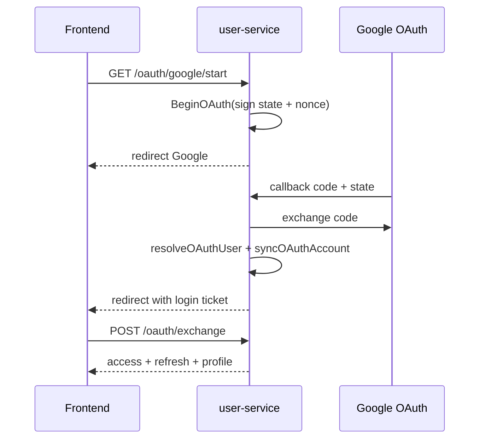

### Call chain

1. `user_handler.go:813` `StartGoogleOAuth` -> `startOAuth`.
2. `oauth_service.go:70` `BeginOAuth`.
3. `oauth_service.go:474` `signOAuthState`.
4. `oauth_provider_client.go:35` `AuthorizationURL`.
5. Callback: `user_handler.go:817` -> `handleOAuthCallback`.
6. `oauth_service.go:118` `CompleteOAuthCallback`.
7. `oauth_service.go:484` `parseOAuthState`.
8. `oauth_provider_client.go:65` `ExchangeCode`.
9. `oauth_service.go:220` `resolveOAuthUser`.
10. `oauth_service.go:377` `syncOAuthAccount`.
11. `oauth_service.go:479` `signOAuthLoginTicket`.
12. Frontend gọi `user_handler.go:821` `ExchangeOAuthTicket`.
13. `oauth_service.go:172` `ExchangeOAuthTicket`.
14. `user_auth.go:198` `buildAuthResponse`.

### Vì sao flow tách làm 3 bước

- `BeginOAuth`: tạo signed state và chọn redirect URL đúng origin.
- `CompleteOAuthCallback`: xử lý với provider và tạo login ticket ngắn hạn.
- `ExchangeOAuthTicket`: chỉ tại bước cuối mới phát JWT cho frontend.

Flow này giảm rủi ro lộ access token qua callback URL hoặc log proxy.

### Helper nên đọc kỹ

| Hàm | Ý nghĩa |
| --- | --- |
| `resolveOAuthUser` | Trái tim của identity linking: user cũ theo provider, user cũ theo email, hay tạo social user mới. |
| `signOAuthState` và `parseOAuthState` | Chứng minh state là server-issued, không tin query từ client. |
| `resolveOAuthCallbackURL` và `resolveFrontendOrigin` | Xử lý khác biệt local loopback/web app/proxy origin. |

## Luồng 5: Profile patch, verified phone và default address

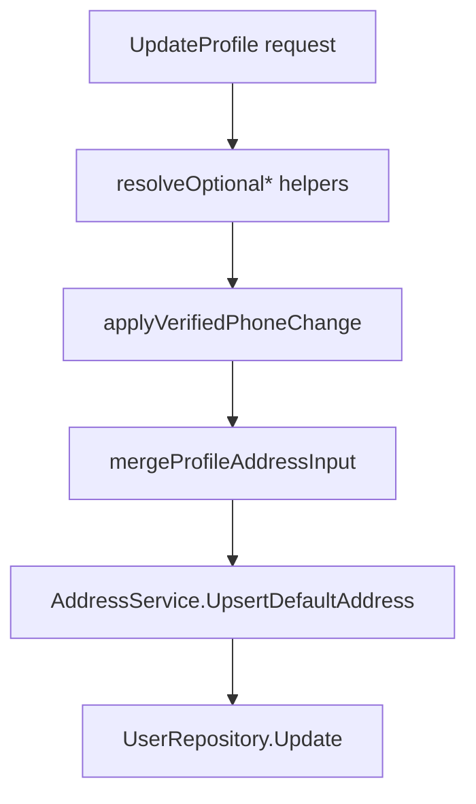

### Call chain

1. `user_handler.go:290` `UpdateProfile`.
2. `user_profile.go:60` `UpdateProfile`.
3. `user_profile.go:329-448` resolve/normalize name, phone, text fields.
4. `user_profile.go:228` `applyVerifiedPhoneChange`.
5. `user_profile.go:478-624` xử lý address patch.
6. Nếu có address meaningful patch: `address_service.go:99` `UpsertDefaultAddress`.
7. Cuối cùng `user_repository.go:252` `Update`.

### Invariant

- Đổi số điện thoại không chỉ là update string; phải có verified challenge phù hợp.
- Địa chỉ mặc định được suy ra và upsert từ profile patch khi user cung cấp đủ dữ liệu.
- `hasMeaningfulProfileAddressPatch` giúp tránh tạo/chỉnh address chỉ vì request gửi field rỗng.

### Hotspot thực tế

- `CreateAddress`, `UpdateAddress`, `SetDefault` đều dùng `ClearDefault` + write tiếp theo. Chưa có một transaction coordinator chặt cho toàn invariant default-address.

## Luồng 6: Catalog list, search assist, storefront và product review

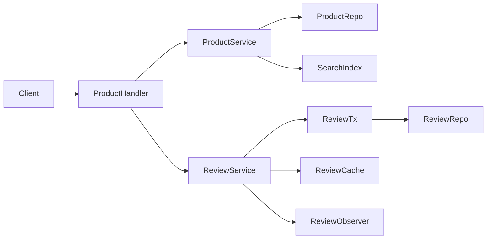

### Catalog list

1. `product_handler.go:174` `List`.
2. `product_queries.go:49` `List`.
3. `product_queries.go:277` `normalizeListProductsQuery`.
4. Nếu `shouldUseSearchBackend` `:410` là true:
   - search index trả danh sách ID
   - `product_repository.go:281` `ListByIDs` load truth từ DB
5. Nếu false:
   - `product_repository.go:164` `List` query trực tiếp DB với cursor.

### Search assist

1. `product_handler.go:224` `SearchAssist`.
2. `product_search_assist.go:26` `GetSearchAssist`.
3. `expandSearchAssistTerms` `:54` sinh token/query variants.
4. `product_search_assist_repository.go:14` `SearchAssist`.
5. Repository gọi:
   - `countSearchAssistResults`
   - `listSearchSuggestions`
   - `listSearchFacets`

### Storefront

1. `storefront_handler.go:33` `GetHome`.
2. `storefront_service.go:46` `GetHome`.
3. `storefront_repository.go:39` `ListCategories`.
4. `storefront_repository.go:132` `ListEditorialSectionsByCategorySlugs`.
5. `storefront_repository.go:178` `ListFeaturedProductsByCategorySlugs`.
6. `storefront_service.go:111` `GetCategoryPage` và `:128` `buildCategoryPage` cho category detail.

### Review write path

1. `product_review_handler.go:69` `CreateReview`.
2. `product_review_service.go:215` `CreateReview`.
3. `product_review_service.go:368` `runInTx`.
4. `product_review_factory.go:26` `New`.
5. `product_review_repository.go:37` `CreateReview`.
6. `product_review_repository.go:203` `ApplyReviewSummaryDelta`.
7. `product_review_service.go:471` `notifyBestEffort`.
8. `product_review_observer.go` chạy metrics/cache invalidation.

### Review read path

1. `product_review_handler.go:17` `ListReviews`.
2. `product_review_service.go:138` `ListReviews`.
3. `loadReviewSummary` `:378`, `loadFirstReviewPage` `:414`.
4. Cache miss thì `loadReviewsFromStore` `:454`.
5. `product_review_cache.go` lưu summary và first page.

### Invariant

- Product truth và stock truth luôn ở `product-service`.
- Search và media là integration phụ, write chính không được phụ thuộc cứng.
- Review summary không recompute toàn bộ mỗi lần; dùng delta apply trong transaction.

### Failure mode

| Failure mode | Hàm | Hành vi |
| --- | --- | --- |
| Search backend chết | `product_queries.go:434`, `:462` | Log warning, fallback DB/query path. |
| Review cache lỗi | `product_review_service.go:484` | Warn rồi fallback DB. |
| Duplicate review | `product_review_repository.go` unique constraint | Service map về domain error, không tạo 2 review/user/product. |

## Luồng 7: Cart merge/add/update dựa trên product truth

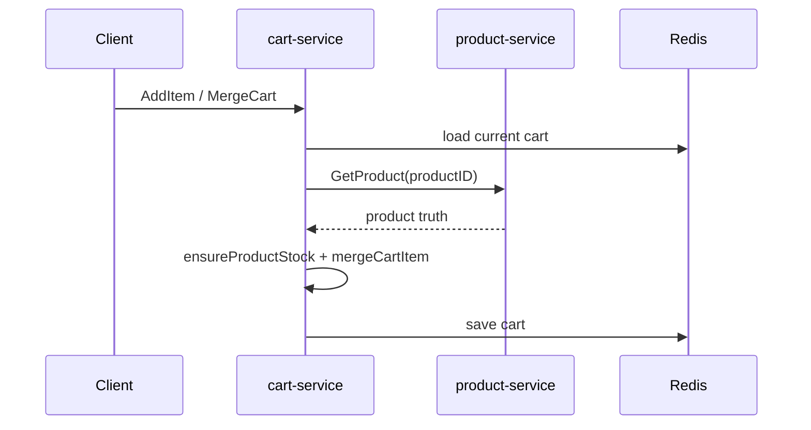

### Add/Merge call chain

1. `cart_handler.go:80` `AddItem` hoặc `:49` `MergeCart`.
2. `cart_mutations.go:69` `AddItem` hoặc `:13` `MergeCart`.
3. `cart_helpers.go:38` `loadCart`.
4. `cart_helpers.go:96` `getProductForCart` -> `grpc_client/product_client.go:38` `GetProduct`.
5. `cart_mutations.go:268` `ensureProductStock`.
6. `cart_mutations.go:204` `mergeCartItem`.
7. `cart_helpers.go:69` `saveCart`.

### Update quantity call chain

1. `cart_handler.go:106` `UpdateItem`.
2. `cart_mutations.go:121` `UpdateItem`.
3. `findCartItemIndex` -> sửa quantity -> `saveCart`.

### Invariant

- Cart không quyết định product truth; add/merge luôn hỏi product-service.
- Cart giữ snapshot cho UX, nhưng order preview/create sẽ quote lại hoàn toàn từ product truth.

### Hotspot

- `UpdateItem` hiện không re-fetch product. Đây là chỗ dễ sinh chênh giá hoặc quantity vượt stock nếu catalog đổi sau khi item đã vào cart.

## Luồng 8: Preview order và create order

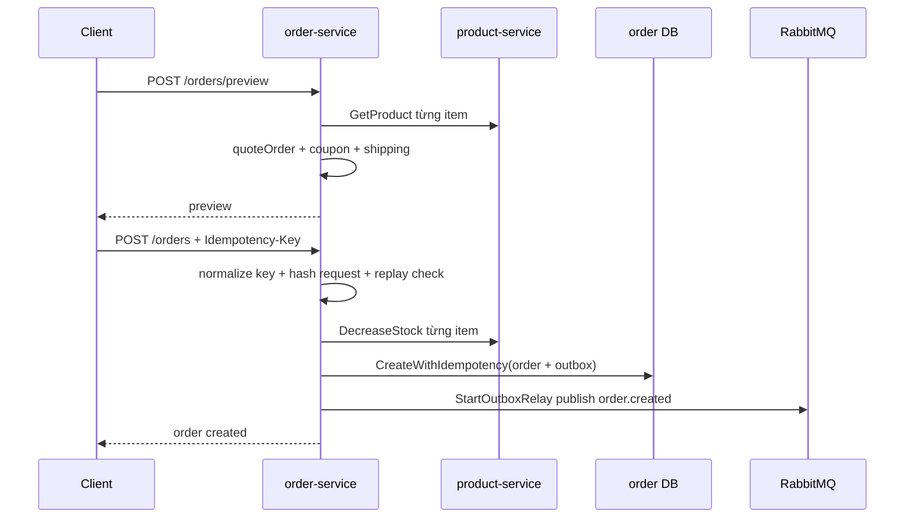

### Preview call chain

1. `order_handler.go:118` `PreviewOrder`.
2. `order_pricing.go:48` `PreviewOrder`.
3. `validateOrderRequest` `:138`.
4. `quoteOrder` `:78`.
5. Mỗi item đi qua `quoteOrderItem` `:181`.
6. Product lookup cache dùng `newProductQuoteCache` và `getOrLoad` `:227`, `:256`.
7. Coupon qua `validateCoupon` `:469`, `calculateDiscount` `:531`.
8. Shipping qua `calculateShippingFee`, `buildShippingOptions`, `resolveShippingPromise`.
9. `pricedOrderQuote.ToPreview` `order_service.go:147`.

### Create order call chain

1. `order_handler.go:89` `CreateOrder`.
2. `order_lifecycle.go:42` `CreateOrder`.
3. `order_idempotency.go:20` `normalizeOrderIdempotencyKey`.
4. `order_idempotency.go:32` `hashCreateOrderRequest`.
5. `order_idempotency.go:62` `findIdempotentOrder`.
6. Re-quote toàn bộ order bằng `quoteOrder`.
7. `newOrderFromQuote` `order_lifecycle.go:386`.
8. `buildOrderItems` `:424`.
9. `reserveCreatedOrderStock` `:568` -> `grpc_client/product_client.go:64` `DecreaseStock`.
10. `persistCreatedOrder` `:460`.
11. `order_repository.go:91` `CreateWithIdempotency`.
12. Outbox relay `order_events.go:182` `StartOutboxRelay`.
13. Nếu persist fail sau khi stock đã reserve: `restoreOrderItemsStock` `:590`.

### Invariant chính

- Không tin `price`, `discount`, `shipping`, `total` từ client.
- Idempotency key gắn với request hash, nên retry cùng key nhưng payload khác sẽ bị từ chối.
- Stock reserve đi trước DB persist, nhưng có compensation rõ nếu persist fail.
- Event publish không gửi trực tiếp trong transaction; đi qua outbox.

### Failure mode

| Failure mode | Hàm | Recovery |
| --- | --- | --- |
| Double submit | `findIdempotentOrder` | Replay order cũ hoặc trả conflict nếu payload đổi. |
| Hết hàng giữa preview và create | `reserveCreatedOrderStock` | Map sang insufficient stock error. |
| DB fail sau khi reserve stock | `restoreOrderItemsStock` | Compensation restore stock. |
| RabbitMQ fail lúc publish | `StartOutboxRelay` + repo mark failed | Message nằm trong outbox để retry. |

## Luồng 9: Payment process, webhook và đồng bộ trạng thái order

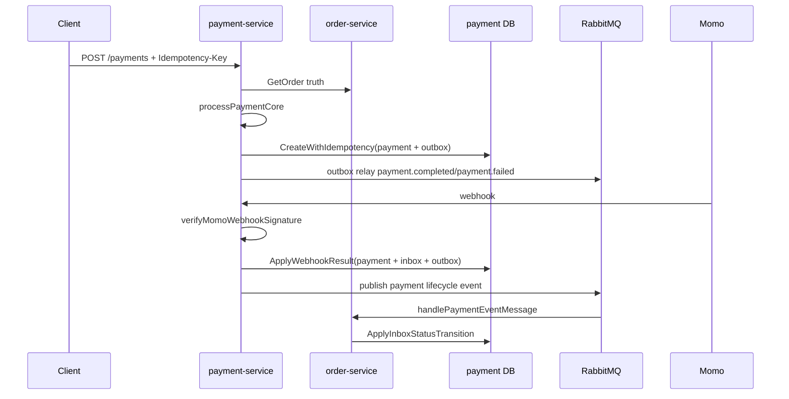

### Process payment call chain

1. `payment_handler.go:50` `ProcessPayment`.
2. `payment_processing.go:43` `ProcessPayment`.
3. `payment_idempotency.go:16` `normalizeIdempotencyKey`.
4. `payment_idempotency.go:28` `hashProcessPaymentRequest`.
5. `payment_idempotency.go:53` `findIdempotentPayment`.
6. `payment_processing.go:62` `processPaymentCore`.
7. `internal/client/order_client.go:53` `GetOrder`.
8. `payment_helpers.go:36` `normalizePaymentMethod`.
9. `payment_helpers.go:66` `resolveGatewayProvider`.
10. `payment_repository.go:60` `CreateWithIdempotency`.
11. `payment_events.go:109` `StartOutboxRelay`.

### Refund call chain

1. `payment_handler.go:145` `RefundPayment`.
2. `payment_refunds.go:41` `RefundPayment`.
3. `payment_idempotency.go:43` `hashRefundPaymentRequest`.
4. `payment_repository.go:199` `ListByOrderID` hoặc read cụm payment liên quan.
5. `payment_enrichment.go:210` `refundableAmountForCharge`.
6. `payment_repository.go:271` `Update` hoặc create refund record/outbox tùy flow model.

### Webhook call chain

1. `payment_handler.go:222` `HandleMomoWebhook`.
2. `payment_refunds.go:230` `HandleMomoWebhook`.
3. `payment_helpers.go:142` `verifyMomoWebhookSignature`.
4. `payment_refunds.go:372` `findWebhookPayment`.
5. `payment_helpers.go:273` `momoWebhookMessageID`.
6. `payment_repository.go:333` `ApplyWebhookResult`.
7. `payment_events.go:45` `buildPaymentOutboxMessage`.
8. `payment_events.go:166` `publishOutboxMessage`.
9. `order-service/internal/service/payment_events.go:78` `handlePaymentEventMessage`.
10. `order_repository.go:2022` `ApplyInboxStatusTransition`.

### Invariant

- Payment luôn dựa trên order truth và outstanding amount, không dựa trên client amount.
- Completed payment có thể publish event ngay; MoMo pending đợi webhook xác nhận.
- Webhook replay được xem là normal case; inbox record ngăn apply lặp side effect.

### Failure mode

| Failure mode | Nơi xử lý | Hành vi |
| --- | --- | --- |
| Idempotency key reuse với payload khác | `findIdempotentPayment` | Trả conflict thay vì tạo side effect mới. |
| Webhook signature sai | `verifyMomoWebhookSignature` | Từ chối ngay. |
| Webhook duplicate | `ApplyWebhookResult` | Inbox transition khiến side effect không nhân đôi. |
| Order-service đang down khi process payment | `order_client.GetOrder` | Fail fast, không tạo payment “mù”. |

## Luồng 10: Return, evidence upload và refund worker

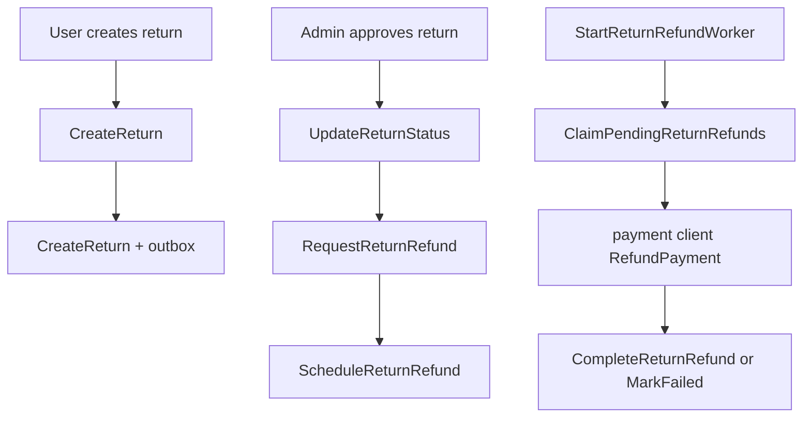

### Create return call chain

1. `order_handler.go:174` `CreateReturn`.
2. `order_returns.go:16` `CreateReturn`.
3. `loadOrderByID` `order_queries.go:297`.
4. `GetReturnEligibility` `order_return_eligibility.go:10`.
5. `buildReturnItems` `order_returns.go:221`.
6. `order_repository.go:271` `CreateReturn`.
7. `order_events.go:73` `buildReturnOutboxMessage`.

### Update return status call chain

1. `order_handler.go:430` `UpdateReturnStatus`.
2. `order_returns.go:147` `UpdateReturnStatus`.
3. `isValidReturnStatus`, `canTransitionReturnStatus`.
4. `order_repository.go:958` `UpdateReturnStatus`.

### Queue refund call chain

1. `order_handler.go:460` `RequestReturnRefund`.
2. `order_returns.go:181` `RequestReturnRefund`.
3. `prepareReturnRefund` `:378`.
4. `calculateReturnRefundAmount` `:342`.
5. `findRefundableChargePayment` `:430`.
6. `buildReturnRefundIdempotencyKey` `:426`.
7. `order_repository.go:1005` `ScheduleReturnRefund`.

### Worker call chain

1. `order_return_refund_worker.go:24` `StartReturnRefundWorker`.
2. `flushPendingReturnRefunds` `:46`.
3. `order_repository.go:1074` `ClaimPendingReturnRefunds`.
4. `processPendingReturnRefund` `:88`.
5. `payment_client.go:171` `RefundPayment`.
6. Thành công: `order_repository.go:1150` `CompleteReturnRefund`.
7. Thất bại retryable: `order_repository.go:1212` `MarkReturnRefundAttemptFailed`.
8. `nextReturnRefundRetryAt` `:156` tính backoff.

### Evidence upload call chain

1. `order_return_evidence_handler.go:23` `UploadReturnEvidence`.
2. `toUploadableReturnEvidence` `:64`.
3. `order_return_evidence.go:15` `UploadReturnEvidence`.
4. `isClosedReturnForEvidence` `:89`.
5. Upload object store với key từ `buildReturnEvidenceObjectKey` `:72`.
6. `order_repository.go:587` `AddReturnEvidence`.

### Invariant

- Return quantity không được vượt số đã mua trừ số đã hoàn trước đó.
- Refund chỉ queue khi return ở trạng thái được phép.
- Refund worker dùng lease nên nhiều worker song song vẫn tránh double processing.

## Luồng 11: Notification consumer, retry và wishlist alerts

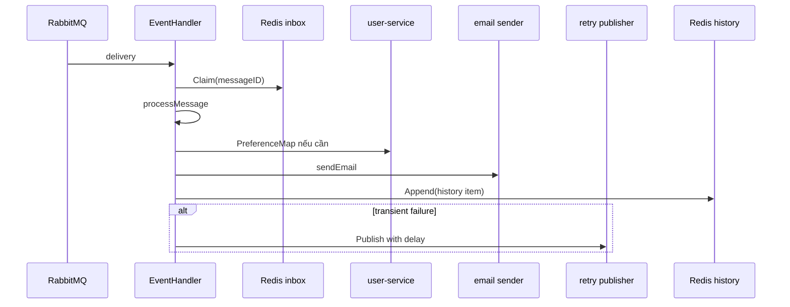

### Consumer call chain

1. `notification-service/cmd/main.go:223` `startWorker`.
2. `event_handler.go:127` `HandleMessage`.
3. `messaging/delivery_metadata.go:19` `BuildDeliveryMetadata`.
4. `inbox/redis_store.go:39` `Claim`.
5. `event_handler.go:250` `processMessage`.
6. Tùy routing key, gọi `handleOrderCreated`, `handlePaymentCompleted`, `handlePaymentFailed`, `handlePaymentRefunded`, `handleOrderCancelled`, `handleReturnEvent`.
7. Nếu topic cần preference:
   - `user_client.go:83` `PreferenceMap`
   - `event_handler.go:524` `shouldDeliverTopic`
8. `event_handler.go:706` `sendEmail`.
9. `history_store.go:53` `Append`.
10. Thành công: `redis_store.go:58` `MarkProcessed`.
11. Fail tạm thời: `retry_publisher.go:37` `Publish`.
12. Fail vĩnh viễn: reject/DLQ path.

### Wishlist alert worker call chain

1. `cmd/main.go:154` tạo worker.
2. `wishlist_alert_worker.go:63` `Start`.
3. `runCycle` `:84`.
4. `user_client.go:144` `ListDispatchableWishlistAlerts`.
5. `wishlist_alert_deduper.go:38` `Claim`.
6. `wishlist_alert_worker.go:133` `wishlistAlertEmail`.
7. Gửi mail -> log kết quả.

### Invariant

- Notification consumer chấp nhận at-least-once delivery, nên phải dedupe.
- Inbox store và history store tách riêng: một bên phục vụ correctness, một bên phục vụ UX/audit.
- Wishlist alert deduper giúp poll worker không spam lặp khi điều kiện alert vẫn còn đúng ở nhiều cycle.

### Failure mode

| Failure mode | Hàm | Hành vi |
| --- | --- | --- |
| Redis inbox down | `cmd/main.go` fallback/degrade | Consumer có thể vẫn chạy nhưng duplicate protection yếu hơn. |
| Preference lookup fail | `event_handler.go:524` path | Xử lý như transient và đưa vào retry nếu cần. |
| Email sender fail | `sendEmail` + delivery error helpers | Phân loại permanent/transient để quyết định retry. |

## Kết luận: những invariant quan trọng nhất của backend

| Invariant | Hàm giữ invariant |
| --- | --- |
| Checkout không được tạo 2 order cho cùng một intent | `order_lifecycle.go:42`, `order_idempotency.go:20-62`, `order_repository.go:91` |
| Payment không được vượt outstanding balance và phải replay-safe | `payment_processing.go:43`, `payment_idempotency.go`, `payment_repository.go:60` |
| Webhook không được áp side effect hai lần | `payment_refunds.go:230`, `payment_repository.go:333` |
| Event publish không được mất giữa DB commit và MQ publish | `order_events.go:182`, `payment_events.go:109`, outbox tables trong repo |
| Consumer không được gửi email vô hạn khi nhận message lặp | `event_handler.go:127`, `inbox/redis_store.go:39`, `retry_publisher.go:37` |
| Stock không được âm khi checkout/hủy đơn | `order_lifecycle.go:568`, `:590`, `product_grpc.go:139`, `product_repository.go:347`, `:364` |
