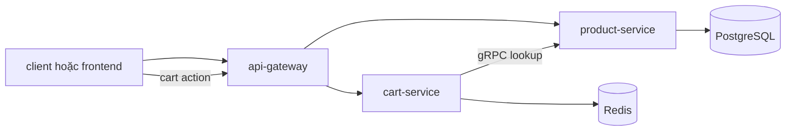
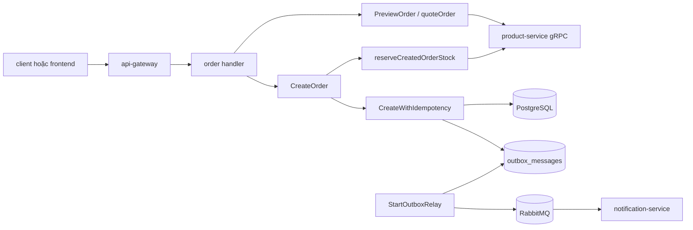
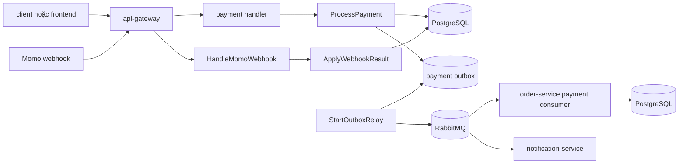
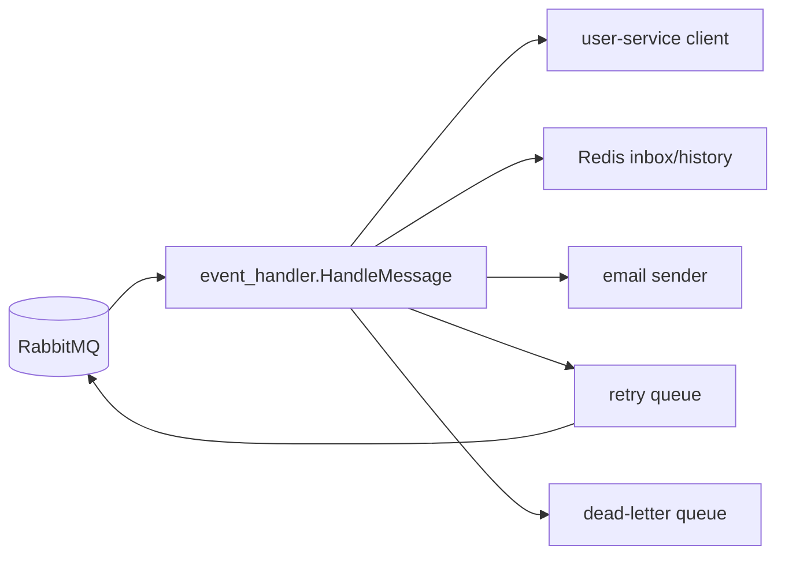

# Deep Dive

File này gom toàn bộ deep-dive cũ thành một bản runtime map duy nhất: repo chạy thế nào, dữ liệu đi qua đâu, và service nào giữ invariant gì.

## Runtime thật của repository

| Thành phần | Vai trò | Source of truth nên đọc |
| --- | --- | --- |
| `api-gateway/` | HTTP entrypoint, reverse proxy, resilience cơ bản | `api-gateway/cmd/main.go`, `api-gateway/internal/proxy/service_proxy.go` |
| `services/user-service/` | auth, profile, address, wishlist, notification preference | `services/user-service/internal/handler/`, `internal/service/` |
| `services/product-service/` | catalog, storefront listing, media, search, review, gRPC product lookup | `services/product-service/internal/service/`, `internal/repository/` |
| `services/cart-service/` | guest/user cart trên Redis, merge cart, sync snapshot sản phẩm | `services/cart-service/internal/service/cart_mutations.go` |
| `services/order-service/` | quote, create order, reserve stock, cancel, admin order/report, outbox | `services/order-service/internal/service/order_pricing.go`, `order_lifecycle.go`, `order_events.go` |
| `services/payment-service/` | create payment, refund, webhook, outbox, idempotency | `services/payment-service/internal/service/payment_processing.go`, `payment_refunds.go`, `payment_events.go` |
| `services/notification-service/` | consume event RabbitMQ, inbox/history, retry, DLQ, email send | `services/notification-service/cmd/main.go`, `internal/handler/event_handler.go` |
| `pkg/` | config, logger, DB, middleware, observability, response | `pkg/config/`, `pkg/logger/`, `pkg/middleware/`, `pkg/observability/` |
| `proto/` | contract gRPC giữa service | `proto/*.proto` |
| `client/` | shopper storefront/account runtime chính trong Compose | `client/src/app/`, `client/src/lib/api/` |
| `frontend/` | admin/workbook React + Vite | `frontend/src/app/`, `frontend/src/features/admin/`, `frontend/src/services/api/` |
| `deployments/docker/` | runtime local gần production nhất | `deployments/docker/docker-compose.yml`, `deployments/docker/config/` |

## Boundary cần nhớ trước khi đọc sâu

- PostgreSQL là source of truth cho user, product, order, payment.
- Redis là storage chính cho cart; với notification, Redis inbox/history chỉ là lớp reliability phụ trợ.
- RabbitMQ xử lý luồng bất đồng bộ sau commit, không thay transaction đồng bộ.
- MinIO và Elasticsearch là integration tùy chọn; catalog core không được chết theo hai dependency này.
- `client/` là shopper runtime chính ở `http://localhost:3000`; `frontend/` là admin/workbook ở `http://localhost:4173`.

## Luồng 1: Catalog và Cart

Điểm chính:

- Catalog public đi qua `services/product-service/internal/handler/product_handler.go` và `internal/service/product_queries.go`.
- Cart write flow nằm ở `services/cart-service/internal/service/cart_mutations.go::{MergeCart,AddItem,UpdateItem,RemoveItem}`.
- `AddItem` và `MergeCart` hỏi `product-service` để lấy snapshot giá/tồn kho mới nhất trước khi ghi Redis.
- `UpdateItem` hiện chỉ đổi quantity trên snapshot đang có, không hỏi lại product domain; đây là pitfall cần nhớ khi sửa cart.

## Luồng 2: Preview order, tạo order, giữ tồn kho, phát event

Điểm chính:

- Preview path: `services/order-service/internal/service/order_pricing.go::PreviewOrder`, `quoteOrder`, `quoteOrderItem`.
- Create path: `services/order-service/internal/service/order_lifecycle.go::CreateOrder`.
- Stock reservation và rollback đọc ở cùng file `order_lifecycle.go`, cộng thêm `order_reservations.go::finalizeOrderReservationState`.
- Persist + idempotency nằm ở `services/order-service/internal/repository/order_repository.go::CreateWithIdempotency`.
- Event relay nằm ở `services/order-service/internal/service/order_events.go::StartOutboxRelay`.
- Cancel flow hoàn trả stock trong `services/order-service/internal/service/order_lifecycle.go::{CancelOrder,CancelOrderAsAdmin,restoreOrderItemsStock}`.

## Luồng 3: Payment, webhook, đồng bộ trạng thái order

Điểm chính:

- Payment create path: `services/payment-service/internal/service/payment_processing.go::ProcessPayment`.
- Refund và webhook: `services/payment-service/internal/service/payment_refunds.go::{RefundPayment,HandleMomoWebhook}`.
- Idempotent persist: `services/payment-service/internal/repository/payment_repository.go::CreateWithIdempotency`.
- Webhook duplicate protection: `services/payment-service/internal/repository/payment_repository.go::ApplyWebhookResult`.
- Order đồng bộ trạng thái từ event payment ở `services/order-service/internal/service/payment_events.go::handlePaymentEventMessage`.

## Luồng 4: Notification worker và reliability

Điểm chính:

- Service boot và wiring nằm ở `services/notification-service/cmd/main.go`.
- Worker chính nằm ở `services/notification-service/internal/handler/event_handler.go::HandleMessage`.
- Redis inbox/history được bật nếu Redis ping thành công; nếu không, service vẫn chạy nhưng mất duplicate protection và audit đầy đủ.
- Queue declaration, retry publisher, queue monitor nằm ở `services/notification-service/internal/messaging/`.

## Những vùng cần đọc kỹ vì ảnh hưởng production

### Invariant về tiền và tồn kho

- Không tin giá từ frontend; order và payment đều tự quote lại.
- Không tách create order thành nhiều repo call rời rạc ngoài transaction/idempotency boundary.
- Không để cancel flow quên hoàn stock.

### Retry safety

- Order create và payment create đều có idempotency key.
- Payment webhook và notification consume đều có cơ chế chống duplicate ở tầng persistence hoặc inbox.
- Nếu thêm webhook mới, phải tìm đúng chỗ đang áp dụng pattern này thay vì tự viết flow mới.

### Pagination và query cost

- `services/order-service/internal/repository/order_repository.go::ListAllByCursor` là hướng đúng cho list lớn.
- `ListAll` vẫn dùng `COUNT(*) + OFFSET/LIMIT`; handler `ListAdminOrders` chỉ dùng cursor khi query có `cursor`.
- Review listing ở `services/product-service/internal/service/product_review_service.go::ListReviews` vẫn normalize `page/limit/offset`.

## Khi docs và source mâu thuẫn

Tin theo thứ tự sau:

1. `deployments/docker/docker-compose.yml`
2. `services/*/cmd/main.go`
3. `services/*/internal/handler/`
4. `services/*/internal/service/`
5. `services/*/internal/repository/`
6. `client/src/` và `frontend/src/`
