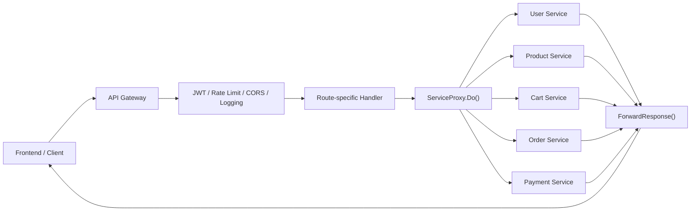

# API Gateway Deep Dive

## 1. Vai trò của service

`api-gateway` là cửa vào chung cho toàn bộ backend. Frontend không gọi trực tiếp từng microservice, mà gọi gateway rồi gateway forward request sang service thích hợp.

Service này không chứa business logic nghiệp vụ như "tạo đơn hàng" hay "xử lý thanh toán". Nhiệm vụ chính của nó là:

- gom route public thành một API thống nhất,
- áp middleware chung như JWT, CORS, rate limit, logging,
- reverse proxy request sang service thật.

## 2. File quan trọng

- `cmd/main.go`
- `internal/handler/*.go`
- `internal/proxy/service_proxy.go`

## 3. Luồng hoạt động

```text
Frontend
  -> API Gateway
      -> route matching
      -> JWT / rate limit / logging
      -> ServiceProxy.Do()
      -> backend service
      -> ForwardResponse()
      -> Frontend
```

## 3.1 Sơ đồ Mermaid



## 4. File nên đọc đầu tiên

### `cmd/main.go`

Bạn sẽ thấy:

- load config,
- khởi tạo proxy cho từng service,
- gắn middleware toàn cục,
- register route cho từng handler.

Đây là nơi tốt nhất để hiểu bức tranh backend cấp hệ thống.

### `internal/proxy/service_proxy.go`

File này là trái tim của gateway:

- build backend URL,
- copy header,
- forward query string,
- dùng `http.Client` để gọi backend,
- có retry và circuit breaker.

Điểm Golang rất đáng học:

- code explicit, ít magic,
- dùng `context.Context` đúng cách,
- dùng composition thay vì framework nặng.

## 5. Handler của gateway làm gì?

Gateway handler rất mỏng. Ví dụ:

- `internal/handler/order_handler.go`
- `internal/handler/payment_handler.go`
- `internal/handler/user_handler.go`

Các handler này gần như chỉ:

1. lấy request hiện tại,
2. gọi `proxy.Do(...)`,
3. trả response về client.

Đây là một bài học kiến trúc quan trọng: không nhét domain logic vào gateway.

## 5.1 OAuth route mới đi qua gateway như thế nào?

Gateway vẫn giữ đúng vai trò "mỏng" cho social login:

- frontend redirect người dùng tới `/api/v1/auth/oauth/:provider/start`,
- gateway forward nguyên request sang `user-service`,
- `user-service` tạo `state` đã ký, set `nonce` cookie rồi redirect sang Google,
- provider callback quay về gateway tại `/api/v1/auth/oauth/:provider/callback`,
- gateway forward callback đó về `user-service`,
- `user-service` đổi `code` thành `login_ticket` ngắn hạn rồi redirect người dùng về frontend `/auth/callback`,
- frontend gọi `POST /api/v1/auth/oauth/exchange` qua gateway để đổi `login_ticket` sang `access token + refresh token`.

Điểm quan trọng là gateway không tự xử lý business logic OAuth, không giữ provider secret, và cũng không tự ký JWT cho client. Nó chỉ làm đúng phần forward route và response.

## 6. Middleware đáng chú ý

Gateway dùng shared middleware trong `pkg/middleware`:

- `JWTAuth`: kiểm tra token.
- `FrontendCORS`: chỉ cho phép origin phù hợp.
- `NewRateLimiter`: chống spam request.
- `RequestLogger`: ghi log request.

Với người học backend, gateway là nơi tốt để hiểu "cross-cutting concerns" nên được áp ở đâu.

## 7. Điều nên học từ service này

- Cách Go tổ chức reverse proxy theo hướng đơn giản.
- Cách tách routing khỏi business logic.
- Cách dùng middleware để chuẩn hóa behavior toàn hệ thống.
- Cách một service "mỏng" nhưng vẫn rất quan trọng trong production.

## 8. Khi đọc code service này, hãy tự trace

Ví dụ với `GET /api/v1/orders/:id`:

1. frontend gọi gateway,
2. gateway match route trong `order_handler.go`,
3. JWT middleware chạy,
4. handler gọi `ServiceProxy.Do`,
5. request sang `order-service`,
6. response được forward ngược lại.

Nếu trace được flow này, bạn đã hiểu đúng vai trò của API Gateway.

## 9. Lý thuyết cần biết để hiểu service này

### Reverse proxy là gì?

Reverse proxy là một service đứng trước các backend service khác, nhận request từ client rồi forward tiếp. Client không cần biết service thật đang ở đâu.

Trong project này, gateway giúp:

- gom toàn bộ API về một domain/entry point,
- giữ contract ổn định cho frontend,
- áp cùng một lớp middleware cho nhiều service.

### Middleware là gì?

Middleware là lớp chạy trước hoặc sau handler chính. Nó dùng để xử lý các concern dùng chung như:

- xác thực,
- CORS,
- logging,
- rate limit.

Nếu không có middleware, mỗi handler sẽ phải tự viết lại các đoạn kiểm tra lặp đi lặp lại.

### Idempotent request là gì?

Một request được coi là idempotent khi gọi nhiều lần cũng không làm thay đổi trạng thái nhiều hơn một lần. Ví dụ:

- `GET /products` là idempotent.
- `POST /orders` không idempotent.

Điều này giải thích vì sao `ServiceProxy` chỉ retry an toàn với các method như `GET`.

### Circuit breaker là gì?

Circuit breaker là cơ chế ngăn gateway tiếp tục gọi tới một service đang lỗi liên tục. Nếu không có nó:

- service chết vẫn bị gọi,
- latency tăng,
- error dây chuyền lan sang cả hệ thống.

### Tại sao người học Go nên hiểu gateway?

Vì gateway dạy bạn:

- cách tổ chức một entry point cho nhiều domain,
- cách Go làm proxy/networking rõ ràng,
- và cách tách cross-cutting concerns ra khỏi domain logic.
