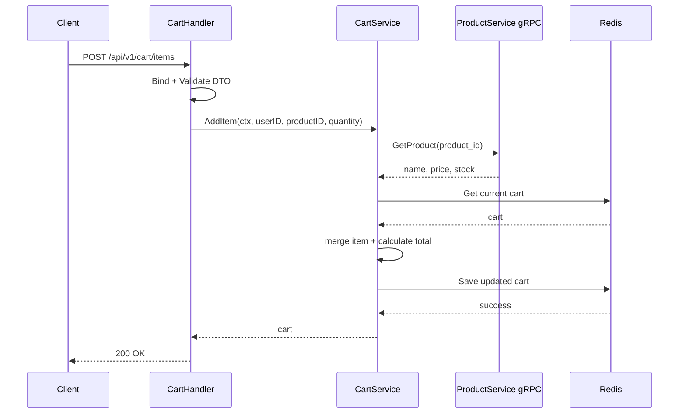

# Cart Service Deep Dive

## 1. Vai trò của service

`cart-service` quản lý giỏ hàng của người dùng. Đây là service rất hay để học vì nó dạy hai điều quan trọng:

- không phải dữ liệu nào cũng cần nằm trong PostgreSQL,
- backend không được tin client ở các trường quan trọng như giá sản phẩm.

## 2. Route chính

Tất cả route đều cần JWT:

- `GET /api/v1/cart`
- `POST /api/v1/cart/items`
- `PUT /api/v1/cart/items/:productId`
- `DELETE /api/v1/cart/items/:productId`
- `DELETE /api/v1/cart`

## 3. Storage và dependency

- Redis: lưu cart theo user.
- gRPC Product Client: lấy dữ liệu sản phẩm thật.

Sau patch mới, request add-to-cart chỉ cần:

- `product_id`
- `quantity`

Backend tự lấy:

- `name`
- `price`
- `stock`

## 4. Luồng thêm sản phẩm vào giỏ

```text
request
  -> handler.AddItem
  -> validate DTO
  -> service.AddItem
  -> gRPC GetProduct(product_id)
  -> get current cart from Redis
  -> merge item / update quantity
  -> calculate total
  -> save cart to Redis
  -> response
```

## 4.1 Sơ đồ Mermaid



## 5. File quan trọng

### `internal/service/cart_service.go`

Đây là file quan trọng nhất:

- gọi `product-service` để lấy product thật,
- kiểm tra stock,
- cập nhật quantity nếu item đã tồn tại,
- tính lại tổng cart.

### `internal/repository/cart_repository.go`

Repository cho Redis, thể hiện cách Go làm việc với key-value store rất gọn.

### `internal/grpc_client/product_client.go`

Client nội bộ dùng để gọi product service qua gRPC.

### `internal/handler/cart_handler.go`

Mapping business error thành HTTP code:

- product not found,
- invalid product,
- insufficient stock,
- item not found.

## 6. Điều đáng học

- Redis phù hợp với dữ liệu tạm như cart.
- Source of truth phải nằm ở backend/service đúng domain.
- Service có thể vừa thao tác Redis vừa gọi gRPC sang service khác.

## 7. Tư duy backend quan trọng

`cart-service` là ví dụ rất thực chiến cho nguyên tắc:

> Frontend chỉ nên gửi intent, backend mới quyết định dữ liệu nghiệp vụ thật.

Intent ở đây là: "Tôi muốn thêm sản phẩm X với số lượng Y".

Backend mới là nơi quyết định:

- sản phẩm có tồn tại không,
- còn hàng không,
- giá thật là bao nhiêu,
- tổng giỏ hàng là bao nhiêu.

## 8. Thứ tự đọc gợi ý

1. `cmd/main.go`
2. `internal/handler/cart_handler.go`
3. `internal/dto/cart_dto.go`
4. `internal/service/cart_service.go`
5. `internal/repository/cart_repository.go`
6. `internal/grpc_client/product_client.go`

## 9. Bài học nghề nghiệp

Service này rất đáng học nếu bạn muốn làm Golang backend thực tế, vì nó dạy:

- tích hợp Redis,
- tích hợp gRPC client,
- bảo vệ business data khỏi client tampering,
- và giữ logic nghiệp vụ ở đúng tầng service.

## 10. Lý thuyết cần biết để hiểu service này

### Redis phù hợp với cart ở điểm nào?

Cart là dữ liệu:

- thay đổi thường xuyên,
- không cần transaction nặng như order/payment,
- có thể xem là state tạm thời.

Redis mạnh ở read/write nhanh và key-value structure, nên rất hợp cho cart.

### Source of truth là gì?

Source of truth là nơi dữ liệu được coi là đúng nhất trong hệ thống.

Với project này:

- product name/price/stock: source of truth là `product-service`
- cart: chỉ là bản tạm thời để người dùng thao tác

### Vì sao backend không tin frontend?

Frontend có thể bị:

- sửa thủ công request,
- script giả mạo,
- bug UI làm gửi dữ liệu sai.

Nếu backend tin `price` từ frontend, người dùng có thể tạo cart sai giá.

### gRPC trong cart-service giúp gì?

Nó giúp cart lấy product thật một cách type-safe hơn so với gọi HTTP thủ công, đặc biệt phù hợp cho internal service-to-service call.
