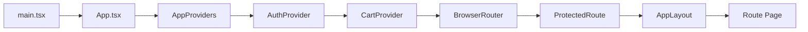

# Frontend Architecture

Tài liệu này giải thích kiến trúc frontend hiện tại của repo theo đúng source code đang có. Mục tiêu là để người mới vào dự án có thể:

- biết frontend nào đang là runtime chính
- hiểu vì sao `frontend/src` vừa có cấu trúc mới vừa còn nhiều file compatibility
- lần được luồng `route -> page -> hook/provider -> api -> backend`
- nhận ra phần nào đã hoàn chỉnh, phần nào đang ở trạng thái chuyển tiếp sau refactor

## 1. Frontend nào là source of truth của runtime local

### `frontend/`

Đây là frontend React + Vite và là UI local chính của repo hiện tại.

Điểm xác nhận từ source:

- có service `frontend` trong `deployments/docker/docker-compose.yml`
- `Makefile` có `frontend-install`, `frontend-dev`, `frontend-build`
- `vite.config.ts` cấu hình dev server ở `5174`, preview ở `4173`
- `README.md` và Docker guide của repo đều ưu tiên nhánh này cho local/dev

Vai trò:

- storefront chính
- auth flow
- cart, checkout, account
- admin console

### `client/`

Đây là frontend Next.js App Router ở trạng thái experimental.

Điểm xác nhận từ source:

- có Dockerfile và source khá đầy đủ
- có provider tree riêng (`AuthProvider`, `CartProvider`, `WishlistProvider`)
- không có service compose mặc định
- `Makefile` có `client-dev` và `client-build`, nhưng local runtime mặc định vẫn là `frontend/`

Nói ngắn gọn:

- `frontend/` là thứ cần đọc trước để hiểu hệ thống đang chạy như thế nào
- `client/` là nhánh tham khảo tốt để học hướng tổ chức khác, nhưng chưa phải runtime chính

## 2. Kiến trúc thư mục `frontend/src`

### Lớp source of truth mới

| Thư mục | Vai trò chính | Vì sao đáng học |
| --- | --- | --- |
| `app/` | entrypoint, provider tree, router, layout shell | cho bạn thấy “app boot” diễn ra ở đâu |
| `routes/` | page-level UI theo URL | giúp trace luồng người dùng nhanh |
| `features/` | logic theo domain như auth, cart, account, admin | giảm việc page tự ôm hết logic |
| `shared/` | API layer, shared components, types, utils | là boundary thật giữa UI và backend |
| `styles/` | CSS hệ thống | phản ánh cách app chia base/layout/component/page styles |

### Lớp compatibility vẫn còn tồn tại

Repo hiện không dùng chiến lược “big bang rewrite”. Thay vào đó, nhiều file cũ vẫn tồn tại như cầu nối:

- `frontend/src/hooks/*`
- `frontend/src/lib/*`
- `frontend/src/providers/*`
- `frontend/src/ui/*`
- `frontend/src/utils/*`
- `frontend/src/types/*`
- `frontend/src/app/hooks/*`
- `frontend/src/app/utils/*`
- một số `features/*/lib/*` và `features/*/types/*`

Phần lớn các file này chỉ re-export sang cấu trúc mới, ví dụ:

- `frontend/src/lib/api.ts` -> `../shared/api`
- `frontend/src/hooks/useAuth.ts` -> `../features/auth/hooks/useAuth`
- `frontend/src/ui/account/accountConfig.ts` -> `../../features/account/config/accountNavigation`
- `frontend/src/providers/AuthContext.tsx` -> `../features/auth/providers/AuthProvider`

### Vì sao code lại được tổ chức như vậy

Đây là cách refactor thực dụng:

- tách dần module theo domain
- vẫn giữ import cũ chạy được
- không bắt tất cả route/page phải sửa đồng loạt trong một PR khổng lồ

Lợi ích:

- ít rủi ro gãy app hàng loạt
- người đọc vẫn tìm ra “implementation thật”
- tạo nền để dọn import và tách module tiếp theo từng lát cắt nhỏ

Trade-off:

- cùng một capability có thể xuất hiện ở nhiều đường import
- người mới rất dễ nhầm file re-export với file implementation

Đó là lý do tài liệu `annotated/frontend-source-map.md` rất quan trọng.

## 3. Provider tree và dependency graph

Provider tree hiện tại:

1. `AppProviders`
2. `AuthProvider`
3. `CartProvider`
4. `BrowserRouter`
5. `ProtectedRoute`
6. `AppLayout`
7. page thật

### Vì sao thứ tự này đúng

`CartProvider` phụ thuộc `AuthProvider` vì nó phải biết:

- người dùng đã đăng nhập chưa
- có nên đọc guest cart từ localStorage hay fetch server cart
- khi login thì có cần merge guest cart vào server cart không

Nếu đảo ngược thứ tự này, cart bootstrap sẽ không có đủ context để quyết định behavior đúng.

## 4. Route tree thực tế

### Public / auth

- `/login`
- `/register`
- `/forgot-password`
- `/auth/callback`
- `/verify-email`
- `/reset-password`

### Storefront

- `/`
- `/products`
- `/products/:productId`
- `/categories/:categoryName`
- `/cart`
- `/checkout`

### Account protected

- `/profile`
- `/myorders`
- `/addresses`
- `/orders/:orderId`
- `/payments`
- `/security`
- `/notifications`

### Admin protected

- `/admin`

### Vì sao route tree này đáng đọc

- tách rõ public flow và authenticated flow
- dùng `AppLayout` cho phần có shell chung
- account/admin được guard ở router boundary thay vì mỗi page tự kiểm tra quyền

Đây là cách tổ chức dễ maintain hơn việc để từng page tự xử lý layout + auth + redirect.

## 5. Luồng dữ liệu quan trọng nhất

### Auth flow

`LoginPage/RegisterPage/AuthCallbackPage`
-> `useAuth()`
-> `AuthProvider`
-> `authApi`
-> `shared/api/http-client.ts`
-> `api-gateway`
-> `user-service`

Điểm đáng học:

- page chỉ lo UX của form
- provider giữ token lifecycle, bootstrap profile và refresh token
- OAuth dùng `login_ticket` ngắn hạn thay vì lộ JWT trên URL

### Guest cart / authenticated cart

`CatalogPage/ProductDetailPage/CartPage`
-> `useCart()`
-> `CartProvider`

Nếu guest:

- đọc/ghi localStorage qua guest cart storage
- gọi `productApi.getProductById` để kiểm tra stock và làm mới giá

Nếu authenticated:

- gọi `cartApi`
- khi vừa login, fetch cart server rồi merge guest items từng item một

Điểm đáng học:

- cart abstraction che giấu hai mode hoạt động khác nhau
- merge từng item giúp giảm nguy cơ mất toàn bộ guest cart nếu lỗi giữa chừng

### Account aggregation

`ProfilePage`, `OrdersPage`, `PaymentHistoryPage`, `SecurityPage`, `NotificationsPage`
-> `useOrderPayments()` / `useSavedAddresses()`
-> `orderApi`, `paymentApi`, `userApi`

Pattern này tốt vì:

- hook tổng hợp được dùng lại cho nhiều page
- page không phải tự lặp một chuỗi request giống nhau

### Admin

`AdminPage`
-> `useAuth()`
-> `api` compatibility layer
-> nhiều backend domain (`product`, `order`, `payment`, `user`)

Điểm đáng chú ý:

- admin page đang chạy được end-to-end
- nhưng file còn khá lớn và là ứng viên refactor rõ ràng nhất ở frontend

## 6. Những page nào fully-backed, page nào partial

### Tương đối bám backend thật

- login / register / verify email / forgot password / reset password
- product list / product detail / review
- cart
- checkout
- orders
- payment history
- admin product / coupon / payment / role update

### Partial hoặc còn tính “derived UI”

- `AddressesPage`: list địa chỉ thật, nhưng add/edit đang đẩy qua checkout thay vì có address form riêng
- `SecurityPage`: UI đổi mật khẩu và 2FA có mặt, nhưng backend hiện vẫn đi theo reset-password flow và chưa có 2FA thật
- `NotificationsPage`: feed và preferences được suy ra ở client, chưa có notification center API riêng

Viết docs theo cách này quan trọng vì nó giúp người mới:

- không hiểu nhầm capability UI là capability backend đã hoàn tất
- biết chỗ nào là UI placeholder, chỗ nào là integration thật

## 7. API layer của frontend được chia như thế nào

Lớp API thật nằm ở:

- `shared/api/http-client.ts`
- `shared/api/error-handler.ts`
- `shared/api/normalizers.ts`
- `shared/api/modules/*.ts`
- `shared/types/api.ts`

Nhưng repo vẫn giữ thêm các lớp compatibility:

- `shared/http/client.ts`
- `lib/api.ts`
- `lib/http/client.ts`
- `lib/normalizers/index.ts`
- `features/*/lib/api.ts`
- `features/*/types/api.ts`

### Vì sao pattern này tốt

- boundary network được gom một chỗ
- response thô không tràn thẳng vào UI
- refactor cấu trúc thư mục không bắt mọi page đổi hết trong một lần

### Khi nào nên dùng mẫu này

Dùng tốt khi app:

- gọi nhiều endpoint
- có nhiều page dùng chung cùng contract type
- muốn refactor dần từ cấu trúc cũ sang cấu trúc mới

## 8. Những điểm contract từng lệch và bài học còn lại

Tài liệu nên nói rõ những chỗ này vì đây là bài học thực tế về “source code đang ở đâu trên hành trình refactor”.

- merge guest cart hiện vẫn nằm trong `CartProvider`; helper `cartApi.mergeCart()` đã bị xoá để tránh gợi ý sai rằng backend có route `/api/v1/cart/merge`
- `orderApi.cancelOrder()` đã được đồng bộ về `PUT /api/v1/orders/:id/cancel`
- helper `paymentApi.verifyPaymentSignature()` đã bị xoá vì backend hiện không có route verify tương ứng
- copy trên `AuthCallbackPage` còn nhắc “Google/Facebook”, nhưng provider type ở source frontend và backend hiện là Google-only

Những điểm này không có nghĩa là kiến trúc sai. Chúng chỉ cho thấy:

- refactor và hoàn thiện contract vẫn đang tiếp diễn
- docs phải nói đúng hiện trạng, không được suy diễn “đã hoàn thiện”

## 9. Vì sao frontend hiện tại vẫn đáng học rất nhiều

### Điều làm tốt

- tách khá rõ `app -> routes -> features -> shared`
- provider và API layer có chủ đích
- normalizer giúp UI chịu lỗi tốt hơn
- account/cart/auth flow có ý thức về state lifecycle
- nhiều file compatibility được dùng như chiến lược migration an toàn

### Điều nên tiếp tục cải thiện

- dọn dần import cũ sang entrypoint mới
- tách `AdminPage` thành các route con hoặc feature module
- tách `normalizers.ts` theo domain khi đủ lớn
- tạo dedicated address management UI
- đồng bộ frontend API contract với backend route thật

## 10. Cách học nhanh và nhớ lâu

### Thứ tự đọc nên ưu tiên

1. `app/main.tsx`
2. `app/App.tsx`
3. `app/providers/AppProviders.tsx`
4. `features/auth/providers/AuthProvider.tsx`
5. `features/cart/providers/CartProvider.tsx`
6. `shared/api/*`
7. các route đang quan tâm

### Mẹo nhớ nhanh

- `app/` là “khởi động và bao ngoài”
- `routes/` là “màn hình”
- `features/` là “logic theo domain”
- `shared/` là “hạ tầng frontend”
- `lib/`, `hooks/`, `ui/`, `providers/` ở root chủ yếu là “cầu nối compatibility”

## 11. Cách debug thực chiến

1. Route lỗi: mở `app/App.tsx` và xem route tree trước.
2. Trang hiện sai trạng thái đăng nhập: trace `page -> useAuth -> AuthProvider`.
3. Cart sai dữ liệu: trace `page -> useCart -> CartProvider -> guest storage hoặc cartApi`.
4. API trả shape lạ: xem `shared/api/normalizers.ts`.
5. Import path khó hiểu: mở `annotated/frontend-source-map.md` để map sang implementation thật.

## 12. Tài liệu liên quan

- [../annotated/frontend-source-map.md](../annotated/frontend-source-map.md)
- [../annotated/frontend-app.md](../annotated/frontend-app.md)
- [../annotated/frontend-auth-cart-providers.md](../annotated/frontend-auth-cart-providers.md)
- [../annotated/frontend-api-layer.md](../annotated/frontend-api-layer.md)
- [../annotated/frontend-routes-and-flows.md](../annotated/frontend-routes-and-flows.md)
- [../annotated/client-experimental.md](../annotated/client-experimental.md)
