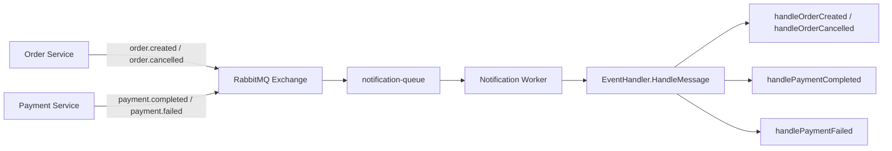

# Notification Service Deep Dive

## 1. Vai trò của service

`notification-service` là service event-driven của hệ thống. Nó không nhận request nghiệp vụ từ frontend như các service khác, mà ngồi nghe message từ RabbitMQ.

Đây là service rất tốt để người học hiểu rằng backend thực tế không chỉ có REST API.

## 2. Event mà service này consume

- `order.created`
- `order.cancelled`
- `payment.completed`
- `payment.failed`

## 3. Luồng hoạt động

```text
RabbitMQ
  -> notification-queue
  -> Consume()
  -> EventHandler.HandleMessage
  -> switch by routing key
  -> unmarshal payload
  -> business action
  -> Ack/Nack
```

## 3.1 Sơ đồ Mermaid



## 4. File quan trọng

### `cmd/main.go`

File này cho thấy toàn bộ setup của một worker:

- connect RabbitMQ,
- declare exchange,
- declare queue,
- bind routing key,
- set QoS,
- start consumer loop,
- đồng thời mở một health/metrics HTTP server tối giản.

Đây là một mẫu rất hay để học worker service trong Go.

### `internal/handler/event_handler.go`

Dù tên là `handler`, file này không xử lý HTTP mà xử lý message.

Nó:

- đọc `RoutingKey`,
- unmarshal JSON vào đúng struct event,
- gọi hàm xử lý tương ứng,
- `Ack` hoặc `Nack` message.

## 5. Điều đáng học

- Cấu trúc package vẫn nhất quán dù service không có HTTP endpoint chính.
- `Ack/Nack` là khái niệm rất quan trọng của message-driven system.
- Worker có thể chạy song song với HTTP health endpoint trong cùng một binary Go.

## 6. Vì sao service này quan trọng cho sự nghiệp backend?

Vì nhiều hệ thống production sẽ có:

- background jobs,
- consumers,
- email/sms workers,
- event processors,
- retry pipelines.

Nếu chỉ biết CRUD API mà không hiểu worker/consumer, kiến thức backend của bạn sẽ thiếu một mảng lớn.

## 7. Thứ tự đọc gợi ý

1. `cmd/main.go`
2. `internal/handler/event_handler.go`
3. trace ngược về nơi publish event trong:
   - `order-service`
   - `payment-service`

## 8. Bài học nghề nghiệp

`notification-service` dạy bạn một mindset rất quan trọng:

- request-response không phải cách duy nhất backend hoạt động,
- nhiều nghiệp vụ nên được xử lý bất đồng bộ,
- và Go rất phù hợp để viết worker/consumer nhỏ, rõ ràng, chạy ổn định.

## 9. Lý thuyết cần biết để hiểu service này

### Exchange, Queue, Routing Key là gì?

- Exchange: nơi nhận message trước.
- Queue: nơi giữ message để consumer đọc.
- Routing key: nhãn dùng để quyết định message đi vào queue nào.

Trong project này:

- `events` là exchange,
- `notification-queue` là queue,
- `order.created` hoặc `payment.completed` là routing key.

### Ack và Nack khác nhau thế nào?

- `Ack`: tôi đã xử lý xong, broker có thể xóa message.
- `Nack`: tôi chưa xử lý được, broker có thể requeue hoặc drop tùy config.

### QoS / Prefetch là gì?

`prefetchCount=5` nghĩa là consumer không nhận quá nhiều message cùng lúc. Đây là cơ chế backpressure rất quan trọng trong hệ thống message-driven.

### Vì sao worker cũng có health endpoint?

Vì trong production bạn vẫn cần:

- health check,
- metrics,
- monitoring,

dù service đó không phục vụ HTTP business endpoint.
