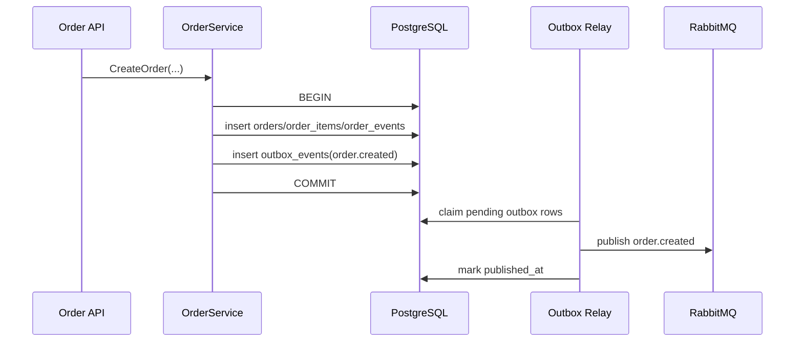
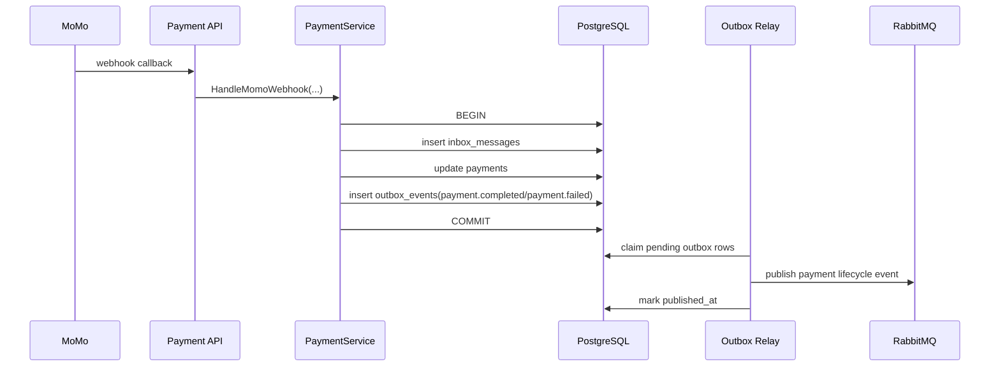

# Outbox/Inbox Cho `order-service` Và `payment-service`

## Mục tiêu

Tài liệu này mô tả refactor ưu tiên cao để loại bỏ rủi ro mất event trong `order-service` và `payment-service`, đồng thời thêm lớp chống duplicate side effect cho các luồng async quan trọng.

Phạm vi thực hiện trong repo hiện tại:

- `order-service`
  - thêm `outbox_events` để publish `order.created` và `order.cancelled` theo kiểu durable relay
  - thêm `inbox_messages` để xử lý idempotent cho `payment.completed` và `payment.refunded`
- `payment-service`
  - thêm `outbox_events` để publish `payment.completed`, `payment.failed`, `payment.refunded`
  - thêm `inbox_messages` để xử lý idempotent cho webhook `momo`

Không thay đổi:

- public HTTP contract
- route hiện tại
- exchange RabbitMQ hiện tại là `events`
- downstream consumer contract ở mức field business chính

## Vấn đề trước khi refactor

### 1. Mất event sau khi commit DB

Trước đây flow đi theo dạng:

1. ghi dữ liệu vào PostgreSQL
2. `Commit()`
3. gọi `amqp.Publish(...)`

Rủi ro:

- DB đã đúng nhưng publish fail
- service restart giữa bước 2 và 3
- RabbitMQ tạm unavailable đúng thời điểm commit

Kết quả:

- `notification-service` có thể không gửi email
- `order-service` có thể không nhận payment event đúng kỳ vọng
- reconciliation và audit trở nên khó vì không có nguồn pending event durable

### 2. Duplicate delivery gây replay side effect

Async consumer và webhook đều có thể bị gửi lại:

- RabbitMQ redelivery
- producer retry
- gateway webhook retry

Nếu không có inbox/idempotency bền vững:

- order có thể bị apply transition nhiều lần
- webhook có thể cập nhật payment lặp lại
- log và metric bị nhiễu

## Thiết kế sau refactor

## Order Service

### Outbox

`CreateOrder` và `CancelOrder` không publish trực tiếp nữa.

Thay vào đó:

1. service build payload event
2. repository ghi `orders`/`order_events` và `outbox_events` trong cùng transaction
3. relay worker poll `outbox_events`
4. worker publish sang RabbitMQ
5. publish thành công thì mark `published_at`
6. publish lỗi thì cập nhật `last_error`, `available_at` để retry

### Inbox

Consumer `payment.completed` và `payment.refunded` dùng `inbox_messages` để chống duplicate.

Flow:

1. nhận message từ RabbitMQ
2. lấy `message_id`
3. insert `inbox_messages`
4. nếu conflict thì bỏ qua vì message đã xử lý
5. nếu insert thành công thì apply transition order trong cùng transaction

Điểm quan trọng:

- `inbox insert` và `order status transition` diễn ra trong cùng transaction
- nếu transaction fail thì inbox record cũng rollback
- tránh trường hợp “đã đánh dấu processed nhưng chưa đổi trạng thái business”

## Payment Service

### Outbox

`ProcessPayment`, `RefundPayment`, `HandleMomoWebhook` không publish trực tiếp nữa.

Thay vào đó:

1. service build enriched payment event
2. repository ghi `payments` và `outbox_events` cùng transaction
3. relay worker publish async từ outbox

### Inbox

Webhook `momo` được bảo vệ bởi `inbox_messages`.

Flow:

1. verify signature
2. build `message_id` từ payload webhook
3. `ApplyWebhookResult(...)` chạy transaction
4. insert inbox record
5. update payment từ `pending` sang `completed/failed`
6. insert outbox message cùng transaction

Kết quả:

- duplicate webhook không replay state change
- update payment và enqueue event là atomic

## Mermaid

## Schema mới

Mỗi service có 2 bảng mới:

- `outbox_events`
- `inbox_messages`

### `outbox_events`

Field chính:

- `id`: event id đồng thời dùng làm `message_id`
- `aggregate_type`, `aggregate_id`: giúp debug và audit
- `event_type`, `routing_key`: phục vụ publish
- `payload`: JSONB event body
- `attempts`, `last_error`, `available_at`, `published_at`: phục vụ retry

### `inbox_messages`

Field chính:

- `consumer`
- `message_id`
- `routing_key`
- `created_at`

Khóa chính: `(consumer, message_id)`

## Before / After

### Before

- commit DB xong mới publish
- publish fail thì event mất
- webhook/consumer duplicate dễ replay side effect
- khó audit event nào chưa publish

### After

- state change và enqueue event là atomic
- broker outage chỉ làm chậm, không làm mất event
- duplicate delivery được chặn bởi inbox
- có thể query outbox pending để reconciliation

## Vì sao giải pháp này phù hợp repo hiện tại

- không cần thêm service mới
- không kéo Kafka/outbox framework nặng
- bám đúng stack hiện tại: Go + PostgreSQL + RabbitMQ
- failure mode đơn giản, dễ vận hành trên Docker Compose lẫn production

## Vận hành production

Nên theo dõi thêm:

- số lượng outbox chưa publish
- tuổi lớn nhất của outbox pending
- retry count theo routing key
- số lượng duplicate inbox message
- số webhook duplicate

Alert gợi ý:

- outbox pending > ngưỡng trong 5-10 phút
- publish fail tăng mạnh
- inbox duplicate tăng bất thường

## Checklist rollout

1. chạy migration cho `order-service`
2. chạy migration cho `payment-service`
3. deploy code mới
4. verify relay worker đang chạy
5. tạo order test và xác nhận outbox row được publish
6. tạo payment/webhook test và xác nhận inbox duplicate hoạt động
7. theo dõi log + metric sau deploy

## Việc nên làm tiếp theo

- thêm dashboard Grafana cho `outbox backlog`, `publish success/fail`, `duplicate inbox`
- thêm reconciliation job quét outbox stuck quá lâu
- thêm DLQ policy ở `notification-service`
- chuẩn hóa `message_id` xuyên suốt cho mọi event async khác
- sau khi lớp reliability ổn định mới tiếp tục chuyển `payment` từ `float64` sang `int64 minor units`
