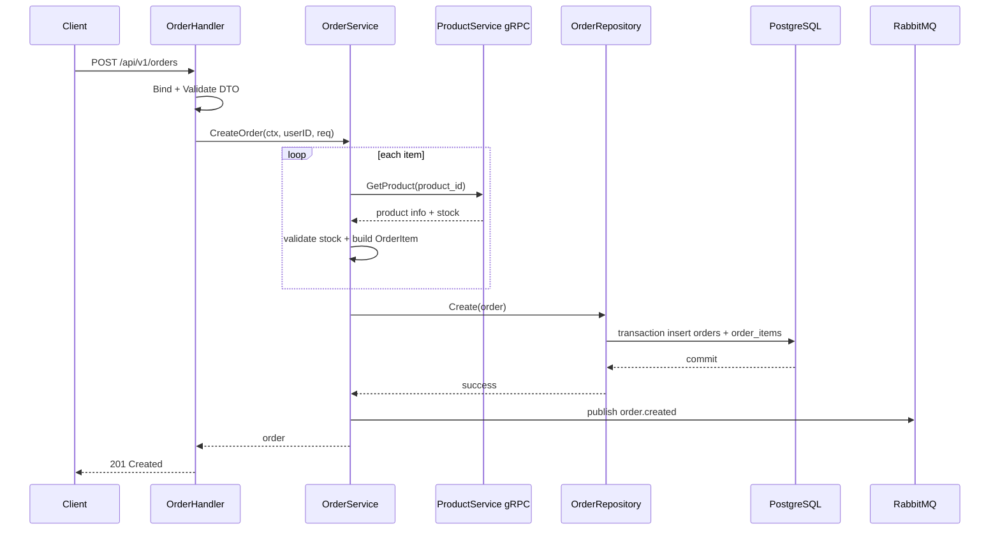

# Order Service Deep Dive

## 1. Vai trò của service

`order-service` là service quan trọng nhất về business flow của hệ thống. Nó biến danh sách sản phẩm người dùng muốn mua thành một đơn hàng thật.

Đây là service nên đọc sâu nhất nếu bạn muốn tiến từ mức "biết Go" sang mức "biết làm backend Go".

## 2. Route chính

Tất cả route đều cần JWT:

- `POST /api/v1/orders`
- `GET /api/v1/orders`
- `GET /api/v1/orders/:id`

## 3. Luồng tạo đơn hàng

```text
request
  -> handler.CreateOrder
  -> validate DTO
  -> service.CreateOrder
  -> for each item:
       -> gRPC ProductService.GetProduct
       -> validate stock
       -> create OrderItem
       -> accumulate total
  -> repository.Create (transaction)
  -> publish order.created
  -> response
```

## 3.1 Sơ đồ Mermaid



## 4. Vì sao service này rất đáng học?

Vì nó kết hợp cùng lúc nhiều khía cạnh quan trọng của backend:

- business logic nhiều bước,
- gRPC call sang service khác,
- transaction database,
- event publishing sau khi persist,
- ownership check khi đọc order.

## 5. File quan trọng

### `internal/service/order_service.go`

Đây là file số 1 cần đọc.

Bạn sẽ thấy:

- cách validate item,
- cách lấy dữ liệu sản phẩm thật,
- cách tính tổng tiền,
- cách tạo `Order` và `OrderItem`,
- cách publish event sau khi lưu DB.

### `internal/repository/order_repository.go`

Rất đáng học về transaction:

- insert `orders`,
- insert `order_items`,
- commit nếu mọi thứ thành công.

### `internal/grpc_client/product_client.go`

Minh họa cách một service Go gọi gRPC client sang service khác.

### `internal/handler/order_handler.go`

Cho thấy handler không làm tính tiền hay kiểm kho; handler chỉ orchestrate request/response.

## 6. Ownership check là gì?

Khi gọi `GET /api/v1/orders/:id`, service không chỉ lấy order theo ID.

Nó còn check:

- order này có thuộc `claims.UserID` không?

Đây là một bài học backend cực kỳ quan trọng:

- Auth != Authorization
- Có token hợp lệ chưa đủ; còn phải có quyền xem đúng record.

## 7. Event publishing

Service publish `order.created` sau khi lưu DB.

Điểm cần học:

- Tác vụ như notification không nên block request chính.
- Nhưng publish event cũng phải được làm cẩn thận.
- Phiên bản hiện tại đã bỏ kiểu goroutine fire-and-forget và chuyển sang publish có retry ngắn, giúp giảm rủi ro mất event ngay lập tức.

## 8. Điều Golang nên học từ service này

- Viết service orchestration nhiều bước.
- Kết hợp DB + gRPC + RabbitMQ trong cùng một use case.
- Dùng error wrapping để tầng handler có thể `errors.Is(...)`.
- Dùng transaction đúng chỗ trong repository.

## 9. Thứ tự đọc gợi ý

1. `cmd/main.go`
2. `internal/handler/order_handler.go`
3. `internal/dto/order_dto.go`
4. `internal/service/order_service.go`
5. `internal/repository/order_repository.go`
6. `internal/grpc_client/product_client.go`
7. `migrations/*.sql`

## 10. Bài học nghề nghiệp

Nếu bạn muốn theo Golang backend một cách nghiêm túc, `order-service` là kiểu code rất nên tập đọc và tập viết lại:

- use case phức tạp hơn CRUD,
- phải phối hợp nhiều dependency,
- nhưng vẫn giữ code rõ tầng và dễ reasoning.

## 11. Lý thuyết cần biết để hiểu service này

### Transaction là gì?

Transaction là một nhóm thao tác DB phải cùng thành công hoặc cùng thất bại.

Trong `order-service`, nếu insert order thành công nhưng insert order item thất bại, hệ thống không được để lại order "mồ côi". Vì vậy repository dùng transaction.

### Orchestration là gì?

Orchestration là một service đứng ra điều phối nhiều bước trong một use case:

- gọi service khác,
- validate,
- persist,
- publish event.

`order-service` là ví dụ điển hình của orchestration.

### Event-driven sau khi tạo order nghĩa là gì?

Thay vì gọi trực tiếp notification trong request, service publish event `order.created`. Các consumer sẽ tự xử lý sau.

Lợi ích:

- giảm coupling,
- request chính nhanh hơn,
- side effect dễ mở rộng.

### Ownership check là gì?

Record-level authorization nghĩa là:

- không chỉ xác thực user,
- mà còn kiểm tra record đó có thuộc user này không.

Đây là một phần rất quan trọng của backend an toàn.
