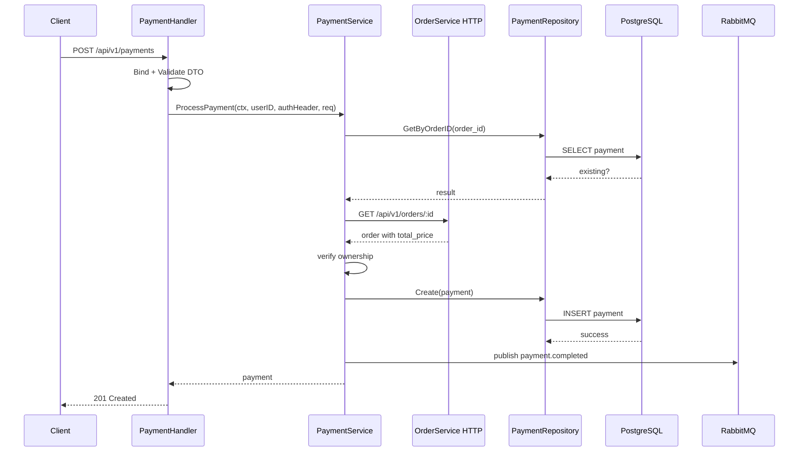

# Payment Service Deep Dive

## 1. Vai trò của service

`payment-service` chịu trách nhiệm tạo payment cho đơn hàng và phát event sau thanh toán.

Domain này rất nhạy cảm vì liên quan đến:

- số tiền,
- quyền truy cập payment record,
- trạng thái thanh toán,
- side effect sau thanh toán.

Chính vì vậy, đây là service rất đáng học nếu bạn muốn hiểu tư duy backend an toàn.

## 2. Route chính

Tất cả route đều cần JWT:

- `POST /api/v1/payments`
- `GET /api/v1/payments/:id`
- `GET /api/v1/payments/order/:orderId`

## 3. Luồng xử lý thanh toán hiện tại

```text
request
  -> handler.ProcessPayment
  -> validate DTO
  -> service.ProcessPayment
  -> check duplicate payment
  -> call order-service to fetch real order
  -> verify order belongs to current user
  -> set amount from order.TotalPrice
  -> repository.Create
  -> publish payment.completed
  -> response
```

## 3.1 Sơ đồ Mermaid



## 4. Tại sao service này quan trọng với người học?

Vì nó dạy bạn một bài học backend rất thực tế:

> Client không được quyết định dữ liệu tiền bạc.

Sau patch mới:

- client chỉ gửi `order_id` và `payment_method`,
- backend tự lấy `amount` từ order thật,
- backend kiểm tra ownership trước khi đọc payment hoặc tạo payment.

## 5. File quan trọng

### `internal/service/payment_service.go`

Đây là file số 1 của service.

Những việc quan trọng trong file:

- check duplicate payment,
- gọi order client,
- verify ownership,
- tạo payment,
- publish event,
- map lỗi unique violation.

### `internal/client/order_client.go`

Đây là client nội bộ gọi sang `order-service`.

Điểm học được:

- một service Go có thể gọi service khác bằng HTTP nội bộ,
- có thể forward bearer token hiện tại để tái dùng authorization đã có,
- config service URL cần được normalize cẩn thận.

### `internal/repository/payment_repository.go`

Tầng DB access:

- create payment,
- get by id,
- get by order id,
- get by id/order id nhưng có filter theo user.

Đây là ví dụ tốt cho việc đẩy authorization filter xuống query thay vì chỉ fetch rồi mới if.

### `internal/handler/payment_handler.go`

Cho thấy cách:

- lấy `Authorization` header,
- lấy `claims.UserID`,
- mapping lỗi domain sang HTTP code phù hợp.

## 6. Read path và authorization

Hai endpoint đọc payment là nơi rất dễ sai nếu chỉ nghĩ theo hướng "có JWT là đủ".

Điểm đúng ở phiên bản hiện tại:

- `GetPayment` lọc theo `payment_id + user_id`
- `GetPaymentByOrder` lọc theo `order_id + user_id`

Đây là ví dụ chuẩn để học record-level authorization.

## 7. Event publishing

Payment service publish event `payment.completed` hoặc `payment.failed`.

Phiên bản hiện tại đã chuyển từ:

- goroutine fire-and-forget

sang:

- publish trực tiếp với retry ngắn.

Điều này chưa phải outbox hoàn chỉnh, nhưng là bước hardening tốt để người học hiểu bài toán reliability.

## 8. Điều Golang nên học từ service này

- mapping error domain sạch bằng `errors.Is`.
- dùng helper check unique violation cho PostgreSQL.
- tách HTTP client nội bộ thành package riêng.
- bảo vệ domain nhạy cảm bằng verification ở service layer.

## 9. Thứ tự đọc gợi ý

1. `cmd/main.go`
2. `internal/handler/payment_handler.go`
3. `internal/dto/payment_dto.go`
4. `internal/service/payment_service.go`
5. `internal/client/order_client.go`
6. `internal/repository/payment_repository.go`
7. `internal/model/payment.go`

## 10. Bài học nghề nghiệp

Service này cực kỳ đáng học nếu bạn muốn tiến xa trong backend Go, vì nó dạy 3 năng lực thực chiến:

- security mindset,
- data ownership mindset,
- và cách sửa một domain nhạy cảm theo hướng an toàn hơn mà vẫn giữ code đơn giản.

## 11. Lý thuyết cần biết để hiểu service này

### Record-level authorization là gì?

Đây là việc kiểm tra xem user hiện tại có quyền truy cập đúng bản ghi dữ liệu hay không.

Ví dụ:

- user A có token hợp lệ,
- nhưng không được đọc payment của user B.

Đó là lý do query ở repository phải lọc theo cả `id/order_id` và `user_id`.

### Duplicate payment là bài toán gì?

Nếu cùng một order bị thanh toán hai lần, dữ liệu sẽ sai.

Project xử lý bằng:

- check trước theo `order_id`,
- unique constraint ở DB,
- map unique violation thành lỗi domain phù hợp.

### Vì sao `amount` phải lấy từ order?

Tiền là dữ liệu không thể tin client.

Nếu frontend gửi `amount`, người dùng có thể giả request với số tiền thấp hơn. Vì vậy backend phải lấy `order.TotalPrice` từ source of truth.

### HTTP nội bộ giữa service dùng để làm gì?

`payment-service` gọi `order-service` để verify order thật. Điều này dạy bạn:

- service boundary không phải chỉ là file/folder,
- dữ liệu đôi khi phải đi qua một service khác mới xác thực được.
