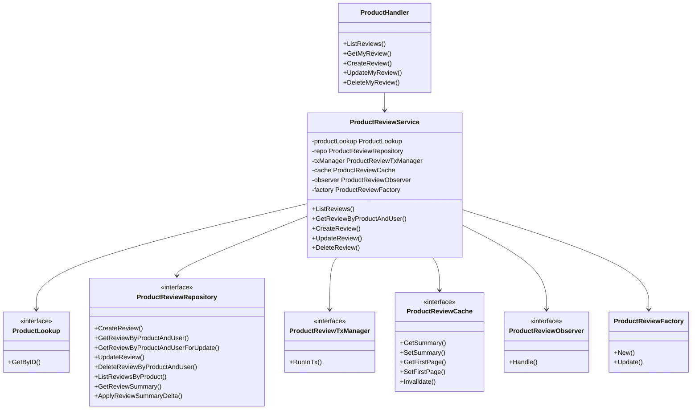
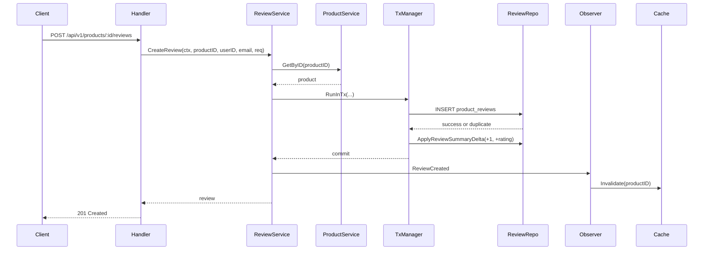
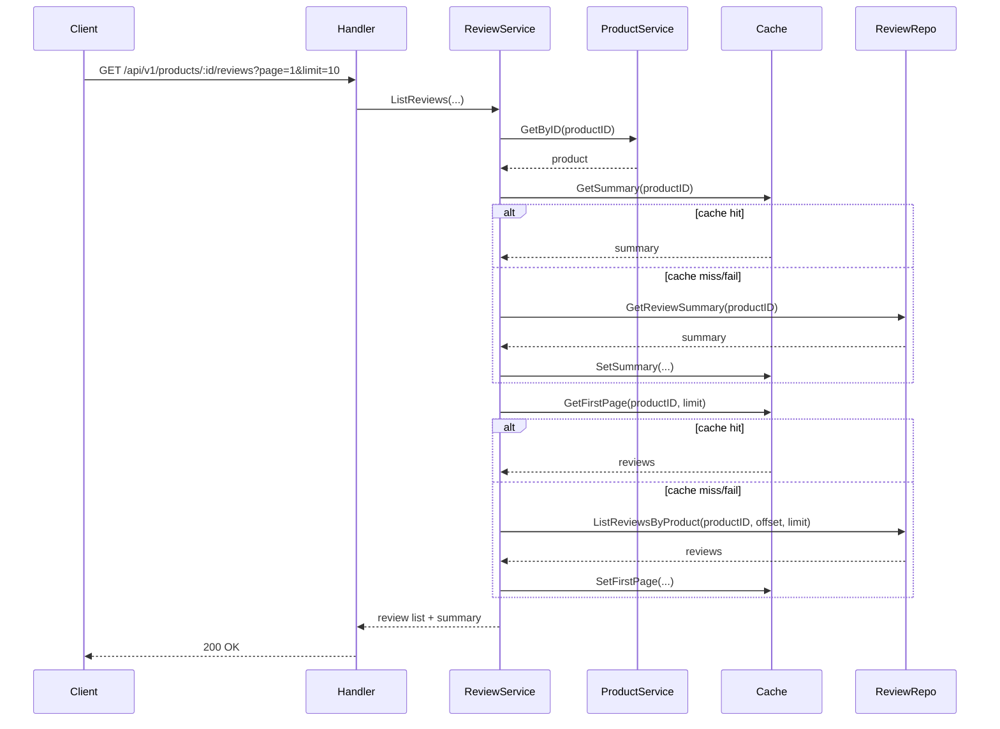

# Product Review Refactor Trong `product-service`

Tài liệu này giải thích refactor module review/comment hiện có trong `product-service` của ứng dụng bán hàng.

Mục tiêu của refactor:

- giữ nguyên API public `/api/v1/products/:id/reviews`
- làm code rõ hơn theo đúng phân tầng `handler -> service -> repository`
- giảm race condition ở luồng create/update/delete review
- giảm tải DB ở luồng đọc nhiều bằng summary table và Redis cache tùy chọn
- tạo nền tảng tốt để sau này mở rộng sang verified purchase, notification hoặc tách service

## 1. Trước Và Sau

### Before

Trước refactor, review nằm trực tiếp trong `ProductService` và `ProductRepository`.

Điều này tạo ra một số vấn đề:

- `ProductRepository` ôm cả catalog lẫn review, dễ thành god interface
- create review dùng flow `check trước rồi insert sau`, dễ đua tranh khi client bấm gửi 2 lần
- list review dùng `COUNT(*) + OFFSET/LIMIT`, ổn lúc đầu nhưng sẽ tốn dần khi dữ liệu lớn
- summary rating tính từ aggregate query mỗi lần đọc
- chưa có cache chuyên cho review hot path
- error duplicate còn dựa vào parse chuỗi lỗi

### After

Sau refactor:

- review được tách thành `ProductReviewService` riêng nhưng vẫn ở trong `product-service`
- `ProductService` chỉ còn lo product catalog
- review có repository riêng, tx manager riêng, cache riêng và observer riêng
- create dựa vào unique constraint `(product_id, user_id)` thay vì check-then-insert
- summary được lưu trong bảng `product_review_summaries` và cập nhật cùng transaction với write flow
- page 1 và summary có thể đi qua Redis cache, nhưng Redis chỉ là tối ưu phụ

## 2. Kiến Trúc Áp Dụng

### Clean Architecture Theo Repo Này

Refactor này không ép repo sang một layout mới hoàn toàn. Thay vào đó nó áp dụng tinh thần Clean Architecture ngay trên cấu trúc đang có:

- `handler` nhận request, validate, map sang response
- `service` giữ business rule
- `repository` giữ SQL, transaction boundary và lock
- `model` giữ domain types và error/domain delta dùng chung

### SOLID Ở Đây Được Hiểu Thế Nào

- `S`: `ProductService` và `ProductReviewService` tách trách nhiệm rõ hơn
- `O`: observer cho phép thêm notification/analytics sau này mà không đụng core flow
- `L`: cache/repository/tx manager đều thay được bằng fake trong test
- `I`: review flow chỉ cần `ProductLookup`, không phải cả `ProductRepository`
- `D`: service phụ thuộc vào abstraction như repository/cache/observer thay vì concrete DB/Redis

## 3. Design Patterns Đã Dùng

### Repository Pattern

`ProductReviewRepository` là nơi duy nhất biết:

- query review
- lock review bằng `FOR UPDATE`
- delete bằng `RETURNING`
- cập nhật summary delta

Điểm quan trọng là repository không biết HTTP status code hay business messaging.

### Factory Pattern

`ProductReviewFactory` gom các việc trước đây rải rác nhiều chỗ:

- sinh `review_id`
- set `created_at`, `updated_at`
- normalize comment
- mask `author_label`

Ví dụ thực tế:

- before: handler trim comment, service trim lại comment, repository trim khi scan
- after: normalize tại factory/service boundary một lần, tránh logic bị phân tán

### Observer Pattern

Refactor thêm `ProductReviewObserver` theo kiểu in-process.

Subscriber mặc định:

- metrics observer
- cache invalidation observer

Ý nghĩa:

- write flow chính không bị dính chặt với cache invalidation
- sau này có thể thêm subscriber gửi notification hoặc audit log

## 4. Class Diagram



## 5. Sequence Diagram

### Create Review



### List Reviews



## 6. Vì Sao Summary Table Quan Trọng

### Before

Mỗi lần đọc summary cần aggregate trực tiếp từ `product_reviews`.

Khi số review tăng lớn:

- `AVG(rating)` phải scan nhiều row
- `COUNT(*) FILTER (...)` cũng scan nhiều row
- endpoint hot path bị phụ thuộc vào aggregate cost

### After

`product_review_summaries` giữ:

- `review_count`
- `rating_total`
- breakdown 1 sao đến 5 sao

Khi create/update/delete:

- transaction cập nhật `product_reviews`
- transaction cập nhật `product_review_summaries`

Lợi ích:

- đọc summary thành O(1) row read
- meta `total` không cần `COUNT(*)`
- dễ cache hơn

Ví dụ thực tế:

- sản phẩm bán chạy có 500.000 review
- trước đây mỗi lần mở trang sản phẩm phải aggregate nhiều row
- sau refactor chỉ đọc 1 row summary + 1 page list

## 7. Concurrency Và Race Condition

### Vấn đề Double Submit

Người dùng có thể:

- bấm gửi 2 lần
- client retry do timeout
- gateway resend request do mạng chập chờn

### Before

Flow cũ:

1. query xem review đã tồn tại chưa
2. nếu chưa thì insert

Hai request song song có thể cùng qua bước 1 rồi cùng chạy bước 2.

### After

Flow mới:

- DB unique constraint `(product_id, user_id)` là chốt chặn cuối cùng
- application map `23505` sang `ErrProductReviewAlreadyExists`

Đây là cách production-grade hơn vì không dựa vào assumption "sẽ không có request song song".

### Update/Delete

Luồng update dùng `SELECT ... FOR UPDATE` để khóa row trước khi:

- đọc old rating
- sửa review
- tính delta cho summary

Delete dùng `DELETE ... RETURNING` để lấy chính xác rating vừa bị xóa.

## 8. Security Best Practices

- request vẫn validate ở handler
- query tiếp tục parameterized, không nối chuỗi SQL từ input user
- author email không trả raw ra API
- internal DB error không leak ra response
- Redis cache chỉ là optimization, không trở thành source of truth

Anti-pattern cần tránh:

- validate business rule sâu trong handler
- dùng raw SQL error string làm contract cho upper layer
- cache hit thì bỏ qua kiểm tra product tồn tại
- swallow cache error mà không log

## 9. Logging Và Observability

Refactor này thêm hoặc chuẩn hóa:

- `LoggerWithContext(...)` để log kèm `request_id`, `trace_id`, `span_id`
- business metrics cho `list_reviews`, `get_my_review`, `create_review`, `update_review`, `delete_review`
- metric event cho cache hit/miss/fallback
- metric event cho conflict duplicate
- trace span cho cache path và DB path của review flow

### Monitoring Nên Có

- rate và p95 của `create_review`, `update_review`, `delete_review`
- rate và p95 của `list_reviews`
- `review_summary_cache_hit`, `review_summary_cache_miss`
- `review_list_cache_hit`, `review_list_cache_miss`
- `review_conflict`
- `review_summary_cache_fallback`, `review_list_cache_fallback`

### Alert Gợi Ý

- p95 `list_reviews` tăng mạnh trong 15 phút
- `review_conflict` tăng đột biến bất thường
- cache fallback tăng liên tục
- system error của review write flow vượt baseline

## 10. Benchmark Strategy

Repo có benchmark cho service list path:

- cold path: không có cache warm sẵn
- warm cache: summary + first page đã có trong cache

Chạy benchmark:

```bash
cd services/product-service
go test -run '^$' -bench 'ProductReviewServiceListReviews' ./internal/service
```

Ngoài benchmark trong Go, khi cần kiểm chứng production-like:

1. dùng `EXPLAIN ANALYZE` cho query list và summary
2. seed dữ liệu lớn vào `product_reviews`
3. chạy load test HTTP cho `GET /reviews` và `POST /reviews`
4. so sánh:
   - query count
   - p95 latency
   - cache hit ratio
   - CPU của PostgreSQL

## 11. Before/After So Sánh Nhanh

### Boundary

- before: `ProductService` vừa lo catalog vừa lo review
- after: `ProductReviewService` chịu trách nhiệm review, `ProductService` chỉ cần đóng vai `ProductLookup`

### Error Handling

- before: parse chuỗi lỗi duplicate
- after: typed error từ repository/domain

### Read Performance

- before: summary và total phụ thuộc `COUNT(*)` và aggregate trên `product_reviews`
- after: summary đọc từ bảng tổng hợp, list page 1 có thể đi qua cache

### Write Safety

- before: check-then-insert
- after: unique constraint + transaction + row lock

## 12. Best Practices

- để database giữ invariant quan trọng như uniqueness
- tách interface ở phía consumer để giảm coupling
- cập nhật summary trong cùng transaction với write chính
- cache chỉ dùng cho read hot path và phải fallback được
- log warning có context khi dependency phụ lỗi
- benchmark theo dữ liệu thật hoặc gần thật thay vì tối ưu bằng cảm giác

## 13. Anti-Patterns Cần Tránh

- thêm service mới quá sớm khi domain vẫn còn nhỏ
- cache everything mà không có invalidation rõ ràng
- tính summary bằng aggregate live cho mọi request public hot path
- đẩy business rule xuống handler hoặc repository
- dùng mutex trong app cho bài toán mà DB transaction xử lý tốt hơn

## 14. Roadmap Mở Rộng

Sau refactor này, các bước mở rộng hợp lý là:

1. verified purchase badge bằng cách nối read model từ order/payment
2. moderation workflow cho review xấu, spam hoặc chứa nội dung cấm
3. notification cho seller hoặc internal analytics qua observer mới
4. API v2 nếu cần threaded comment hoặc media attachment
5. outbox/event-driven chỉ khi review event thực sự cần phát tin cậy sang nhiều service

## 15. Roadmap Học Tập

### Giai đoạn 1: Nắm chắc nền tảng

- transaction trong PostgreSQL
- isolation level cơ bản
- index composite và cách đọc `EXPLAIN ANALYZE`
- error wrapping, `errors.Is`, `errors.As`

### Giai đoạn 2: Viết backend tốt hơn

- Clean Architecture thực dụng trong repo Go thật
- repository pattern không lạm dụng interface
- cache-aside và invalidation strategy
- structured logging và tracing

### Giai đoạn 3: Lên mức senior hơn

- consistency trade-off giữa transaction, cache và event
- thiết kế hot path theo read/write profile
- migration additive, rollback strategy
- decision record: khi nào nên tách service, khi nào chưa nên

Nếu muốn tự học từ thay đổi này, hãy đọc theo thứ tự:

1. `internal/service/product_review_service.go`
2. `internal/repository/product_review_repository.go`
3. `internal/repository/product_review_tx_manager.go`
4. `internal/repository/product_review_cache.go`
5. `migrations/000004_create_product_review_summaries.up.sql`

## 16. Kết Luận

Refactor này không cố làm hệ thống “oách” hơn. Nó làm một việc thực dụng hơn:

- giảm coupling
- giảm rủi ro race condition
- giảm chi phí đọc ở hot path
- giữ nguyên API public
- mở sẵn chỗ cắm cho các nhu cầu mở rộng thật sự sau này

Đó là kiểu refactor có giá trị production và cũng là kiểu thay đổi giúp kỹ năng backend Go trưởng thành theo hướng senior.
