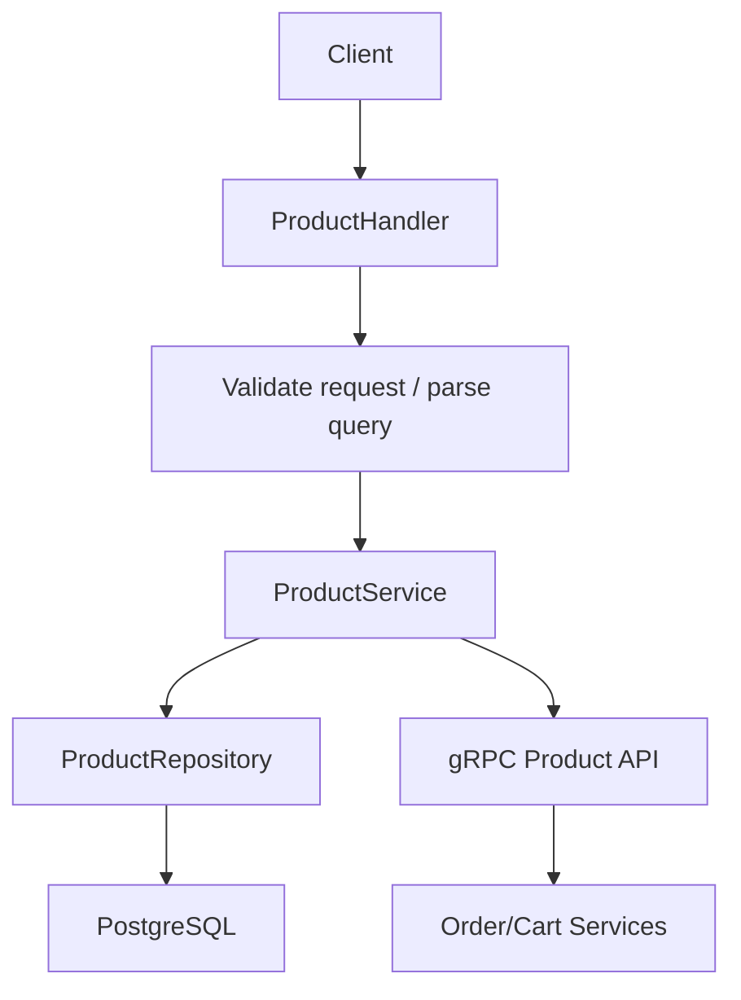

# Product Service Deep Dive

## 1. Vai trò của service

`product-service` quản lý catalog sản phẩm. Đây là service phù hợp để học:

- CRUD backend,
- pagination,
- filtering/search,
- admin authorization,
- repository pattern với `database/sql`.

## 2. Route chính

Public:

- `GET /api/v1/products`
- `GET /api/v1/products/:id`

Admin only:

- `POST /api/v1/products`
- `PUT /api/v1/products/:id`
- `DELETE /api/v1/products/:id`

## 3. Luồng xử lý

### Luồng đọc danh sách sản phẩm

```text
request
  -> handler.List
  -> build query object
  -> service.List
  -> repository.List
  -> SQL with filters
  -> response + pagination meta
```

### Luồng tạo/cập nhật sản phẩm

```text
request
  -> JWTAuth
  -> RequireRole(admin)
  -> handler
  -> service
  -> repository
  -> PostgreSQL
```

## 3.1 Sơ đồ Mermaid



## 4. File quan trọng

### `internal/handler/product_handler.go`

Cho thấy cách service chia route public và route admin.

### `internal/service/product_service.go`

Chứa business logic tạo, cập nhật, xóa, list sản phẩm.

### `internal/repository/product_repository.go`

Đây là file đáng đọc kỹ nhất của service này vì:

- có SQL động,
- có pagination,
- có search/filter,
- vẫn giữ parameterized query để an toàn.

### `internal/grpc/product_grpc.go`

Giúp `order-service` và `cart-service` gọi sản phẩm qua gRPC.

Đây là điểm rất hay để học: một service có thể vừa phục vụ HTTP cho client, vừa expose gRPC cho internal service.

## 5. Điều nên học từ service này

- Cách tách route public và route admin.
- Cách dùng role-based authorization ở middleware.
- Cách viết repository SQL sạch mà không cần ORM.
- Cách service-to-service contract được expose qua gRPC.

## 6. Điểm đáng chú ý cho người học

- `List(...)` là ví dụ rất tốt để học pagination backend.
- `UpdateStock(...)` là ví dụ về update có điều kiện để tránh stock âm.
- Product service là "source of truth" cho giá và tồn kho; service khác không nên tự tin dữ liệu frontend gửi lên.

## 7. Thứ tự đọc gợi ý

1. `cmd/main.go`
2. `internal/handler/product_handler.go`
3. `internal/dto/product_dto.go`
4. `internal/service/product_service.go`
5. `internal/repository/product_repository.go`
6. `internal/grpc/product_grpc.go`
7. `proto/product.proto`

## 8. Bài học nghề nghiệp

Nếu bạn muốn làm backend Go cho hệ thống e-commerce, catalog/product domain là nơi rất thực tế để luyện:

- query design,
- pagination,
- CRUD an toàn,
- internal contract cho service khác dùng lại.

## 9. Lý thuyết cần biết để hiểu service này

### CRUD là gì?

CRUD là 4 thao tác cơ bản với dữ liệu:

- Create
- Read
- Update
- Delete

`product-service` là nơi giúp bạn học CRUD backend rất rõ.

### Pagination là gì?

Pagination là chia danh sách lớn thành từng trang nhỏ. Thường gồm:

- `page`
- `limit`
- `total`

Điều này rất quan trọng để API không trả hàng nghìn record một lần.

### Filtering và search khác nhau thế nào?

- Filtering: lọc theo điều kiện cố định như `category`.
- Search: tìm kiếm theo từ khóa như `laptop`.

Trong code, cả hai được gom vào repository để SQL xử lý thay vì lọc ở Go.

### Tại sao cần admin-only route?

Catalog là dữ liệu public để đọc, nhưng tạo/sửa/xóa sản phẩm là thao tác quản trị. Vì vậy project dùng:

- `JWTAuth`
- `RequireRole(admin)`

để giới hạn quyền.

### Vì sao product-service là source of truth?

Giá và stock là dữ liệu cốt lõi của sản phẩm. Service khác như cart/order nên hỏi `product-service` thay vì tin client.
