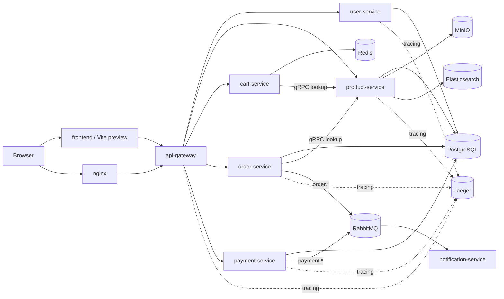

# System Overview

Tài liệu này mô tả hệ thống ở mức runtime: request đi đâu, data nằm ở đâu, service nào là bắt buộc trong local stack, service nào chỉ là integration bổ trợ, và frontend nào đang được Compose dùng thật.

## 1. Kiến trúc tổng thể

## 2. Service nào đang có trong Docker Compose

### Runtime ứng dụng

- `frontend`
- `nginx`
- `api-gateway`
- `user-service`
- `product-service`
- `cart-service`
- `order-service`
- `payment-service`
- `notification-service`

### Hạ tầng

- `postgres`
- `redis`
- `rabbitmq`
- `minio`
- `elasticsearch`
- `jaeger`
- `prometheus`
- `grafana`

### Điều rất dễ nhầm

- `frontend` là UI chính chạy preview Vite ở host port `4173`
- `nginx` publish host port `80`, nhưng chủ yếu proxy `/api/*` và `/health`, không phải frontend React đầy đủ
- `client/` không có service compose mặc định

## 3. Những cổng host thực sự nên nhớ

Các cổng publish ra host theo compose hiện tại:

- `http://localhost:80` -> `nginx`
- `http://localhost:4173` -> `frontend` preview
- `http://localhost:8080` -> `api-gateway`
- `http://localhost:9000` và `http://localhost:9001` -> MinIO API / Console
- `http://localhost:9200` -> Elasticsearch
- `http://localhost:16686` và `http://localhost:4318` -> Jaeger UI / OTLP

Các service quan trọng nhưng không publish ra host mặc định:

- `postgres`
- `redis`
- `rabbitmq`
- `prometheus`
- `grafana`
- từng backend service riêng lẻ như `user-service`, `product-service`, `order-service`, ...

Ý nghĩa:

- smoke test từ host nên đi qua `api-gateway`
- muốn chẩn đoán service nội bộ, thường phải dùng `docker compose exec` hoặc `docker compose logs`

## 4. Boundary của từng thành phần

### `api-gateway`

- entrypoint HTTP cho frontend
- tạo proxy tới downstream services
- có retry cho request idempotent và circuit breaker
- không nên nhồi business logic vào đây

### `user-service`

- auth, refresh token, verify email, reset password
- profile, address, phone verification, role update
- dùng PostgreSQL

### `product-service`

- catalog, review, product image metadata
- source of truth là PostgreSQL
- MinIO và Elasticsearch là optional integration
- expose gRPC cho cart/order lookup

### `cart-service`

- lưu cart state trong Redis
- không phải source of truth của giá và tồn kho
- gọi `product-service` qua gRPC để lấy product authoritative

### `order-service`

- preview order, create order, list/detail, cancel, admin report
- source of truth là PostgreSQL
- gọi `product-service` qua gRPC
- phát event sang RabbitMQ

### `payment-service`

- tạo payment, history, refund, webhook
- source of truth là PostgreSQL
- publish payment events sang RabbitMQ

### `notification-service`

- worker nền, không phải service UI chính
- consume event `order.*` và `payment.*`
- gửi email qua SMTP

## 5. Source of truth của từng domain

| Domain | Source of truth | Ghi chú |
| --- | --- | --- |
| User/Profile | PostgreSQL | qua `user-service` |
| Product/Catalog | PostgreSQL | Elasticsearch chỉ hỗ trợ search/index |
| Product Media Metadata | PostgreSQL | file thực có thể nằm ở MinIO |
| Cart | Redis | trạng thái tạm thời theo user/session |
| Order | PostgreSQL | audit/timeline cũng gắn với order domain |
| Payment | PostgreSQL | RabbitMQ chỉ là event transport |

## 6. Kiểu giao tiếp trong hệ thống

### HTTP qua gateway

Dùng cho:

- frontend gọi API
- OAuth callback/exchange
- cart, order, payment, account flows

Lợi ích:

- client chỉ cần biết một entrypoint
- auth, CORS, rate limiting, observability được gom ở gateway

### gRPC service-to-service

Dùng rõ nhất ở:

- `cart-service -> product-service`
- `order-service -> product-service`

Lợi ích:

- contract rõ ràng hơn HTTP nội bộ
- tránh đi vòng qua gateway cho lookup backend-backend

### RabbitMQ event flow

Dùng cho:

- `order.created`
- `order.cancelled`
- `payment.completed`
- `payment.failed`
- `payment.refunded`

Lợi ích:

- tách side effect như email ra khỏi request path
- user không phải chờ notification flow

## 7. Flow tiêu biểu

### Đăng nhập

1. Browser gọi frontend hoặc thẳng gateway.
2. Frontend gửi `POST /api/v1/auth/login` qua gateway.
3. Gateway forward sang `user-service`.
4. `user-service` xác thực và trả token pair.
5. Frontend bootstrap profile qua `GET /api/v1/users/profile`.

### Add to cart

1. Frontend gọi gateway.
2. `cart-service` dùng gRPC hỏi `product-service`.
3. `product-service` trả giá/stock authoritative.
4. `cart-service` lưu cart vào Redis.

### Checkout

1. Frontend preview/create order qua gateway.
2. `order-service` hỏi `product-service` để định giá và kiểm tra stock.
3. `order-service` ghi PostgreSQL.
4. `order-service` phát event `order.created`.
5. Frontend tạo payment qua `payment-service`.
6. `payment-service` ghi PostgreSQL và phát `payment.*`.
7. `notification-service` consume event và gửi email.

## 8. Điều cần nhớ khi đóng góp vào repo

- PostgreSQL là trung tâm của business data.
- Redis và RabbitMQ không thay thế transaction core.
- MinIO và Elasticsearch là optional integration; service nên degrade gracefully khi chúng lỗi.
- `frontend/` mới là UI local chính; `client/` chưa phải runtime mặc định.
- nếu test từ host, hãy ưu tiên qua `api-gateway` thay vì giả định từng service đều publish port riêng.
