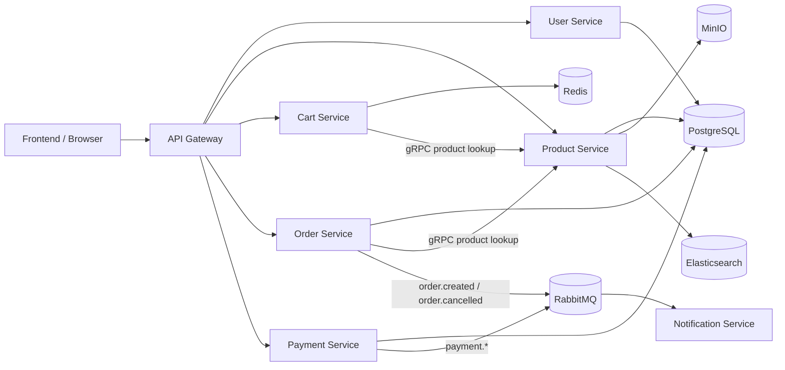

# System Overview

Tài liệu này mô tả hệ thống ở mức runtime: request đi đâu, event đi đâu, data nằm ở đâu, và thành phần nào là bắt buộc hay chỉ là integration bổ sung.

## 1. Kiến trúc tổng thể

## 2. Boundary của từng thành phần

### API Gateway

- là điểm vào HTTP cho frontend
- forward request xuống service đích
- thêm resilience qua retry và circuit breaker
- không giữ business logic nặng

### User Service

- quản lý user profile, password, JWT-related flow
- lưu dữ liệu ở PostgreSQL
- có cả HTTP và gRPC surface

### Product Service

- quản lý catalog
- PostgreSQL là source of truth
- MinIO là nơi lưu product media
- Elasticsearch là search backend tùy chọn
- gRPC được dùng cho cart/order lookup

### Cart Service

- lưu giỏ hàng theo user trong Redis
- không phải source of truth cho giá/stock
- phải hỏi `product-service` trước các thao tác quan trọng

### Order Service

- quote, tạo đơn, coupon, shipping, audit timeline
- lưu order ở PostgreSQL
- hỏi `product-service` bằng gRPC để định giá và kiểm tra stock
- phát event sang RabbitMQ

### Payment Service

- quản lý charge, refund, pending/completed lifecycle
- lưu payment ở PostgreSQL
- gọi lại `order-service` để đọc order
- phát event payment sang RabbitMQ

### Notification Service

- consumer chạy nền
- không phải API business service
- nhận event từ RabbitMQ rồi gửi email

## 3. Các kiểu giao tiếp trong hệ thống

### HTTP qua API Gateway

Dùng cho:

- frontend gọi API
- auth, profile, cart, catalog, order, payment flow từ UI

Lý do:

- đơn giản cho client
- chỉ cần một host/entrypoint

### gRPC service-to-service

Dùng chủ yếu cho:

- `cart-service -> product-service`
- `order-service -> product-service`

Lý do:

- lookup nội bộ nhanh
- contract rõ ràng
- không phải đi vòng qua API Gateway

### RabbitMQ event flow

Dùng cho:

- `order-service` phát `order.created`, `order.cancelled`
- `payment-service` phát `payment.completed`, `payment.failed`, `payment.refunded`
- `notification-service` consume để gửi email

Lý do:

- tách biệt side effect khỏi request path chính
- không làm user chờ email provider

## 4. Source of truth

| Domain | Source of truth | Ghi chú |
| --- | --- | --- |
| User/Profile | PostgreSQL | qua `user-service` |
| Product/Catalog | PostgreSQL | Elasticsearch chỉ hỗ trợ search |
| Product Media | MinIO | metadata vẫn nằm ở PostgreSQL |
| Cart | Redis | session-like state |
| Order | PostgreSQL | audit events cũng nằm ở DB |
| Payment | PostgreSQL | RabbitMQ chỉ để phát tín hiệu |

## 5. Flow tiêu biểu

### Đăng nhập và bootstrap user

1. Frontend gọi `/api/v1/auth/login` qua gateway
2. Gateway forward sang `user-service`
3. `user-service` xác thực password và trả JWT
4. Frontend lưu token rồi gọi profile để bootstrap state

### Add to cart

1. Frontend gọi gateway
2. `cart-service` hỏi `product-service` qua gRPC
3. Nếu stock đủ thì lưu cart vào Redis
4. Frontend nhận cart mới

### Checkout và thanh toán

1. Frontend tạo order
2. `order-service` quote lại theo catalog thật
3. Order được lưu vào PostgreSQL
4. `order-service` phát event `order.created`
5. Frontend hoặc admin tạo payment
6. `payment-service` lưu payment và phát `payment.*`
7. `notification-service` gửi email tương ứng

## 6. Điều cần nhớ khi contribute

- PostgreSQL vẫn là nền tảng chính của business data.
- Redis và RabbitMQ phục vụ bài toán rất cụ thể, không thay thế transaction core.
- Một số dependency như MinIO và Elasticsearch là integration bổ sung; service nên degrade gracefully khi chúng lỗi.
