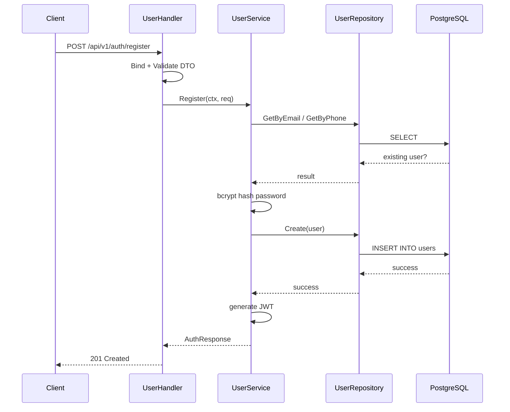

# User Service Deep Dive

## 1. Vai trò của service

`user-service` chịu trách nhiệm cho domain người dùng:

- đăng ký,
- đăng nhập,
- lấy profile,
- cập nhật profile.

Đây là service nên đọc sớm nhất nếu bạn đang học backend Go, vì nó tập trung rất nhiều khái niệm nền tảng:

- request validation,
- password hashing,
- JWT generation,
- repository với PostgreSQL,
- phân tách `handler -> service -> repository`.

## 2. Route chính

Public:

- `POST /api/v1/auth/register`
- `POST /api/v1/auth/login`
- `POST /api/v1/auth/refresh`
- `GET /api/v1/auth/oauth/google/start`
- `GET /api/v1/auth/oauth/google/callback`
- `POST /api/v1/auth/oauth/exchange`

Protected:

- `GET /api/v1/users/profile`
- `PUT /api/v1/users/profile`
- `PUT /api/v1/users/password`
- `GET/POST/PUT/DELETE /api/v1/users/addresses`

*Lưu ý: Các route quản trị (Admin/Staff) không được liệt kê hết ở đây nhưng được bảo vệ bởi middleware `RequireRole(admin, staff)`.*

## 3. Cấu trúc thư mục

```text
user-service/
  cmd/main.go
  internal/
    dto/
    handler/
    model/
    repository/
    service/
    grpc/
  migrations/
```

## 4. Luồng đăng ký

```text
HTTP request
  -> handler.Register
  -> validate DTO
  -> service.Register
  -> check duplicate email/phone
  -> bcrypt hash password
  -> repository.Create
  -> generate JWT
  -> response
```

## 4.1 Sơ đồ Mermaid



### Điểm học được

- Password không bao giờ được lưu plaintext.
- Validation nên làm ở boundary.
- JWT có thể được tạo ngay sau đăng ký để user tự đăng nhập luôn.

## 5. Luồng đăng nhập

File quan trọng nhất: `internal/service/user_service.go`

Logic chính:

1. Chuẩn hóa identifier.
2. Nếu identifier chứa `@`, coi là email.
3. Nếu không, normalize như phone number.
4. Lấy user từ DB.
5. So sánh password bằng bcrypt.
6. Tạo JWT.

Điểm đáng học:

- Dùng cùng một error cho sai user/sai password để tránh enumeration.
- Service giữ logic auth; handler chỉ bind/validate/trả response.

## 5.1 Luồng Refresh Token và Đổi mật khẩu

Hai tính năng quan trọng vừa được thêm vào:

- **Refresh Token**: Client gửi `refresh_token` lên endpoint `POST /auth/refresh`. Service sẽ verify token này, và sinh ra một cặp Access/Refresh token mới. Giúp bảo mật tốt hơn với Access Token ngắn hạn mà không làm phiền người dùng đăng nhập lại liên tục.
- **Đổi mật khẩu**: Yêu cầu xác định mật khẩu cũ trước khi hash và lưu mật khẩu mới.
- **Xác minh Email (Email Verification)**: Sau khi đăng ký, user được cấp một `EmailVerificationTokenHash` (giới hạn thời gian sống) sinh ra từ mã token ngẫu nhiên để gửi vào Email.
- **Quên / Đặt lại mật khẩu (Password Reset)**: Tương tự như verify email, cấp một Session Token tạm thời (Hash lưu vào DB) để user có quyền đổi mật khẩu mới.

*Bài học về Token Hash*: Backend không bao giờ lưu raw token vào DB. Hàm `hashToken()` băm token bằng SHA256 để dù DB bị lộ, hacker cũng không thể dùng claim token đó để mạo danh reset password. Mọi Token thao tác đặc biệt (Reset/Verify) đều có cờ `ExpiresAt`.

## 5.2 Luồng OAuth Google / Facebook

`user-service` giờ chịu trách nhiệm luôn cho social login:

1. `GET /auth/oauth/:provider/start`
2. service tạo `state` đã ký và `nonce` cookie ngắn hạn
3. redirect người dùng sang Google hoặc Facebook
4. provider callback về `GET /auth/oauth/:provider/callback`
5. service verify `state`, `nonce` và `code`
6. gọi provider API để lấy profile chuẩn hóa về `OAuthIdentity`
7. nếu đã có `user_oauth_accounts(provider, provider_user_id)` thì đăng nhập user cũ
8. nếu chưa có nhưng email trùng user hiện hữu thì tự động link vào account đó
9. nếu chưa có user nào thì tạo user mới với `email_verified=true`
10. sinh `login_ticket` ngắn hạn rồi redirect người dùng về frontend `/auth/callback`
11. frontend gọi `POST /auth/oauth/exchange` để đổi `login_ticket` thành token pair chuẩn của hệ thống

Điểm thiết kế chính:

- không đưa JWT thật lên URL,
- không cần service OAuth riêng,
- không đổi schema `users.password` thành nullable,
- mapping social account được lưu tại bảng `user_oauth_accounts`.

## 5.3 Quản lý địa chỉ giao hàng (Shipping Address)

User có thể quản lý nhiều địa chỉ giao hàng (`Address` model). Điểm thú vị:
- Giới hạn tối đa 10 địa chỉ/user để tránh lạm dụng DB.
- Tự động fallback: địa chỉ đầu tiên tạo ra sẽ tự động làm mặc định. Khi set một địa chỉ khác làm mặc định, backend sẽ dùng SQL Transaction tĩnh `ClearDefault` (set `is_default = false` cho mọi địa chỉ của user) rồi mới `SetDefault` cho địa chỉ được chọn. Đảm bảo rule "chỉ 1 địa chỉ mặc định tại mọi thời điểm".

## 6. File quan trọng

### `internal/handler/user_handler.go`

Nơi nhận HTTP request, bind DTO, gọi service, mapping error thành HTTP status code.

### `internal/service/user_service.go`

Đây là file quan trọng nhất của service:

- `Register(...)`
- `Login(...)`
- `GetProfile(...)`
- `UpdateProfile(...)`
- `generateToken(...)`
- `normalizeIdentifier(...)`

### `internal/service/oauth_service.go`

Nơi chứa business logic social login:

- tạo state đã ký,
- xác thực callback,
- auto-link account theo email,
- sinh `login_ticket`,
- đổi ticket sang `access token + refresh token`.

Đây là file đáng đọc nếu bạn muốn học cách thêm OAuth vào một auth service Go đang chạy ổn mà không tạo thêm microservice.

### `internal/service/oauth_provider_client.go`

Adapter HTTP tối giản cho Google OAuth 2.0 và Facebook Login API:

- build authorization URL,
- exchange authorization code,
- lấy profile provider rồi normalize về cùng một shape.

### `internal/repository/user_repository.go`

Lớp giao tiếp với PostgreSQL:

- `GetByEmail`
- `GetByPhone`
- `GetByID`
- `Create`
- `Update`

### `internal/dto/user_dto.go`

Định nghĩa contract request/response, giúp service không bị lẫn với database model.

### `internal/model/user.go`

Định nghĩa shape của entity người dùng.

## 7. Điều Golang nên học từ service này

- Cách viết constructor `NewUserService(...)`.
- Cách bọc lỗi bằng `%w`.
- Cách dùng `context.Context` từ handler xuống repository.
- Cách dùng `bcrypt` và `jwt` trong backend Go.

## 8. Thứ tự đọc gợi ý

1. `cmd/main.go`
2. `internal/handler/user_handler.go`
3. `internal/dto/user_dto.go`
4. `internal/service/user_service.go`
5. `internal/repository/user_repository.go`
6. `migrations/*.sql`

## 9. Bài học nghề nghiệp

Nếu bạn muốn trở thành Golang Back-end Developer, `user-service` là nơi cực tốt để luyện:

- auth flow,
- clean layering,
- database repository,
- bảo mật cơ bản nhưng quan trọng.

## 10. Lý thuyết cần biết để hiểu service này

### Authentication và Authorization khác nhau thế nào?

- Authentication: bạn là ai?
- Authorization: bạn được làm gì?

`user-service` chủ yếu giải quyết authentication. Authorization thường được thực thi ở middleware và domain service khác.

### Bcrypt là gì?

`bcrypt` là thuật toán hash mật khẩu được dùng rất phổ biến. Điểm mạnh:

- có salt mặc định,
- chậm có chủ đích để chống brute-force,
- không lưu password gốc trong DB.

### JWT là gì?

JWT là token chứa thông tin claim như:

- `user_id`
- `email`
- `role`
- `expires_at`

Backend ký token bằng secret; service downstream chỉ cần verify token là biết user nào đang gọi.

### DTO và Model khác nhau gì?

- DTO: object dùng để nhận/trả dữ liệu API.
- Model: object đại diện cho entity nghiệp vụ hoặc DB.

Tách 2 lớp này giúp code dễ thay đổi hơn và tránh lộ dữ liệu không nên public.

### Vì sao normalize identifier quan trọng?

Người dùng có thể nhập:

- email,
- số điện thoại,
- chuỗi có space/thừa ký tự.

Normalize giúp backend so sánh dữ liệu nhất quán hơn và tránh bug khó thấy.
