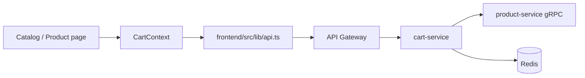

# First Contribution Walkthrough

Tài liệu này dành cho contributor mới muốn sửa một thay đổi nhỏ nhưng vẫn hiểu rõ flow của repo.

## Mục tiêu

Sau walkthrough này, bạn sẽ biết:

- nên đọc file nào trước khi sửa code
- nên test ở đâu
- nên verify ở local như thế nào

## Bài tập khởi động nên làm

Hãy tưởng tượng bạn cần sửa một lỗi nhỏ ở flow add-to-cart hoặc hiển thị profile.

## Lộ trình đọc source đề xuất

### Nếu sửa add-to-cart

1. Đọc [../deep-dive/system-overview.md](../deep-dive/system-overview.md)
2. Đọc [../annotated/frontend-app.md](../annotated/frontend-app.md)
3. Đọc [../annotated/cart-service.md](../annotated/cart-service.md)
4. Nếu cần xác nhận product lookup, đọc thêm [../annotated/product-service.md](../annotated/product-service.md)

### Nếu sửa auth/profile

1. Đọc [../annotated/frontend-app.md](../annotated/frontend-app.md)
2. Đọc [../annotated/shared-packages.md](../annotated/shared-packages.md)
3. Đọc [../annotated/auth-go.md](../annotated/auth-go.md)
4. Đọc [../annotated/user-service.md](../annotated/user-service.md)

## Quy trình làm việc khuyến nghị

1. Chạy repo local.
2. Tái hiện lỗi trên frontend hoặc bằng `curl`.
3. Xác định route đang gọi service nào.
4. Xác định business rule nằm ở handler, service hay repository.
5. Sửa code ở lớp đúng trách nhiệm.
6. Chạy lại test hoặc health checks liên quan.
7. Verify lại end-to-end.

## Ví dụ trace add-to-cart

## Checklist trước khi mở PR

- Đã hiểu source of truth của dữ liệu mình sửa chưa
- Đã kiểm tra flow guest và logged-in nếu sửa cart/auth chưa
- Đã chạy command verify tối thiểu chưa
- Đã cập nhật tài liệu nếu thay đổi behavior chưa
