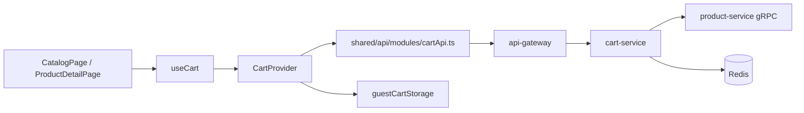
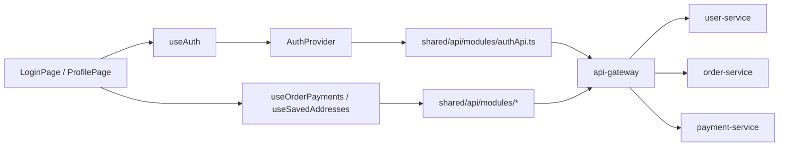

# First Contribution Walkthrough

Tài liệu này dành cho contributor mới muốn sửa một thay đổi nhỏ nhưng vẫn hiểu rõ flow của repo.

## 1. Mục tiêu

Sau walkthrough này, bạn sẽ biết:

- nên đọc file nào trước khi sửa code
- nên trace bug theo tuyến nào
- nên verify tối thiểu ra sao sau khi sửa

## 2. Chọn một bài tập nhỏ nhưng có giá trị

Hai bài tập khởi động rất tốt:

- sửa một lỗi nhỏ ở flow add-to-cart
- sửa một lỗi nhỏ ở flow profile/account

Lý do:

- cả hai đều chạm nhiều boundary
- nhưng vẫn đủ nhỏ để bạn không bị chìm trong order/payment orchestration

## 3. Nếu sửa add-to-cart, hãy đọc theo thứ tự này

1. [../deep-dive/system-overview.md](../deep-dive/system-overview.md)
2. [../deep-dive/frontend-architecture.md](../deep-dive/frontend-architecture.md)
3. [../annotated/frontend-source-map.md](../annotated/frontend-source-map.md)
4. [../annotated/frontend-auth-cart-providers.md](../annotated/frontend-auth-cart-providers.md)
5. [../annotated/cart-service.md](../annotated/cart-service.md)
6. nếu cần đối chiếu lookup product, đọc thêm [../annotated/product-service.md](../annotated/product-service.md)

## 4. Nếu sửa auth/profile, hãy đọc theo thứ tự này

1. [../annotated/frontend-app.md](../annotated/frontend-app.md)
2. [../annotated/frontend-auth-cart-providers.md](../annotated/frontend-auth-cart-providers.md)
3. [../annotated/frontend-api-layer.md](../annotated/frontend-api-layer.md)
4. [../annotated/auth-go.md](../annotated/auth-go.md)
5. [../annotated/user-service.md](../annotated/user-service.md)

## 5. Quy trình làm việc khuyến nghị

1. Chạy repo local theo [00-local-setup.md](./00-local-setup.md).
2. Tái hiện lỗi trên frontend hoặc bằng `curl`.
3. Xác định route/page hoặc endpoint đang tham gia.
4. Xác định logic đó đang nằm ở page, hook/provider, handler, service hay repository.
5. Sửa code ở đúng lớp trách nhiệm.
6. Chạy lại verification tối thiểu.
7. Kiểm tra lại flow end-to-end.

## 6. Ví dụ trace add-to-cart

### Điều cần nhớ khi trace

- nếu user chưa login, flow có thể không chạm backend cart ngay
- `CartProvider` mới là nơi quyết định guest mode hay authenticated mode
- backend cart không tin giá frontend, luôn xin lại từ product-service

## 7. Ví dụ trace auth/profile

### Bài học quan trọng

`ProfilePage` không chỉ là “form profile”. Nó còn kéo:

- auth state
- order summary
- payment summary
- saved addresses
- phone verification

Nên nếu sửa page này, bạn cần kiểm tra nhiều dependency hơn một form thông thường.

## 8. Những câu hỏi nên tự hỏi trước khi sửa

- dữ liệu này source of truth nằm ở đâu?
- có luồng guest và logged-in khác nhau không?
- page này đang dùng implementation thật hay file compatibility re-export?
- nếu sửa API contract, normalizer hoặc type nào phải đổi theo?

## 9. Checklist trước khi mở PR

- đã tái hiện được bug hoặc use case cần sửa chưa
- đã hiểu feature nằm ở page, provider, handler, service hay repository chưa
- đã kiểm tra cả happy path lẫn edge case chính chưa
- đã verify tối thiểu bằng command hoặc UI chưa
- đã cập nhật docs nếu behavior hoặc đường dẫn thay đổi chưa
