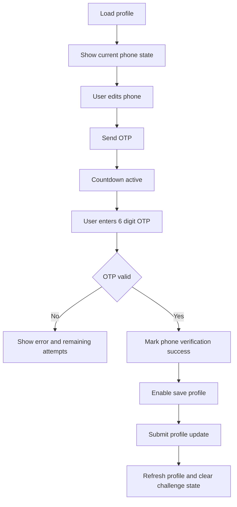

# Kế hoạch triển khai profile + xác thực số điện thoại bằng OTP qua Telegram

## 1. Hiện trạng đã khảo sát

- Trang profile hiện chỉ cập nhật `first_name` và `last_name` trong [client/src/components/account-pages.tsx](../client/src/components/account-pages.tsx).
- Luồng profile frontend đang đi qua [client/src/lib/api/auth.ts](../client/src/lib/api/auth.ts) và state auth nằm ở [client/src/providers/auth-provider.tsx](../client/src/providers/auth-provider.tsx).
- Backend hiện có `GET/PUT /api/v1/users/profile` trong [services/user-service/internal/handler/user_handler.go](../services/user-service/internal/handler/user_handler.go), nhưng `UpdateProfile` trong [services/user-service/internal/service/user_service.go](../services/user-service/internal/service/user_service.go) mới chỉ xử lý tên.
- Repo đã có bảng `addresses` trong [services/user-service/migrations/000001_create_users.up.sql](../services/user-service/migrations/000001_create_users.up.sql), nên không cần thêm `address` text trực tiếp vào user profile.
- Gateway chỉ cần mirror route tại [api-gateway/internal/handler/user_handler.go](../api-gateway/internal/handler/user_handler.go).

## 2. Quyết định kiến trúc

### 2.1. Địa chỉ

Giữ mô hình địa chỉ riêng trong bảng `addresses`.

- Trên profile chỉ hiển thị và chỉnh sửa **địa chỉ mặc định**.
- Nếu user chưa có địa chỉ mặc định, submit profile sẽ có thể tạo mới một address mặc định.
- Nếu đã có địa chỉ mặc định, submit profile sẽ update bản ghi default hiện có.
- Không thêm field `address` vào bảng `users` để tránh trùng nguồn dữ liệu với checkout.

### 2.2. Số điện thoại và xác thực OTP

Không lưu `otp_code` thô trên bảng `users`.

Thiết kế an toàn hơn:

- Bảng `users` chỉ giữ trạng thái số điện thoại đã xác thực:
  - `phone`
  - `phone_verified`
  - `phone_verified_at`
  - `phone_last_changed_at`
- Tạo bảng mới `user_phone_verification_challenges` để lưu challenge OTP ngắn hạn.
- Chỉ lưu:
  - `phone_candidate`
  - `otp_hash`
  - `expires_at`
  - `resend_available_at`
  - `attempt_count`
  - `max_attempts`
  - `status`
  - `telegram_chat_id`
  - `last_sent_at`
  - `verified_at`
  - `created_at`
  - `updated_at`
- Mỗi user tại một thời điểm chỉ có tối đa một challenge `pending` cho mục đích `profile_phone_update`.

### 2.3. Vì sao không lưu OTP ngay trong bảng users

- Tránh làm phình entity [services/user-service/internal/model/user.go](../services/user-service/internal/model/user.go) bằng dữ liệu ngắn hạn.
- Dễ xoá, hết hạn, lock và audit riêng.
- Giảm nguy cơ để lộ OTP nếu object user bị serialize nhầm.
- Giúp mở rộng sau này cho login OTP hoặc đổi số điện thoại mà không làm bẩn bảng `users`.

## 3. Thay đổi database đề xuất

### 3.1. Migration bổ sung cho bảng `users`

```sql
ALTER TABLE users
  ADD COLUMN phone_verified BOOLEAN NOT NULL DEFAULT FALSE,
  ADD COLUMN phone_verified_at TIMESTAMP NULL,
  ADD COLUMN phone_last_changed_at TIMESTAMP NULL;

CREATE INDEX IF NOT EXISTS idx_users_phone_verified ON users(phone_verified);
```

Ghi chú:

- Nếu user đổi sang số mới, chỉ update `phone` sau khi OTP hợp lệ.
- Khi xác minh thành công:
  - set `phone = normalized_phone_candidate`
  - set `phone_verified = TRUE`
  - set `phone_verified_at = NOW()`
  - set `phone_last_changed_at = NOW()`
- Nếu user chưa có phone hoặc phone chưa verify, frontend hiển thị trạng thái `Chưa xác thực`.

### 3.2. Migration bảng challenge OTP mới

```sql
CREATE TABLE IF NOT EXISTS user_phone_verification_challenges (
  id                   VARCHAR(36) PRIMARY KEY,
  user_id              VARCHAR(36) NOT NULL REFERENCES users(id) ON DELETE CASCADE,
  purpose              VARCHAR(50) NOT NULL,
  phone_candidate      VARCHAR(20) NOT NULL,
  otp_hash             VARCHAR(128) NOT NULL,
  expires_at           TIMESTAMP NOT NULL,
  resend_available_at  TIMESTAMP NOT NULL,
  last_sent_at         TIMESTAMP NOT NULL,
  attempt_count        INT NOT NULL DEFAULT 0,
  max_attempts         INT NOT NULL DEFAULT 5,
  status               VARCHAR(20) NOT NULL DEFAULT 'pending',
  telegram_chat_id     VARCHAR(64) NOT NULL,
  verified_at          TIMESTAMP NULL,
  created_at           TIMESTAMP NOT NULL DEFAULT NOW(),
  updated_at           TIMESTAMP NOT NULL DEFAULT NOW()
);

CREATE UNIQUE INDEX IF NOT EXISTS idx_phone_verification_pending_user_purpose
ON user_phone_verification_challenges(user_id, purpose)
WHERE status = 'pending';

CREATE INDEX IF NOT EXISTS idx_phone_verification_phone_candidate
ON user_phone_verification_challenges(phone_candidate);

CREATE INDEX IF NOT EXISTS idx_phone_verification_expires_at
ON user_phone_verification_challenges(expires_at);
```

### 3.3. Hash OTP

- OTP sinh ngẫu nhiên 6 chữ số.
- Không lưu plain OTP.
- Hash bằng `SHA-256` kèm server-side pepper hoặc secret riêng trong config.
- So sánh bằng constant-time compare.
- Mỗi lần resend phải sinh OTP mới và invalidate OTP cũ.

## 4. Cấu hình Telegram Bot API

Mở rộng [pkg/config/config.go](../pkg/config/config.go) với khối config mới:

```yaml
telegram:
  enabled: true
  bot_token: "..."
  api_base_url: "https://api.telegram.org"
  otp_message_ttl_seconds: 300
  otp_resend_cooldown_seconds: 60
  otp_max_attempts: 5
  otp_daily_limit_per_user: 5
  otp_hourly_limit_per_ip: 10
  secret_pepper: "change-me"
```

Cập nhật [deployments/docker/config/user-service.yaml](../deployments/docker/config/user-service.yaml) và [.env.example](../.env.example).

### 4.1. Cách gửi qua Telegram

Để gửi OTP tới Telegram đúng người dùng, backend cần biết `telegram_chat_id` đích.

Phương án khả thi, ít thay đổi nhất:

- Cho frontend có field `telegram_chat_id` trong bước gửi OTP đầu tiên.
- Backend validate đây là số hợp lệ.
- OTP sẽ được gửi vào chat id đó qua `POST /bot<token>/sendMessage`.

Tin nhắn mẫu:

```text
Mã OTP xác thực số điện thoại của bạn là 123456.
Mã hết hạn sau 5 phút.
Không chia sẻ mã này cho bất kỳ ai.
```

Nếu muốn an toàn hơn ở vòng sau, có thể thêm bước liên kết Telegram account riêng, nhưng chưa bắt buộc cho scope hiện tại.

## 5. API backend đề xuất

### 5.1. Giữ lại endpoint profile hiện có

`GET /api/v1/users/profile`

Mở rộng response user:

```json
{
  "id": "...",
  "email": "...",
  "phone": "0912345678",
  "phone_verified": true,
  "phone_verified_at": "2026-03-28T08:00:00Z",
  "first_name": "Dung",
  "last_name": "Nguyen",
  "role": "user",
  "email_verified": true,
  "created_at": "...",
  "updated_at": "..."
}
```

### 5.2. Cập nhật profile

`PUT /api/v1/users/profile`

Body đề xuất:

```json
{
  "first_name": "Dung",
  "last_name": "Nguyen",
  "phone": "0912345678",
  "default_address": {
    "recipient_name": "Dung Nguyen",
    "phone": "0912345678",
    "street": "123 Nguyen Trai",
    "ward": "Phuong 1",
    "district": "Quan 5",
    "city": "TP HCM"
  },
  "phone_verification_id": "challenge-uuid"
}
```

Rule:

- Nếu `phone` giữ nguyên số đang verify thì cho phép lưu tên + địa chỉ bình thường.
- Nếu `phone` khác số hiện tại:
  - bắt buộc có `phone_verification_id`
  - challenge phải `verified`
  - `phone_candidate` phải khớp với `phone`
  - challenge phải thuộc đúng user
  - challenge chưa bị consume
- Nếu không thoả, trả `400` với message rõ ràng.
- Update tên + user.phone + trạng thái phone trong cùng một transaction logic đủ chặt.
- Địa chỉ mặc định được upsert cùng request.

### 5.3. Gửi OTP cho số điện thoại mới

`POST /api/v1/users/profile/phone-verification/send-otp`

Body:

```json
{
  "phone": "0912345678",
  "telegram_chat_id": "123456789"
}
```

Response:

```json
{
  "verification_id": "uuid",
  "phone_masked": "******678",
  "expires_in_seconds": 300,
  "resend_in_seconds": 60,
  "max_attempts": 5,
  "remaining_attempts": 5,
  "status": "pending"
}
```

Rule:

- Normalize phone trước khi xử lý.
- Từ chối nếu phone đã được user khác dùng.
- Từ chối nếu vượt quota theo user, IP, phone.
- Nếu đang có challenge pending cùng phone, cho phép trả lại challenge hiện tại thay vì spam tạo mới.
- Chỉ gửi Telegram sau khi challenge được lưu thành công.

### 5.4. Xác minh OTP

`POST /api/v1/users/profile/phone-verification/verify-otp`

Body:

```json
{
  "verification_id": "uuid",
  "otp_code": "123456"
}
```

Response:

```json
{
  "verification_id": "uuid",
  "status": "verified",
  "phone": "0912345678",
  "verified_at": "2026-03-28T08:00:00Z"
}
```

Rule:

- Kiểm tra challenge thuộc user hiện tại.
- Check `status = pending`.
- Check chưa hết hạn.
- Nếu sai OTP:
  - tăng `attempt_count`
  - khi chạm ngưỡng max thì mark `locked`
  - trả `429` hoặc `400` theo rule business, kèm `remaining_attempts`
- Nếu đúng:
  - mark `verified`
  - set `verified_at`
  - **chưa commit vào `users.phone` ngay**
  - chờ request `PUT /profile` consume verification này

Lý do không commit ngay vào user:

- Giữ UX đúng với form profile: người dùng xác minh xong rồi bấm lưu một lần.
- Tránh tình huống phone đã đổi nhưng tên/địa chỉ chưa lưu thành công.

### 5.5. Gửi lại OTP

`POST /api/v1/users/profile/phone-verification/resend-otp`

Body:

```json
{
  "verification_id": "uuid"
}
```

Response giống send OTP, nhưng:

- bắt buộc sau cooldown
- sinh OTP mới
- reset `expires_at`
- có thể giữ nguyên challenge id

### 5.6. Lấy trạng thái challenge đang mở

`GET /api/v1/users/profile/phone-verification`

Trả về challenge pending hoặc verified-chưa-consume gần nhất để frontend restore state sau refresh trang.

## 6. Thay đổi handler/service/repository backend

### 6.1. DTO mới

Mở rộng [services/user-service/internal/dto/user_dto.go](../services/user-service/internal/dto/user_dto.go):

- `UpdateProfileRequest`
  - `first_name`
  - `last_name`
  - `phone`
  - `phone_verification_id`
  - `default_address`
- `SendPhoneOTPRequest`
- `VerifyPhoneOTPRequest`
- `ResendPhoneOTPRequest`
- `PhoneVerificationStatusResponse`

### 6.2. Repository mới

Tạo repository challenge OTP riêng, ví dụ:

- `CreateOrReplacePendingChallenge`
- `GetPendingByUserIDAndPurpose`
- `GetByID`
- `IncrementAttempt`
- `MarkVerified`
- `MarkLocked`
- `RefreshOTP`
- `MarkConsumed`
- `DeleteExpired`

### 6.3. User service

Mở rộng [services/user-service/internal/service/user_service.go](../services/user-service/internal/service/user_service.go):

- `StartPhoneVerification`
- `VerifyPhoneOTP`
- `ResendPhoneOTP`
- `GetPhoneVerificationStatus`
- `UpdateProfile` nhận thêm dependency address service hoặc coordinator để:
  - load user
  - validate phone change
  - consume verified challenge nếu có
  - upsert default address
  - persist nhất quán

### 6.4. Address service

Mở rộng [services/user-service/internal/service/address_service.go](../services/user-service/internal/service/address_service.go):

- thêm helper `GetDefaultAddress`
- thêm helper `UpsertDefaultAddress`

Luồng `UpsertDefaultAddress`:

- nếu đã có default address thì update bản ghi đó
- nếu chưa có thì create mới `is_default = true`

### 6.5. Handler

Mở rộng [services/user-service/internal/handler/user_handler.go](../services/user-service/internal/handler/user_handler.go):

- `POST /api/v1/users/profile/phone-verification/send-otp`
- `POST /api/v1/users/profile/phone-verification/verify-otp`
- `POST /api/v1/users/profile/phone-verification/resend-otp`
- `GET /api/v1/users/profile/phone-verification`

Gateway mirror route trong [api-gateway/internal/handler/user_handler.go](../api-gateway/internal/handler/user_handler.go).

## 7. Bảo mật và chống abuse

### 7.1. Input validation

- Normalize phone về một format thống nhất.
- Chỉ chấp nhận số Việt Nam hợp lệ theo regex nội bộ.
- `telegram_chat_id` chỉ chấp nhận số nguyên dương, giới hạn độ dài.
- OTP phải đúng 6 chữ số.
- Trim mọi chuỗi text.

### 7.2. Rate limit

Tận dụng middleware Redis hiện có từ [pkg/middleware/rate_limit.go](../pkg/middleware/rate_limit.go) kết hợp limiter ở tầng service.

Áp dụng đồng thời:

- theo user id
- theo IP
- theo phone candidate
- theo challenge id cho verify attempts

Mức đề xuất:

- send OTP: tối đa 1 lần mỗi 60 giây cho cùng challenge
- send OTP: tối đa 5 lần mỗi ngày cho mỗi user
- verify OTP sai: tối đa 5 lần cho mỗi challenge
- hết 5 lần sai: lock challenge
- challenge hết hạn sau 5 phút

### 7.3. Logging

- Log `user_id`, `challenge_id`, `phone_suffix`, `status`
- Không log full OTP
- Không log full phone nếu không cần, chỉ suffix hoặc masked
- Telegram API error chỉ log metadata an toàn

### 7.4. Transaction và nhất quán

Dù repo hiện chưa có transaction helper chung, nên triển khai theo lát cắt nhỏ:

- xác minh OTP và consume challenge phải có điều kiện trạng thái rõ ràng
- update profile nên làm theo thứ tự an toàn:
  1. load user
  2. validate challenge verified nếu đổi phone
  3. update user
  4. upsert default address
  5. mark challenge consumed

Nếu muốn chặt hơn, nên thêm transaction helper cho flow này ở user-service.

## 8. Thiết kế frontend UX

Cập nhật [client/src/components/account-pages.tsx](../client/src/components/account-pages.tsx) để phần Profile có:

- `first_name`
- `last_name`
- `phone`
- nhóm địa chỉ mặc định:
  - `recipient_name`
  - `street`
  - `ward`
  - `district`
  - `city`
- block trạng thái phone:
  - `Đã xác thực`
  - `Chưa xác thực`
  - `Đang chờ xác minh số mới`

### 8.1. Trạng thái UI đề xuất



### 8.2. Rule tương tác

- Nếu user không đổi phone, nút lưu profile hoạt động bình thường.
- Nếu user đổi phone nhưng chưa verify thành công:
  - disable nút `Lưu thay đổi`
  - hiển thị CTA `Gửi OTP`
- Sau khi OTP verify thành công:
  - hiển thị badge `Số mới đã xác minh, chờ lưu`
  - enable nút lưu
- Nếu user sửa phone lần nữa sau khi đã verify:
  - reset trạng thái verify cục bộ
  - yêu cầu gửi OTP lại
- Resend chỉ enable khi countdown về 0.
- Sau refresh trang, frontend gọi endpoint status để restore countdown và trạng thái challenge.

### 8.3. State frontend cần thêm

Trong [client/src/providers/auth-provider.tsx](../client/src/providers/auth-provider.tsx) hoặc hook riêng:

- `phoneVerification`
  - `verification_id`
  - `phone`
  - `status`
  - `expires_at`
  - `resend_available_at`
  - `remaining_attempts`
  - `verified_at`
- actions:
  - `sendPhoneOtp`
  - `verifyPhoneOtp`
  - `resendPhoneOtp`
  - `getPhoneVerificationStatus`

Khuyến nghị: tách logic này thành hook riêng `usePhoneVerification` để không làm phình provider auth.

## 9. Thay đổi type và API client frontend

### 9.1. Mở rộng type user

Trong [client/src/types/api.ts](../client/src/types/api.ts):

- thêm `phone_verified`
- thêm `phone_verified_at`
- thêm type `PhoneVerificationChallenge`
- thêm type `DefaultAddressInput`

### 9.2. Normalizer

Cập nhật [client/src/lib/api/normalizers.ts](../client/src/lib/api/normalizers.ts) để parse:

- `phone_verified`
- `phone_verified_at`
- object challenge OTP

### 9.3. API client

Mở rộng [client/src/lib/api/auth.ts](../client/src/lib/api/auth.ts) hoặc tốt hơn là [client/src/lib/api/user.ts](../client/src/lib/api/user.ts):

- `sendProfilePhoneOtp`
- `verifyProfilePhoneOtp`
- `resendProfilePhoneOtp`
- `getProfilePhoneVerification`
- `updateProfile` body mới có `phone`, `phone_verification_id`, `default_address`

Khuyến nghị: chuyển `getProfile` và `updateProfile` sang [client/src/lib/api/user.ts](../client/src/lib/api/user.ts) để domain user nhất quán hơn, nhưng nếu muốn giảm diff thì có thể giữ tại [client/src/lib/api/auth.ts](../client/src/lib/api/auth.ts).

## 10. Trình tự triển khai khuyến nghị

1. Tạo migration DB cho phone verification metadata và challenge table.
2. Mở rộng model + repository + DTO phía user-service.
3. Implement Telegram sender abstraction và config.
4. Implement service logic send, verify, resend, status OTP.
5. Mở rộng `UpdateProfile` để consume verification và upsert default address.
6. Thêm route trong user-service và gateway.
7. Mở rộng types và API client frontend.
8. Refactor UI profile để thêm phone + default address + block OTP.
9. Test thủ công end-to-end tại `/profile`.
10. Bổ sung test tự động.

## 11. Test cần có

### 11.1. Backend

- Repository test cho challenge CRUD và status transition.
- Service test cho:
  - send OTP thành công
  - send OTP bị rate limit
  - verify OTP sai tăng attempt
  - verify OTP đúng chuyển `verified`
  - resend OTP sinh hash mới
  - update profile bị chặn khi phone đổi nhưng chưa verify
  - update profile thành công khi challenge verified hợp lệ
  - upsert default address khi có và khi chưa có
- Handler test cho status code và error envelope.

### 11.2. Frontend

- Render trạng thái verified và unverified.
- Disable save khi phone changed nhưng chưa verify.
- Countdown resend.
- Verify OTP success bật được nút save.
- Submit profile cập nhật thành công và refresh state.
- Restore trạng thái challenge khi reload.

## 12. Rủi ro và lưu ý

- Telegram Bot không thể tự suy ra chat id từ số điện thoại, nên scope này phải có `telegram_chat_id` hoặc một bước liên kết Telegram rõ ràng.
- Nếu muốn UX gọn hơn sau này, có thể thêm trang liên kết Telegram account trước rồi profile chỉ bấm gửi OTP.
- Không nên ghi trực tiếp phone mới vào bảng `users` trước khi OTP verified.
- Không nên dùng địa chỉ text riêng trên `users` vì sẽ lệch với `addresses` đang là source of truth cho checkout.

## 13. Kết quả mong đợi sau triển khai

- User có thể sửa tên, số điện thoại, địa chỉ mặc định ngay trên profile.
- Số điện thoại mới chỉ được lưu khi OTP Telegram hợp lệ.
- UI hiển thị rõ trạng thái xác thực số điện thoại.
- Có resend, countdown, giới hạn số lần sai và chống spam.
- Backend tách bạch rõ `handler -> service -> repository`, phù hợp cấu trúc hiện tại của repo.
